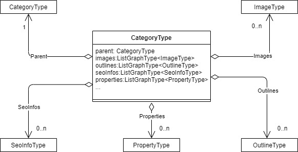

# CategoryType
The chart below shows the `CategoryType` parameter and all its child parameters and options:

## Schema Fields

|#|Name      |Type                   |Description|
|-|----------|-----------------------|-----------|
|1|id        |StringGraphType        |Id of category|
|2|code      |StringGraphType        |SKU of category|
|3|name      |StringGraphType        |Name of category|
|4|slug      |StringGraphType        |Url of category|
|5|parent    |CategoryType           |Field to resolve parent category|
|6|hasParent |BooleanGraphType       |Indicates if category has parent|
|7|images    |List of ImageType      |Category images|
|8|outlines  |List of OutlineType    |Category outlines|
|9|seoInfos  |List of SeoInfoType    |SEO information of the category|
|9|properties  |List of PropertyType    |Properties of the category|