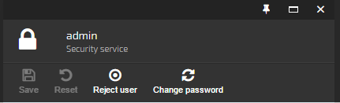

## Introduction

Blade toolbar represents a dedicated area inside a **blade**, where one can add **controls**, which we will call, for convenience, **toolbar items**.



*Four toolbar items nested in the blade toolbar*

Toolbar items can be added to a **blade instance** directly or using Virto Commerce platform toolbar extensibility service.

## Adding Toolbar Items Directly to Blade Instance

Toolbar items are usually defined and added in the Angular.js controller, which is bound to a specific blade in the UI. Adding an item to the toolbar is pretty straightforward: you just need to define the **$scope.blade.toolbarCommands** array with the items in question:

```JS
$scope.blade.toolbarCommands = [
  {
    name: "Save",
    icon: 'fa fa-save',
    title: 'Save action tooltip text', // or you can use keys for translation "platform.commands.titles.save"
    executeMethod: function () {
      $scope.saveChanges();
    },
    canExecuteMethod: function () {
      return isDirty();
    },
    permission: 'platform:security:manage'
  },
  {
    name: "Reset",
    icon: 'fa fa-undo',
    title: 'Reset action tooltip text',
    executeMethod: function () {
      angular.copy($scope.blade.origEntity, $scope.blade.currentEntity);
      userStateCommand.updateName();
    },
    canExecuteMethod: function () {
      return isDirty();
    },
    permission: 'platform:security:manage'
  },
  {
    name: "Change password",
    icon: 'fa fa-refresh',
    title: 'Change password action tooltip text',
    executeMethod: function () {
      var newBlade = {
        id: 'accountDetailChild',
        currentEntityId: $scope.blade.currentEntity.userName,
        title: $scope.blade.title,
        subtitle: "Change your password",
        controller: 'platformWebApp.accountChangePasswordController',
        template: 'Scripts/common/security/blades/account-changePassword.tpl.html'
      };
      bladeNavigationService.showBlade(newBlade, $scope.blade);
    },
    canExecuteMethod: function () {
      return true;
    },
    permission: 'platform:security:manage'
  }
];
```

## Adding Toolbar Items from External Code

A dedicated service is used for adding toolbar items externally, without having any reference to the blade instance. The preferred place for registering a toolbar item is the **module run** block in Angular.js. What you need is reference `platformWebApp.toolbarService` as `toolbarService`, create item option, and call `register` against the service:

```JS
toolbarService.register({
  name: "ADDITIONAL COMMAND", icon: 'fa fa-cloud',
  title: 'Action command tooltip text',
  executeMethod: function (blade) {
    console.log('test: ' + this.name + this.icon + blade);
  },
  canExecuteMethod: function () { return true; },
  index: 2
}, 'virtoCommerce.marketingModule.itemsDynamicContentListController');
```

`toolbarService.register` parameters:

|Parameter|Description|
|---------|-----------|
|toolbarItem|Toolbar item definition.|
|toolbarController|Full toolbar controller name.|

Toolbar item definition structure:

|Member|Description|
|------|-----------|
|name|Display name for the item.|
|icon|Icon for toobar item.|
|title|Tooltip message for the button.|
|executeMethod|Function to run when the item is activated.|
|canExecuteMethod|Function to determine whether the item could be executed. The item is disabled in the toolbar if the *false* value is returned.|
|index|The 0-based position to insert the item in the toolbar.|
