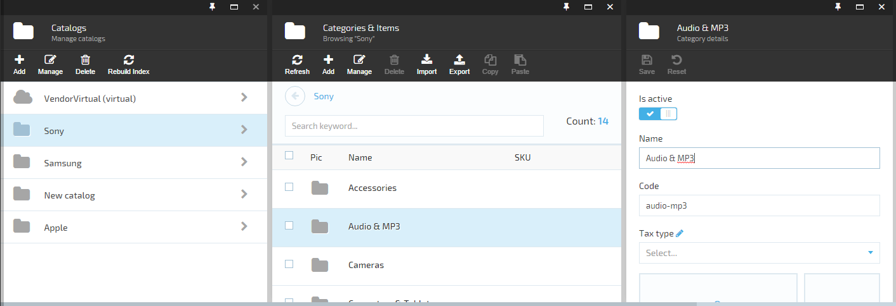

## Overview

Virto Commerce Platform's UI is organized and divided into multiple screens called blades. Blades are ordered left to right and share parent-child hierarchy. Any parent blade has one or more child ones, while every child has a reference to its parent. The hierarchy depth is virtually unlimited.


*Example of unlimited parent-child blade hierarchy*

## Blade Structure and Properties

Every blade is instantiated from a highly customizable template. The template has a few basic parts, such as the maximize area, top and title bottons, toolbar, main content placeholders, etc. We have a dedicated *Blade constructor* page showing all customization options and allowing you to build your own blade on the fly. Our *Blade constructor* is also a useful resource for quick reference. You can check it out [here](https://virtocommerce.com/guides/blade-constructor).

Any blade object has the following properties that Virto Commerce platform respects:

|Property|Type|Description|
|--------|----|-----------|
|id|string|Blade identifier, which is required and should be unique at the module level.|
|isLoading|bool|Toggles the *loading* indicator in the UI.|
|headIcon|string|An icon to show on the blade header. A [Font Awesome](http://fontawesome.io/icon/github/) icon identifier. If undefined, the default *fa-folder* icon is displayed.|
|title|string|Blade title|
|subtitle|string|Blade subtitle|
|toolbarCommands|object []|Toolbar controls (read more [here](../blade-toolbar/)).|
|controller|string|Angular.js controller ID. This property is required.|
|template|string|Angular.js template path. This property is required.|
|parentBlade|object|Reference to parent blade. Platform sets this value automatically.|
|childrenBlades|object []|Child blades. Platform sets and manages this value automatically.|
|isClosingDisabled|bool|Shows whether the close botton (*x*) should be grayed out. A blade with such button grayed out can be closed only using a script.|
|onClose(callback)|function|Action to call **before** closing the blade. This can prevent a blade from closing if the provided callback action is not run. The *onClose* property is usually used to show confirmation dialog.|
|isExpandable|bool|Causes the blade to open maximized and then shrink when a child blade is opened.|
|onExpand()|function|Action to call on maximizing the blade; most often used to expand inner controls of the blade.|

!!! info
	Blade instances can have other additional properties, such as *isNew*, *currentEntity*, etc. However, you have to manually change such properties in the associated controller. 

## Blade Navigation

To manage blades, we use `platformWebApp.bladeNavigationService` that has the following methods:

|Method|Description|
|------|-----------|
|showBlade(blade, parentBlade)|Opens a new blade instance for the parent blade in question. The blade parameter should have at least the **id**, **controller**, and **template** properties set.|
|closeBlade(blade, callback, onBeforeClosing)|Attempts to close the blade in question. If specified, the `onBeforeClosing` function is called **before** closing the blade. If provided, the callback function is called **after** it was closed.|
|closeChildrenBlades(blade, callback)|Attempts to close all child blades. The callback function is called only if all child blades were closed successfully.|
|setError(msg, blade)|Sets an error message for the blade. To clear an error message, leave the `msg` parameter blank.|

```
angular.module('sampleApp')
.controller('sampleController', ['$scope', 'platformWebApp.bladeNavigationService', function ($scope, bladeNavigationService) {

...
  var newBlade = {
    id: "settingDetailChild",
    currentEntityId: node.name,
    title: $scope.blade.title,
    controller: 'platformWebApp.settingDictionaryController',
    template: 'Scripts/app/settings/blades/setting-dictionary.tpl.html'
  };
  bladeNavigationService.showBlade(newBlade, $scope.blade);
```

The blade instance can be accessed in the associated controller by the **$scope.blade** property.
