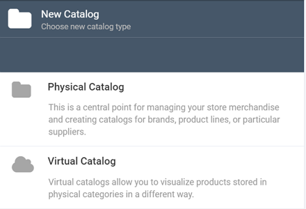
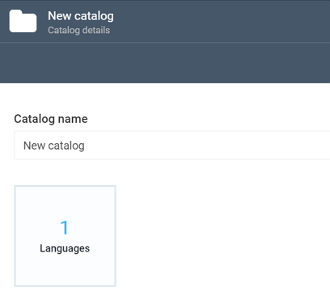
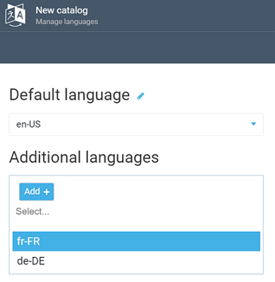
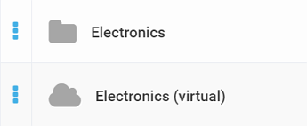

# Adding New Catalog

To add a new catalog, you need to follow these steps:

+ Navigate to the **Catalog** module and click the **Add** button.  
+ The **New catalog** screen will show up, and you will be prompted to choose the new catalog type:

+ Select either **Physical Catalog** or **Virtual Catalog**, depending on what kind of catalog you need.

!!! note
	Physical and virtual catalogs are used for different purposes. While physical catalogs just house the relevant categories and products, virtual ones allow you to pick various items from other catalogs, while keeping the original linking. For instance, you may need to display seasonal goods together, each item belomnging technically to a different catalog. You may create any reasonable number of physical and virtual catalogs, as you deem fit.
	
!!! tip	
	For more info on how physical and virtual catalogs differ, refer to the [Overview](index.md) and [Terminology](glossary.md) sections. 

+ The next screen, **Catalog Details**, will show up, prompting you to enter the catalog's name and specify the languages:

+ Provide the catalog name and specify the default and additional languages:

	
+ Confirm your selection by clicking **OK**.

+ Click **Create**. Your catalog is ready to use!

!!! tip
	You can easily tell physical catalogs from virtual ones by the respective folder  or cloud icons. Virtual catalogs will also have the ***(virtual)*** suffix in their names:
	
	