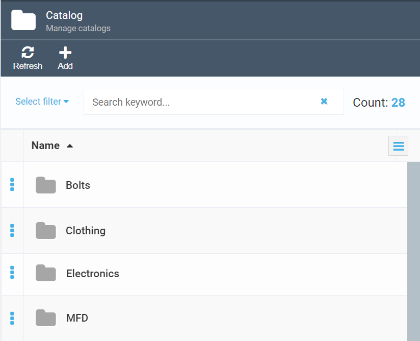
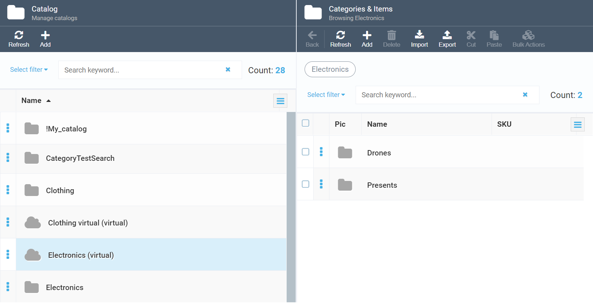
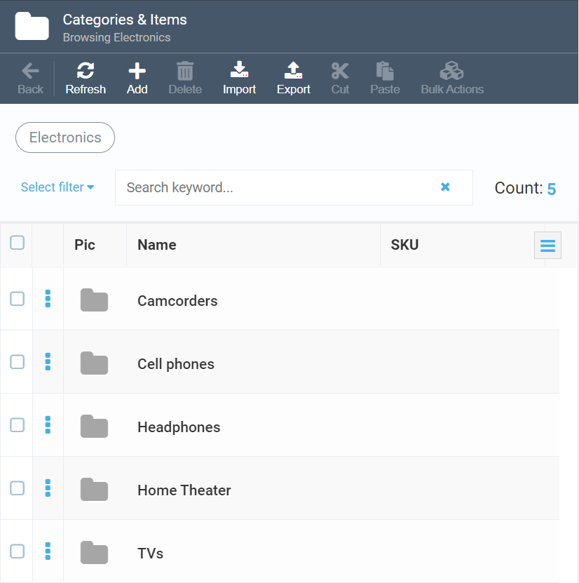
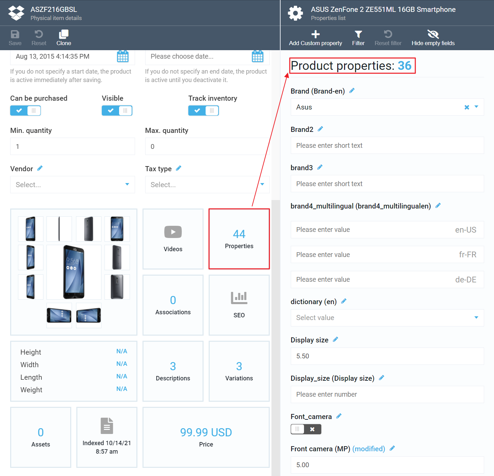

# Overview

Catalog is a Virto’s module that enables adding items to your ecommerce store to market any physical goods or digital content. The items being marketed can be grouped into catalogs and categories based on various properties, such as stock balance, item types, vendor, brand, etc.

The chart below shows how various high-level entities are linked to one another in the Virto Platform.

<i>Chart 1: Logical dependencies in Virto Commerce Catalog</i>

As shown above, you can have one or more stores which both physical and virtual catalogs are linked to. For more info on those types of catalogs, please see below and also check out our [Terminology](glossary.md) section.

!!! note
	Fulfillment centers are relevant to physical products only. If a store markets digital content, such as software or music, it will not require any such centers.

## Related Components
To view the source code of Virto Commerce Catalog module, check out our [GitHub repository](https://github.com/VirtoCommerce/vc-module-catalog).

To download the latest Catalog module release, click [here](https://github.com/VirtoCommerce/vc-module-catalog/releases).

## Physical Catalogs

In a nutshell, a physical catalog is a list of products or services that a company showcases online. All products can be grouped into categories, while one product may be assigned to a single category only or be a direct child of a catalog without any category.

<i>Figure 1: A list of physical catalogs</i>

## Virtual Catalogs

You can create virtual catalogs based on one or more physical ones. For example, a virtual catalog may be used to display seasonal goods that, in technical terms, would be various products picked from multiple physical catalogs.

Any virtual catalog must have a unique name that is different from those of other virtual or physical catalogs. Though virtual catalogs are composed of products and categories from the physical catalogs, you cannot add products from a virtual catalog to another virtual catalog.

Basically, a virtual catalog is none other than just a way to display (visualize) products. Technically, all items are located in physical catalogs, hence the name. This also means that if you modify any item in a physical catalog, the respective virtual catalogs will instantly get updated as well.

<i>Figure 2: Creating virtual catalogs based on physical ones</i>

!!!tip
	You can read more about catalogs here: 
	[Viewing Catalogs and Physical Item Details](view-catalogs-and-physical-items.md) 
	[How to Add a New Catalog](add-new-catalog.md)

## Categories

A category is basically a container for other categories, subcategories, or products.

Categories enable building hierarchies and links between various items in the catalog, which helps the customers navigate to the items they would like to purchase.

If you have large catalogs containing many items, you might want to create multiple categories and subcategories using the parent-child structure.

<i>Figure 3: Example of a list of categories in a consumer electronics online store</i>

!!!tip
	You can read more about categories here: 
	[How to Manage Categories](managing-categories.md)

## Products

A product is a basic entity representing an item one can purchase in an online store. The Catalog module offers the following types of products (see also Chart 2): 

- Physical products: any tangibles, such as cameras or mobile phones
- Digital products: Intangibles such as software or music

!!!note
	Both physical and digital products have their own unique attributes (see also Notes to Chart 2).

- Bill of materials: A special kind of product that has a list of supplementary materials required for a specific item
- Configurable products: A fully customizable item that has unique attributes and thus cannot fall into the above types

Any product may also have one or more variations; for consumer electronics, those could be size or color variations, among others. Technically, a variation is a separate product entity that, at the same time, is linked to its master product. For instance, if a mobile phone is a master product, its variations may include black, white, or red versions, or 5’’ and 6’’ versions (or both).

All variations inherit property values of the master product, such as description and assets, but may also override those values, when required.

!!! note
	You can also read more about variations in the Product Variation Concept section below.

You can configure the following attributes for your products:

1.	Custom properties
2.	SEO text
3.	Associations (e.g., related items)
4.	Assets 
5.	Images
6.	Variations  
7.	Inventory  
8.	Prices

!!!note
	Some attributes may not be applicable to a particular type of product. E.g., bill of materials may not have any variations, while digital product has no inventory, as it is intangible.

!!!note
	For inventory and price management, Virto Commerce offers the dedicated [Inventory](https://virtocommerce.com/docs/latest/modules/inventory/) and [Pricing](https://virtocommerce.com/docs/latest/modules/pricing/) modules.<!--- fix links! -->

<i>Figure 4: Product page displaying various attributes of a single product, including variations and properties</i>

!!!tip
	You can read more about products here: 
	[Managing Products](managing-products.md) 
	[Product Indexing](product-indexing.md) 
	[Managing Product Variations](managing-product-variations.md)

## Product Variation Concept
In ecommerce, there is an ambiguity when it comes to defining a regular product and a product with variations. According to one point of view, a product is a real SKU that can be identified in the accounting system, can have its own description and price, etc. The other one regards a product as not a real SKU item but a container for a group of real products or variations that differ only in some variative properties.

In Virto Commerce, we decided to get rid of this ambiguity; this is why we define only products as SKUs. In case you add any variations to a product, this product and its variation(s) will be linked. Thus, a product with variations is regarded as a collection of products or variations, one of them being the title product (master product), and, technically, being one of the variations at the same time. Every product linked to the master product may inherit its property values, such as description, assets, etc.); however, it may also override the values of those properties if they differ from those of the master product.

For displaying a product with variations in Storefront, we use the master product, which is loaded into the system with all related variations. For product description, we also use the master product property values. The SKU selector for such a product is built using variation properties of the master product and all its variations.

## Properties

Custom properties are additional parameters for catalog entities at various levels:

1.	Catalog level: A property belonging to entire catalog
2.	Category level: A property assigned to a category that may be overwritten in child categories
3.	Product level: A property assigned to a single product or its variation

!!! note
	All properties defined at a higher level are automatically inherited at all lower ones. For instance, if you assign the ***Brand*** property with the ***XXX*** value to a catalog, all categories and products within that catalog will also have ***XXX*** as ***Brand***.

<i>Figure 5: Property view that displays custom properties of an item being marketed</i>

!!!tip
	You can read more about properties here: 
	[Managing Properties](managing-properties.md)

## Search

Virto Commerce offers the Search tool that provides high level relevance, multiple languages, and near-instantaneous responses.

### Key Advantages:
- Document based full text search and text analysis for Products, Categories, and Members   
- Search by keyword, filters, aggregations, and geo-search  
- Supports multiple search engines: Elastic Search, Elastic Cloud, Azure Search, and Lucene
- Inherent complexity of information retrieval processed through REST API or .NET SDK
- The supported document types can be easily extended by a third-party team

### Search Index

The Virto Commerce platform provides a unified solution for indexing and searching for various types of objects. The Search Index is used to improve the search performance and speed.

The indexing process starts automatically based on a pre-defined schedule. However, you can start the indexing process manually at any time, if required.

!!!tip
	You can read more about the search index here: 
	[Managing Search Index](managing-search-index.md)
