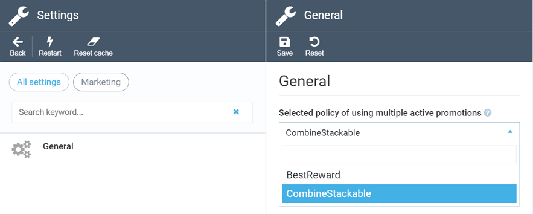

# Promotion Combination Policies

Virto Commerce Marketing module supplies two basic promotion combination policies:  

+ ***Best reward policy***: Only one promotion, being the most beneficial to a customer, will apply. 
+ ***Stackable policy***: Customers can qualify for multiple promotions at a time.

!!! note
	By default, the *best reward* policy is enabled.

## Best Reward Policy  

This policy follows the common *Not Valid with Any Other Offer* principle, meaning that only one promotion may be applied. This promotion will be the most beneficial to the customer; technically, it will have the highest priority.

A simple example of such a policy may include two promotions, 10% off product discount and $10 shipping discount. The system will calculate the most rewarding offer of these two and apply it at customer checkout.

## Stackable Policy

With this policy, any promotion can be combined with all other promotions in an order. This means, for instance, that if you have five active promotions and a customer qualifies for all of them, they will be applied at checkout.

!!! warning
	Stackable policy has the following limitation: in case the total order amount or any item price is less than zero after the promotion is applied, this reward will be skipped and the next one will be applied, in line with the priority settings.

## Promotion Policy Settings

As mentioned above, the best reward policy is enabled by default. If you need to switch to the stackable policy, do the following:

+ Go to *Settings -> Marketing -> General*.
+ In the dropdown list, choose *CombineStackable*:

+ Click *Save*.
+ Restart the application for the new settings to come into effect.