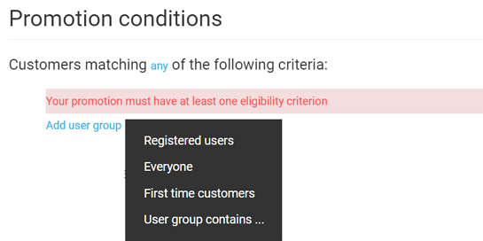
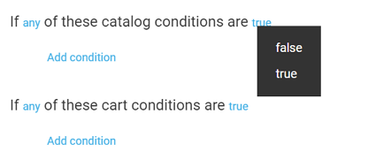
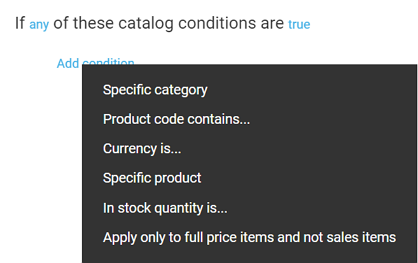
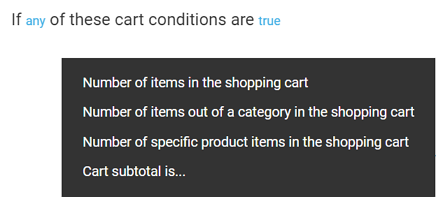
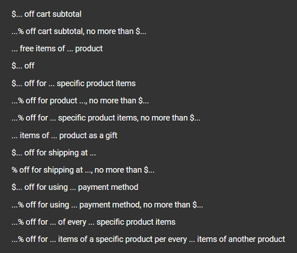
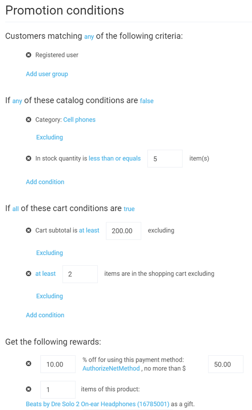

# Promotion Rules

Promotion rules, or conditions, define the behavior and effects of your promotions. Just like [publish conditions](publish-conditions.md) you use for customizing the display of your content, promotion rules allow you to precisely adjust your campaign targeting specific customers, in line with various catalog and cart conditions, and offering specific rewards.

## Customer Targeting

The first promotion condition section you need to configure is the one saying *Customers matching any of the following criteria* (you can click the *any* word and change it to *all* in case you want your promotion applied only to the customers that match all specified criteria). As the warning says, you must provide at least one condition in this section.

After clicking *Add user group*, you will be prompted to select any of the following options:

+ *Registered users*: Your promotion will be valid only for customers that already signed up.
+ *Everyone*: Your promotion will target each and every customer.
+ *First time customers*: Only those signed in customers who are buying something from your store for the first time will get promotion rewards.
+ *User group contains*: The promotion will be valid only for the user group(s) that contain(s) the specified word or phrase.

## Catalog and Cart Conditions

For both catalog and cart conditions, you can not only switch from *any* to *all*, as with customer conditions, but also switch from *true* to *false*:

!!! tip
	Such flexibility, for instance, will allow you to exclude specific categories or products from your promotion or set a minimum purchase amount limit that qualifies for a promotion.

### Catalog Conditions

Configuring catalog conditions is pretty straightforward. You can set specific products, categories, and currencies your promotion will or will not apply to:

You can also exclude specific products from selected categories, set the in-stock quantity, etc.

### Cart Conditions

Cart conditions allow you to speficy such options as number of items in the shopping cart or the cart subtotal, i.e. the assumed purchase amount:

!!! note
	Unlike catalog conditions, cart conditions have additional operators that allow you to build expressions as precisely as possible. For instance, you can configure the purchase amount to be exactly $100, at least $100, or between $100 and $200.

## Rewards

Configuring promotion rewards is the last step of setting promotion conditions. Here, you need to specify the rewards your customers will get within your promotion campaign. Those can be:

+ Free shipping or shipping discount
+ Discounts on specific products
+ Gift items
+ Discount coupons

The complete list of reward options below shows the impressively high level of customizability:

!!! note
	You cannot save your promotion before adding at least one reward.

## Example

The example below showcases the flexibility one might achieve with the promotion condition feature. This promotion is configured in the following way:

+ Only registered users qualify for this promotion.
+ This promotion *does not* apply to the *Cell Phones* category and *is not* valid unless there are more than five items in stock.
+ This promotion is valid only with the purchase amount being at least $200 *and* with at least two items in the shopping cart.
+ Customers qualifying for this promotion will get $10% off (no more than $50) for using a specific payment method *and* a gift item (headphones).

