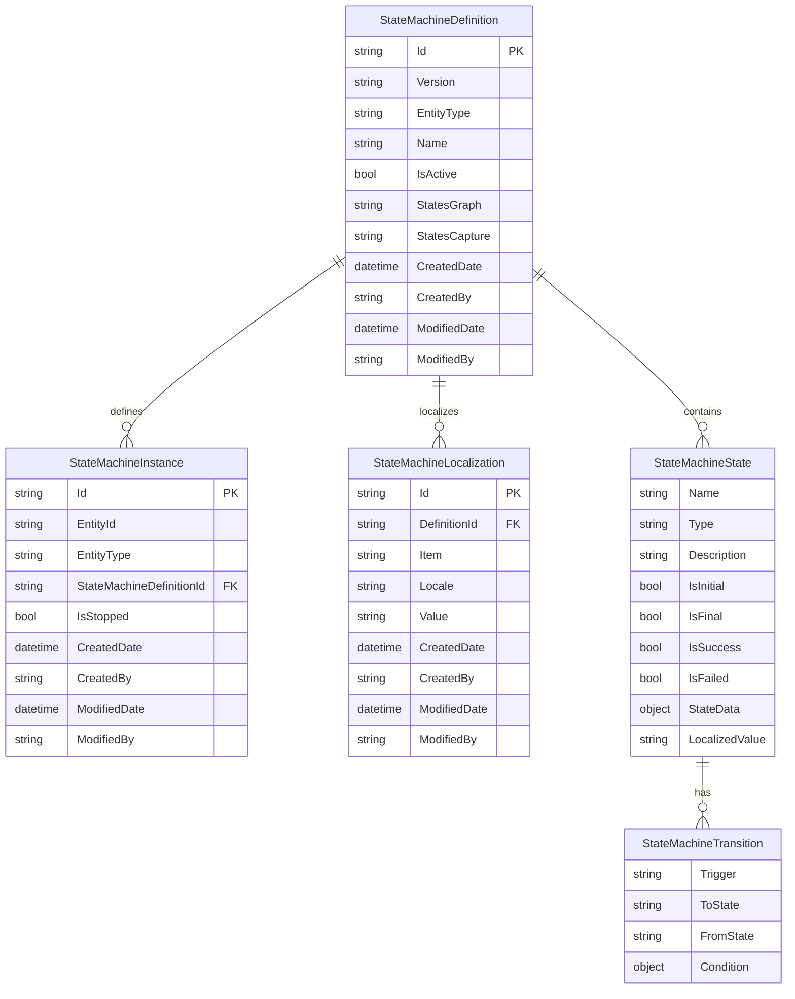

# Data Structure

The State Machine module uses several core data classes to model and manage state machine workflows. Understanding these data structures is essential for implementing custom logic and integrating with the state machine system.

## Core data classes

The following core classes define the building blocks of a state machine. Each class serves a distinct purpose, from modeling workflow definitions to managing runtime instances and supporting localization. Together, they provide the foundation for designing, executing, and extending state-driven business processes.

### StateMachineDefinition

The `StateMachineDefinition` class represents the blueprint for a state machine workflow. It defines the structure, states, and transitions for a specific entity type.

```csharp
public class StateMachineDefinition : AuditableEntity, ICloneable
{
    public string Version { get; set; }
    public string EntityType { get; set; }
    public string Name { get; set; }
    public bool IsActive { get; set; }
    public IList<StateMachineState> States { get; set; }
}
```

| **Property** | **Description** |
|--------------|-----------------|
| Version      | Version identifier for the state machine definition. |
| EntityType   | The type of business entity this state machine applies to (e.g., "Product", "Order"). |
| Name         | Human-readable name for the workflow. |
| IsActive     | Indicates if this definition is currently active. |
| States       | Collection of states that make up the workflow. |


### StateMachineInstance

The `StateMachineInstance` class represents a runtime instance of a state machine bound to a specific business entity.

```csharp
public class StateMachineInstance : AuditableEntity, ICloneable
{
    public string EntityId { get; set; }
    public string EntityType { get; set; }
    public string StateMachineDefinitionId { get; set; }
    public StateMachineDefinition StateMachineDefinition { get; set; }
    public string CurrentStateName { get; set; }
    public StateMachineState CurrentState { get; set; }
    public IEnumerable<string> PermittedTriggers { get; set; }
    public bool IsActive { get; set; }
    public bool IsStopped { get; set; }
}
```

| **Property**            | **Description** |
|--------------------------|-----------------|
| EntityId                 | Unique identifier of the business entity. |
| EntityType               | Type of the business entity. |
| StateMachineDefinitionId | Reference to the state machine definition. |
| CurrentStateName         | Name of the current state. |
| CurrentState             | Full state object with all properties. |
| PermittedTriggers        | List of triggers that can be executed from the current state. |
| IsActive                 | Indicates if the instance is active (not stopped and not in final state). |
| IsStopped                | Manual stop flag for the state machine. |


### StateMachineLocalization

The `StateMachineLocalization` class provides multi-language support for state machines.

```csharp
public class StateMachineLocalization : AuditableEntity, ICloneable
{
    public string DefinitionId { get; set; }
    public string Item { get; set; }
    public string Locale { get; set; }
    public string Value { get; set; }
}
```

| Property  | Description |
|---------------|-----------------|
| DefinitionId  | Reference to the state machine definition. |
| Item          | The item being localized (state name, transition trigger, etc.). |
| Locale        | Language/culture code (e.g., "en-US", "fr-FR"). |
| Value         | Localized text value. |


### StateMachineState

The `StateMachineState` class defines individual states within a state machine.

```csharp
public class StateMachineState : ValueObject
{
    public string Name { get; set; }
    public string Type { get; set; }
    public string Description { get; set; }
    public bool IsInitial { get; set; }
    public bool IsFinal { get; set; }
    public bool IsSuccess { get; set; }
    public bool IsFailed { get; set; }
    public object StateData { get; set; }
    public string LocalizedValue { get; set; }
    public IList<StateMachineTransition> Transitions { get; set; }
}
```

| **Property**    | **Description** |
|-----------------|-----------------|
| Name            | Name of the state. |
| Type            | Type of the state (defines its role or category). |
| Description     | Human-readable description of the state. |
| IsInitial       | Indicates if this is the initial state of the workflow. |
| IsFinal         | Indicates if this is the final state of the workflow. |
| IsSuccess       | Marks the state as a successful completion state. |
| IsFailed        | Marks the state as a failed completion state. |
| StateData       | Additional data associated with the state. |
| LocalizedValue  | Localized display value for the state. |
| Transitions     | List of transitions available from this state. |


## State attributes

| **State Attribute** | **Description** |
|---------------------|-----------------|
| IsInitial | <ul><li>**Purpose**: Marks the starting state for new entities</li><li>**Usage**: "Started" state should have `IsInitial = true`</li><li>**Example**: "Draft" state for new products, "New" state for orders</li></ul> |
| IsFinal   | <ul><li>**Purpose**: Indicates the workflow has completed</li><li>**Usage**: Entities in final states cannot transition to other states</li><li>**Example**: "Completed", "Cancelled", "Archived"</li></ul> |
| IsSuccess | <ul><li>**Purpose**: Marks successful completion of the workflow</li><li>**Usage**: Used with `IsFinal = true` to indicate positive outcomes</li><li>**Example**: "Approved", "Delivered", "Published"</li><li>**Business logic**: Often used for reporting and analytics</li></ul> |
| IsFailed  | <ul><li>**Purpose**: Marks failed completion of the workflow</li><li>**Usage**: Used with `IsFinal = true` to indicate negative outcomes</li><li>**Example**: "Rejected", "Cancelled", "Failed"</li><li>**Business logic**: Triggers error handling and notification processes</li></ul> |


## Data relationships



## Usage examples

### Product approval workflow

```json
{
  "name": "Product Approval",
  "entityType": "Product",
  "isActive": true,
  "states": [
    {
      "name": "Draft",
      "isInitial": true,
      "isFinal": false,
      "isSuccess": false,
      "isFailed": false,
      "transitions": [
        {
          "trigger": "Submit",
          "toState": "PendingReview"
        }
      ]
    },
    {
      "name": "PendingReview",
      "isInitial": false,
      "isFinal": false,
      "isSuccess": false,
      "isFailed": false,
      "transitions": [
        {
          "trigger": "Approve",
          "toState": "Approved"
        },
        {
          "trigger": "Reject",
          "toState": "Rejected"
        }
      ]
    },
    {
      "name": "Approved",
      "isInitial": false,
      "isFinal": true,
      "isSuccess": true,
      "isFailed": false
    },
    {
      "name": "Rejected",
      "isInitial": false,
      "isFinal": true,
      "isSuccess": false,
      "isFailed": true
    }
  ]
}
```

### Using IsSuccess and IsFailed

The `IsSuccess` and `IsFailed` attributes are particularly useful for:

* Reporting and analytics:
    ```csharp
    // Get success rate for product approvals
    var totalProducts = instances.Count();
    var successfulProducts = instances.Count(i => i.CurrentState.IsSuccess);
    var failedProducts = instances.Count(i => i.CurrentState.IsFailed);
    var successRate = (double)successfulProducts / totalProducts * 100;
    ```

* Conditional business logic:
    ```csharp
    // Trigger different actions based on outcome
    if (currentState.IsSuccess)
    {
        // Send success notification
        // Update product status to "Active"
        // Trigger marketing campaigns
    }
    else if (currentState.IsFailed)
    {
        // Send rejection notification
        // Log failure reason
        // Trigger review process
    }
    ```

* Dashboard widgets:
    ```csharp
    // Display workflow statistics
    var stats = new WorkflowStats
    {
        InProgress = instances.Count(i => !i.CurrentState.IsFinal),
        Successful = instances.Count(i => i.CurrentState.IsSuccess),
        Failed = instances.Count(i => i.CurrentState.IsFailed),
        Total = instances.Count()
    };
    ```

## Best practices

| **Area**            | **Description** |
|----------------------|-----------------|
| State Design         | <ul><li>**Keep states simple**: Each state should represent a clear, distinct condition</li><li>**Use meaningful names**: State names should be self-explanatory</li><li>**Plan for localization**: Consider how state names will translate to other languages</li></ul> |
| Transition Design    | <ul><li>**Minimize complexity**: Avoid too many transitions from a single state</li><li>**Use clear triggers**: Trigger names should indicate the action being performed</li><li>**Document conditions**: Complex transition conditions should be well-documented</li></ul> |
| Data Management      | <ul><li>**Version control**: Use the Version field to track state machine changes</li><li>**Audit trails**: Leverage the AuditableEntity base class for change tracking</li><li>**Performance**: Consider indexing frequently queried fields like EntityType and EntityId. </li></ul>


<br>
<br>
********

<div style="display: flex; justify-content: space-between;">
    <a href="../overview">← State Machine module overview</a>
    <a href="../entity-types">Entity types →</a>
</div>