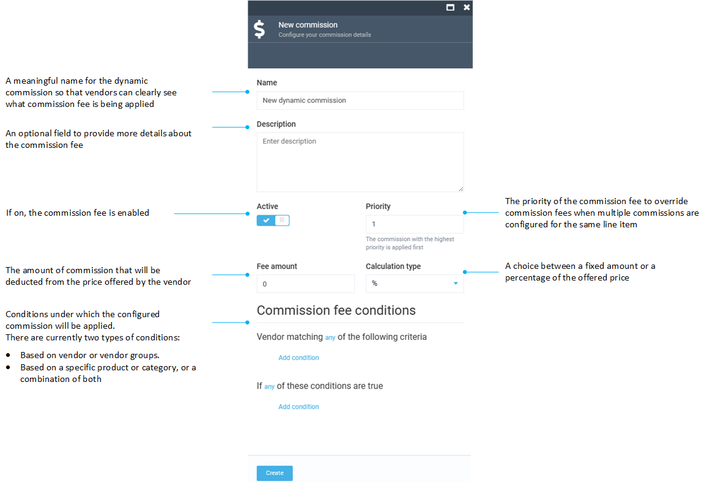

# Dynamic Commission Fees

With the dynamic commission fees feature, you can assign a commission fee that overrides a static commission. The dynamic commissions can be applied to:

* Vendors.
* User groups.
* Products. 
* Product categories. 

It is common to use dynamic when there is a need to override static commissions for a particular products category or a specific product.

Managing dynamic commission fees includes:

* [Adding a new dynamic commission and assigning it to a vendor or a product.](dynamic-commission-fees.md#add-dynamic-commission)
* [Editing a dynamic commission.](dynamic-commission-fees.md#edit-dynamic-commission)
* [Deleting a dynamic commission.](dynamic-commission-fees.md#delete-dynamic-commission)

## Add dynamic commission

To add a new dynamic commission assigned to a vendor or a product:

1. Click **Commissions** in the main menu.
1. In the next blade, select **Dynamic**.
1. In the **Dynamic commissions** blade, click **Add** in the toolbar to add a new dynamic commission. 

    

1. In the new blade, fill in the following fields: 

    

    Let's say, we need want to assign a commission to a laser color printer Epson:

    

1. Click **Create** to save changes.

The commission has been added and assigned to a vendor or a product.

## Edit dynamic commission

To edit a dynamic commission:

1. Click **Commissions** in the main menu.
1. In the next blade, select **Dynamic**.
1. Select the commission you need to edit.
1. In the next blade, edit the desired fields.
1. Click **Save** in the toolbar to save changes.

The modifications have been saved.

## Delete dynamic commission

To delete a dynamic commission:

1. Click **Commissions** in the main menu.
1. In the next blade, select **Dynamic**.
1. Select the commission you need to delete.
1. In the next blade, click **Delete** in the toolbar.
1. Confirm deletion.

The commission has been deleted.

 
 
********

    <a href="../static-commission-fees">← Static commission fees</a>
    <a href="../../vendors-management/vendor-onboarding">Vendor onboarding →</a>

