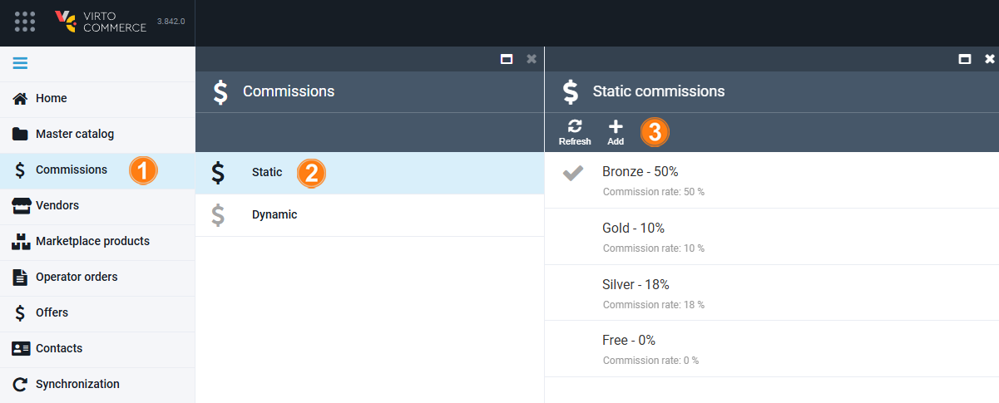
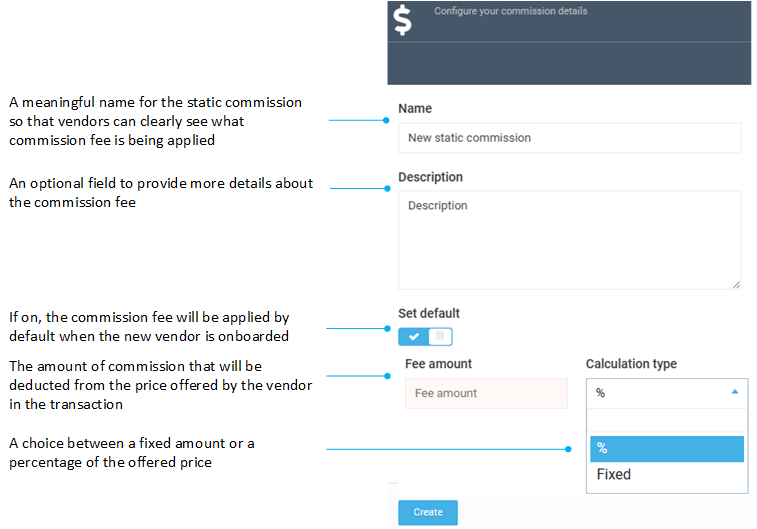

# Static Commission Fees

Static commission fees are the fees that are assigned to a Vendor and applied by default to each transaction of that Vendor. The static commission fee can be set as a percentage of the original transaction or as a fixed amount.

Managing static commission fees includes:

* [Adding a new static commission.](static-commission-fees.md#add-static-commission)
* [Editing a static commission.](static-commission-fees.md#edit-static-commission)
* [Deleting a static commission.](static-commission-fees.md#delete-static-commission)
* [Assigning a static commission to a vendor.](static-commission-fees.md#assign-static-commission)

## Add static commission

To add a new static commission:

1. Click **Commissions** in the main menu.
1. In the next blade, select **Static** to open the list of available commission fees:
1. In the **Static commissions** blade, click **Add** in the toolbar to add a new static commission. 

    

1. In the new blade, fill in the following fields:

    {: style="display: block; margin: 0 auto;" }

1. Click **Create** to save the changes.

The commission has been added.

## Edit static commission

To edit a static commission:

1. Click **Commissions** in the main menu.
1. In the next blade, select **Static** to open the list of available commission fees.
1. In the next blade, select the commission you need to edit.
1. In the next blade, edit the desired fields.
1. Click **Save** in the toolbar to save changes.

The modifications have been saved.

## Delete static commission

!!! Note
    Default commission fee can not be deleted.

To delete a static commission:

1. Click **Commissions** in the main menu.
1. In the next blade, select **Static**.
1. In the next blade, select the commission you need to delete.
1. In the next blade, click **Delete** in the toolbar.
1. Confirm deletion.

The commission has been deleted.

## Assign static commission

To assign a static commission fee to a Vendor:

1. Click **Vendors** in the main menu to open the list of vendors.
1. Select the desired Vendor from the **Vendors** blade to open the vendor details. 
1. Click {: width="20" height="20"} next to the **Commission** field to open the **Static commissions** blade or select a fee from a dropdown list. 
1. Select one of the predefined commission fees or [add a new one](static-commission-fees.md#add-new-static-commission).
1. Click **Save** in the toolbar to save the changes.

!!! note 
    It is common to define Vendor tiers in the marketplace and configure commissions based on the defined vendor levels (e.g. Bronze, Silver, Gold).

The commission has been assigned to a vendor.

 
 
********

    <a href="../overview">← Overview</a>
    <a href="../dynamic-commission-fees">Dynamic commission fees →</a>

