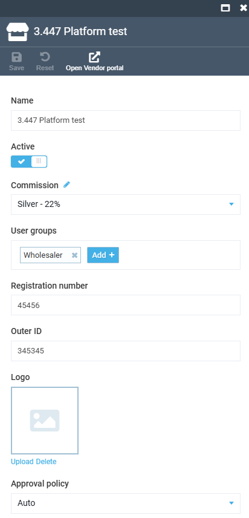
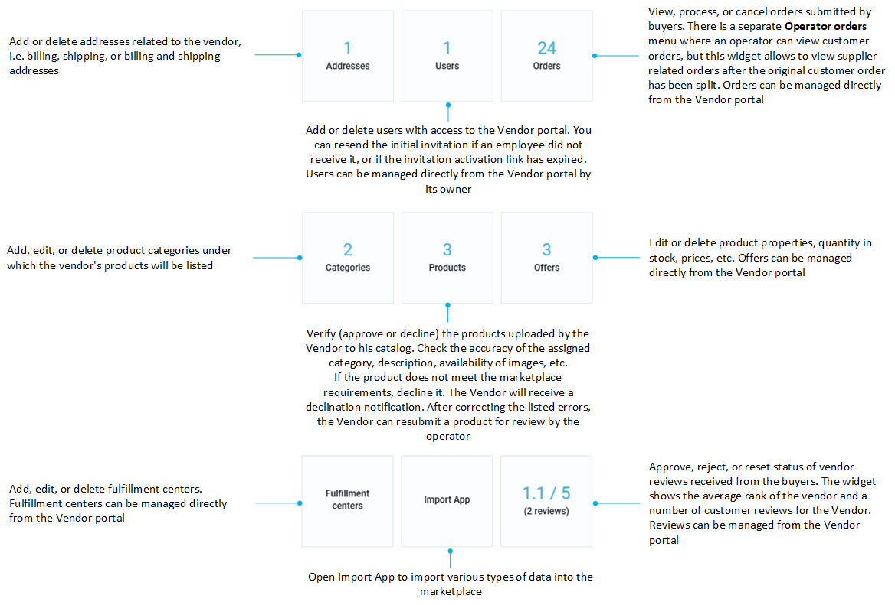

# Vendor Management

Operators can manage vendor information from:

* [Operator portal.](vendor-management.md#manage-vendor-from-operator-portal)
* [Vendor portal.](vendor-management.md#log-in-to-vendor-portal-on-vendor-behalf)

## Manage vendor from Operator portal

To manage a vendor from the Operator portal:

1. Click **Vendor** in the main menu.
1. In the next blade, select a vendor you need to edit.
1. In the next blade, edit the desired information.

    
    
    !!! note
        When configuring the approval policy, select:
        
        * **By operator** if you want to manually review and approve vendors registration to ensure they meet specific standards. 
        * **Auto** if you trust the vendor's compliance and quality and want to reduce the administrative burden on operators.
    
    
      
    In the widget section, you can:

    

1. Click **Save** in the toolbar to save changes.

Your modifications have been saved.

## Log in to Vendor portal on vendor behalf

Operators can access the Vendor portal on behalf of any registered vendor, allowing them to manage vendor-specific settings, troubleshoot issues, and provide direct support without needing the vendor's login credentials. This feature ensures seamless administrative assistance and enhances the overall efficiency of vendor management.

To log in to the Vendor portal on Vendor behalf:

1. Click **Vendor** in the main menu.
1. In the next blade, select a vendor you need to edit.
1. In the next blade, click **Open Vendor portal** in the toolbar.

The Vendor portal opens in a new window. Here you can also switch between Vendors without having to return to the Operator portal:

 
 
********

    <a href="../vendor-onboarding">← Vendor onboarding</a>
    <a href="../../registration-requests">Registration requests →</a>

