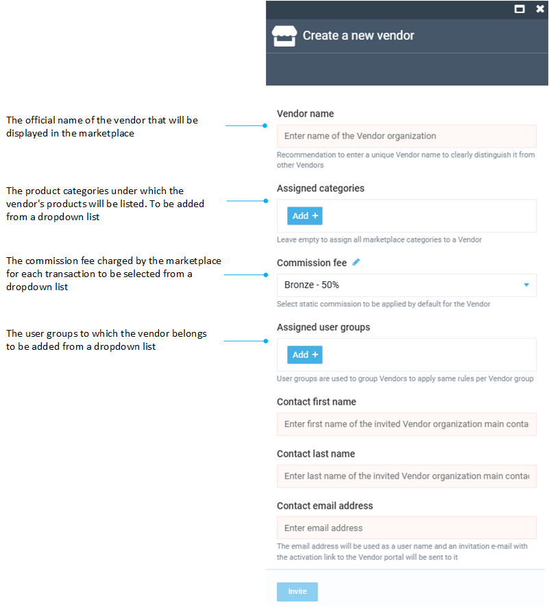

# Vendor Onboarding

Vendors are the key entities in every marketplace. That’s why it is crucial for the operator to have an extensive and user-friendly way of managing them. To onboard (add) a new vendor, the marketplace operator must collect all the necessary vendor information. After that, the operator can start adding new vendor to a marketplace.

## Invite vendor

To add a new vendor:

1. Click **Vendors** in the main menu to open the list of vendors.
1. In the next blade, click **Add** in the toolbar.
1. In the new blade, fill in the following fields:

    {: style="display: block; margin: 0 auto;" }

1. Click **Invite** to send an invitation.

As a result, a new Vendor entity will be added to the list. The vendor owner will receive an email with an account activation link. Once the account is activated, the owner can start using the Vendor portal and work with the Marketplace.

## Add vendor from registration request

Vendors can send registration requests themselves to initiate the onboarding process. The registration form opens for unregistered users:

{: style="display: block; margin: 0 auto;" }

{: width="25"} [Registration requests](../registration-requests.md)

 
 
********

    <a href="../../commission-fees-setup/dynamic-commission-fees">← Dynamic commission fees</a>
    <a href="../vendor-management">Vendor management →</a>

