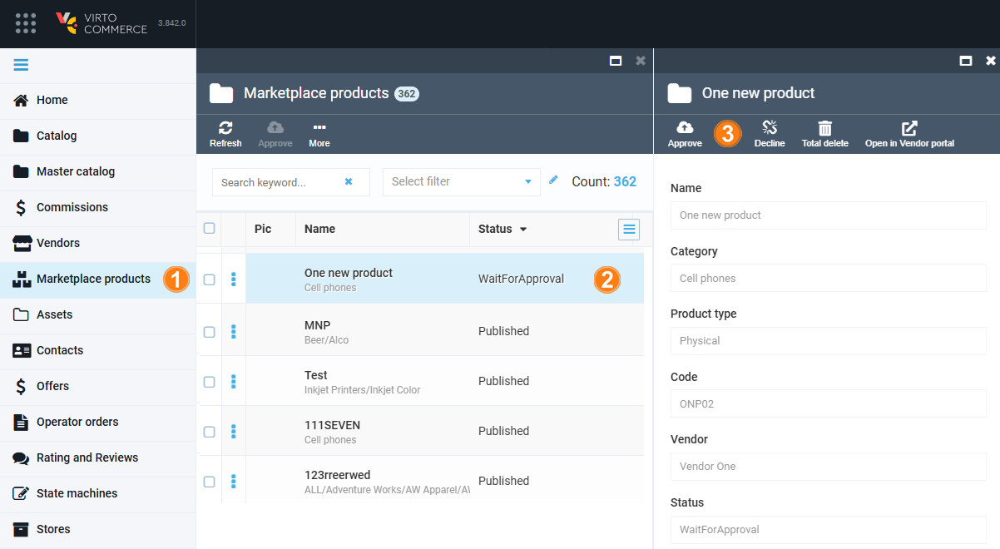
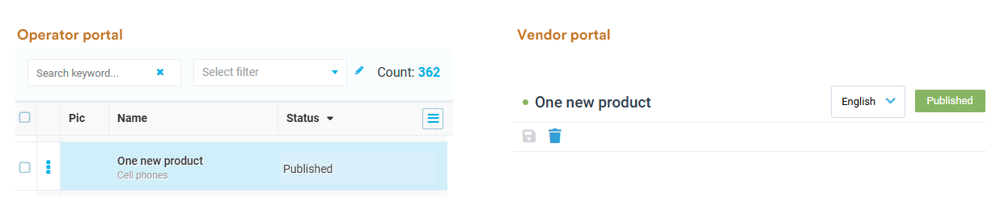
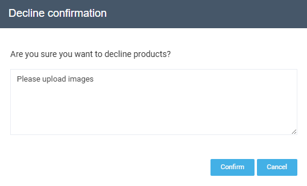
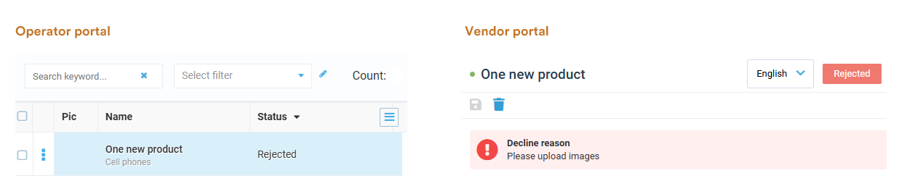
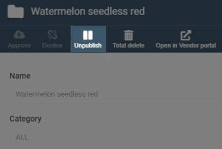
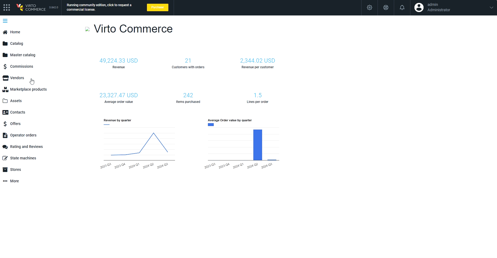

# Marketplace Products

The Operator portal allows operators to manage products uploaded by vendors. The Marketplace products section in the main menu displays all the products uploaded by all vendors in the marketplace, including product descriptions, images, categories, status, and vendor. Operators can list, view, edit, approve, or decline uploaded products and provide the reason for the decline. 

Let's explore most common scenarios and:

* [Approve vendor's product.](marketplace-products.md#approve-product)
* [Decline vendor's product.](marketplace-products.md#decline-product)
* [Manage product from the Vendor portal.](marketplace-products.md#manage-product-from-vendor-portal)

## Approve product

To approve a product uploaded by a vendor in the Vendor portal:

1. Click **Marketplace products** in the main menu to open the list of all products from all marketplace vendors.
1. In the next blade, find products with **Wait for approval** status. Click on the one you need to review.
1. In the next blade, check the correctness of products properties. Click **Approve** in the toolbar if the product information meets the marketplace requirements.

    

The product status in the list of products changes for **Published** in both Operator and Vendor portals:

## Decline product

To decline a product uploaded by a vendor in the Vendor portal:

1. Click **Marketplace products** in the main menu to open the list of all products from all marketplace vendors.
1. In the next blade, find products with **Wait for approval** status. Click on the one you need to review.
1. In the next blade, check the correctness of products properties. Click **Decline** in the toolbar if the products information does not meet the marketplace requirements.
1. In the popup window, specify the reason for decline and confirm the action:

    {: style="display: block; margin: 0 auto;" }

The product status in the list of products changes for **Rejected** in both Operator and Vendor portals:

!!! note
    Operators can now unpublish and republish products. This feature allows operators to quickly remove products that do not meet the marketplace’s standards, have become outdated, or are no longer aligned with the marketplace’s goals.

     

## Manage product from Vendor portal

To manage products directly from the Vendor portal:

1. Click **Marketplace products** in the main menu to open the list of all products from all marketplace vendors.
1. In the next blade, find a product you need to edit.
1. In the next blade, click **Open in Vendor portal** in the toolbar.
1. The Vendor portal opens in a new window:

## Communicate with Vendor

To contact a Vendor directly:

1. Click **Marketplace products** in the main menu to open the list of all products from all marketplace vendors.
1. In the next blade, find the product your want to discuss with the Vendor.
1. In the next blade, click on the **Communication** widget.
1. In the next blade, you can start or continue a conversation. The dialog will appear the same way in the Vendor portal:

 
 
********

    <a href="../registration-requests">← Registration requests</a>
    <a href="../offers">Offers →</a>

