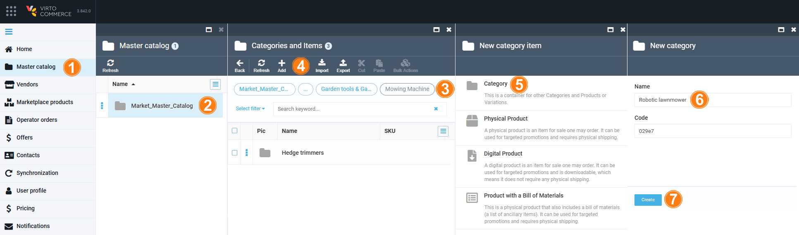
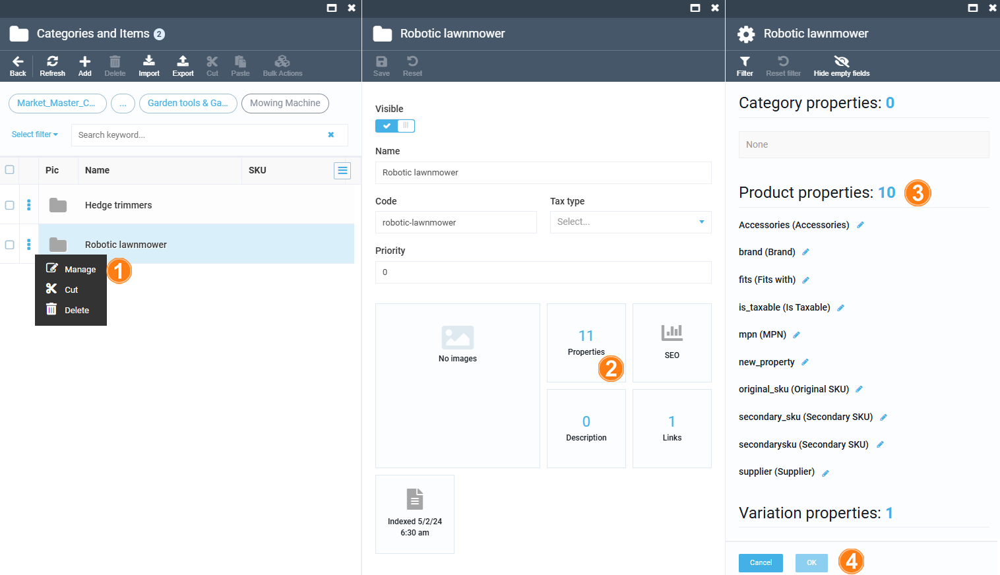
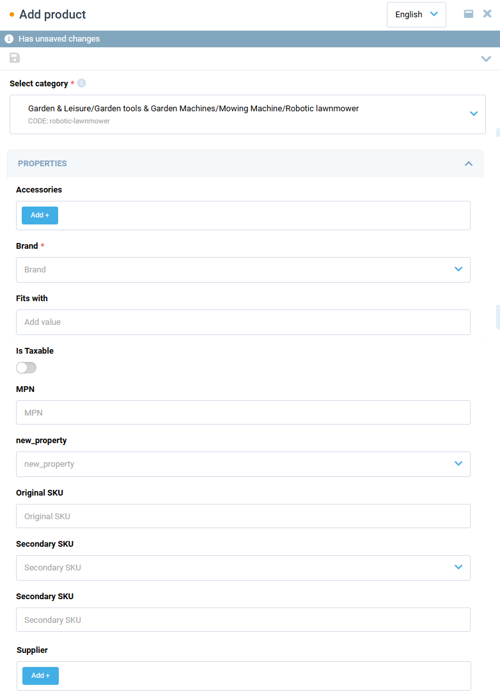

# Master Catalog

The Master catalog serves as the central repository for all products listed in the marketplace. It includes products from all vendors. This ensures a unified and standardized product database. The Marketplace Operator portal allows you to set up a master catalog taxonomy. That is, configure a structure of catalog categories and a set of properties that can be configured for each category. Operators can create and manage product categories and subcategories within the Master catalog. This structure groups products in a logical, easy-to-navigate arrangement. Operators review products submitted by vendors. They approve the products before they appear in the Master catalog.

Let's explore a standard scenario and:

* [Add new category to the master catalog.](master-catalog.md#add-new-category)
* [Adding properties to the newly created category.](master-catalog.md#add-new-category)

## Add new category

To add a new category to the master catalog (for example, a **robotic lawnmower**):

1. Click **Master catalog** in the main menu.
1. In the next blade, select a master catalog.
1. In the next blade, select a category you need to add a new category to. In our example, **Garden and Leisure** --> **Garden tools and garden machines** --> **Mowing machines**. 
1. Click **Add** in the toolbar to add a new item.
1. In the next blade, select an item you need to add. In our case, **Category**.
1. In the next blade, enter the category name.
1. Click **Create** to save the changes.

Your category has been added to the categories and items of master catalog.

## Add properties to category

To add properties to the newly created category:

1. Click the three dots to the left of the name of the newly created category and select **Manage** from the dropdown list.
1. In the next blade, click on the **Properties** widget.
1. In the next blade, manage the properties. 
1. Click **OK** to save the changes.

Your properties have been added to the master catalog and become available for vendors in the Vendor portal:

{: style="display: block; margin: 0 auto;" width="600"}

 
 
********

    <a href="../overview">← Overview</a>
    <a href="../commission-fees-setup/overview">Commissions →</a>

