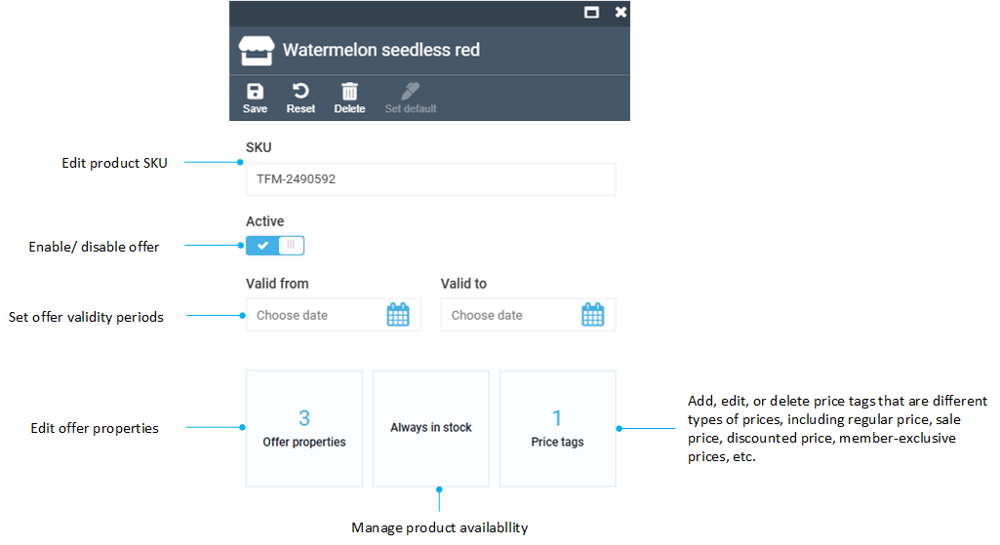

# Offers

The Offers section in the main menu displays all the offers from various vendors. Unlike Marketplace Products, which include product descriptions and images, the Offers section provides e-commerce specific product details such as:

* Product SKUs.
* Availability.
* Price tags, etc.

To manage the offers:

1. Click **Offers** in the main menu.
1. In the next blade, select the offer you need to edit.
1. In the next blade:

    

1. Use the toolbar to save, reset changes, delete offer, or set it as default.

 
 
********

    <a href="../marketplace-products">← Marketplace products</a>
    <a href="../operator-orders">Operator orders →</a>

