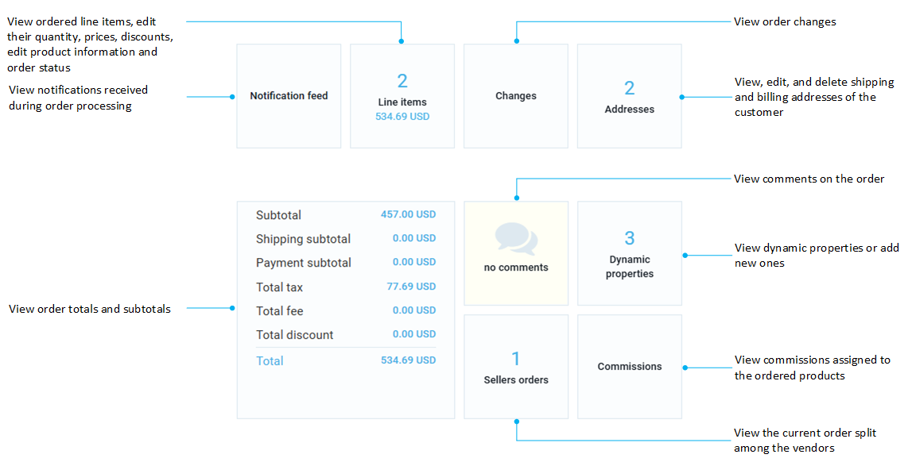

# Operator Orders

The Operator orders section in the main menu displays all the orders as they are submitted by customers via the storefront. In the Operator orders section, you can:

* [View submitted orders.](operator-orders.md#view-orders)
* [Manage submitted orders.](operator-orders.md#manage-orders)

## View orders 

A common scenario is as follows:

1. A customer buys products in the storefront. There can be products from various vendors in one order:

    

1. The operator sees the newly placed order in the Operator orders section:

    

1. The order automatically is split between vendors. Each vendor sees only their part of the order in the Vendor portal:

    === "Vendor 1"
        
    
    === "Vendor 2"
        

## Manage orders

To manage the orders:

1. Click **Operator orders** in the main menu.
1. In the next blade, select the order you need to review.
1. In the next blade:

    

1. In the widget section:

    

1. In the order documents section:

    

1. Use the toolbar to save, reset changes, delete order, cancel document, or get invoice PDF.

 
 
********

    <a href="../offers">← Offers</a>
    <a href="../quotes">Quotes →</a>

