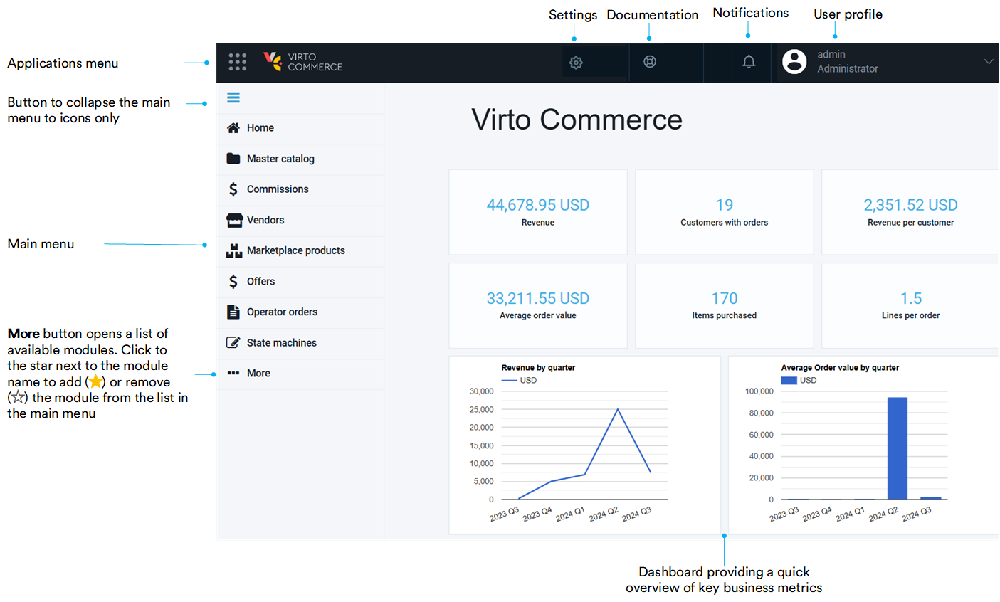

# Overview

The Operator portal in Virto Commerce Marketplace is the main tool for marketplace owners or administrators to manage their marketplace. 

Open the Operator portal homepage to see its structure and main features:

## Key features

While the Operator portal shares a part of the Platform functionality, the following features make it uniquely suited for marketplace management:

* [Creating catalogs for vendors.](master-catalog.md)
* [Vendor onboarding.](Vendors-management/vendor-onboarding.md)
* [Setting static and dynamic commissions for vendors.](Commission-fees-setup/overview.md)
* [Reviewing, approving, and declining products submitted by vendors.](marketplace-products.md)
* [Managing offers submitted by vendors.](offers.md)

 
 
********

    <a href="../master-catalog">Master catalog →</a>

