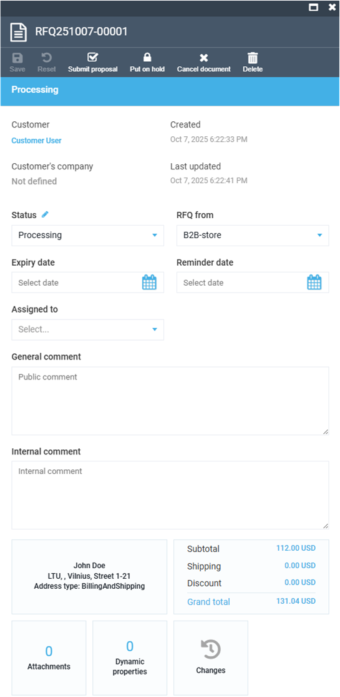

# Quotes

The Quotes section in the main menu displays the list of the quotes submitted to all vendors. You can view the names of vendor and customer, date of creation, quote status, etc:

{: style="display: block; margin: 0 auto;" }

To manage quotes:

1. Click **Quotes** in the main menu.
1. In the next blade, select the quote you need to manage.
1. In the next blade, configure the following:

    {: style="display: block; margin: 0 auto;" }

1. Use the toolbar to submit proposal, put it on hold, cancel or delete the document.

 
 
********

    <a href="../operator-orders">← Operator orders</a>
    <a href="../state-machines">State machines →</a>

