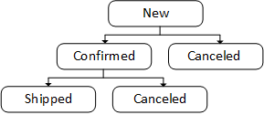

# State Machines

The State machines section manages and automates the various states and their transitions within the marketplace. 

To add a flow:

1. Click **State machines** in the main menu.
1. The next blade lists all the available order state flows. Click **Add** in the toolbar to add a new flow.
1. In the next blade, click **Open Visual Editor**:

    

    !!! note
        The flows are applicable for the following entity types:

          {: style="display: block; margin: 0 auto;" }


1. In the next blade, you can create a flow:

    === "in Visual Editor"
        1. Click **Visual editor** to create a flow:

            1. Click **Add new state** to create a block specifying a state of the flow, for example, **New**:

                {: style="display: block; margin: 0 auto;" width="450"}

            1. Create the second block, such as **Confirmed**, and connect it to the **New** block by extending a line between them. Then, specify the trigger.

                {: style="display: block; margin: 0 auto;" width="450"}
            
            1. Create a third block, such as **Canceled**, and connect it to the **New** block by extending a line between them. Then, specify the trigger.

                {: style="display: block; margin: 0 auto;" width="450"}

            !!! note
                Hovering over transition lines or states highlights the connected units.

        1. Switch to JSON mode to view the flow automatically converted into a JSON file.
        1. Click the checkbox once to mark a status as **Fail**, twice for **Success**, and three times to leave it unmarked:

            {: style="display: block; margin: 0 auto;" }
        


    === "in JSON mode"
        1. Switch to JSON mode in the toolbar.
        1. Type or paste a new flow in the JSON format.

1. Click **Create** in the previous toolbar. 
1. Click **Save** in the toolbar to save the changes.

You new states flow has been added to the list.


Expand the example below to see an order processing workflow algorithm and its JSON representation.

??? Example

    !!! inline end "Order states transition"

        

    ```json
    [
      {
        "id": "New",
        "name": "New",
        "description": "Order created",
        "isInitial": true,
        "isFinal": false,
        "isSuccess": false,
        "isFailed": false,
        "position": {
          "x": 233,
          "y": 44
        },
        "transitions": [
        {
            "id": "transition_uaif3spvc",
            "trigger": "Order confirmed",
            "icon": "",
            "description": "",
            "toState": "Confirmed"
        },
        {
            "id": "transition_xjpksf9n1",
            "trigger": "Order canceled",
            "icon": "",
            "description": "",
            "toState": "Canceled"
        }
        ]
      },
      {
        "id": "Confirmed",
        "name": "Confirmed",
        "description": "Order confirmed",
        "isInitial": false,
        "isFinal": true,
        "isSuccess": false,
        "isFailed": true,
        "position": {
          "x": 56,
          "y": 194
        },
        "transitions": []
      },
      {
        "id": "Canceled",
        "name": "Canceled",
        "description": "Order canceled",
        "isInitial": false,
        "isFinal": true,
        "isSuccess": false,
        "isFailed": false,
        "position": {
          "x": 432,
          "y": 194
        },
        "transitions": []
      }
    ]
    ```


## Edit states in Visual Editor

To edit states in Visual Editor:

1. Open a states flow in Visual Editor.
1. Right-click the state to edit.
1. Select **Edit state** from the popup menu.
1. Edit the following fields:

    {: style="display: block; margin: 0 auto;" }

1. Click **OK** to save the changes.

The state has been modified.

## Add states localizations in Visual Editor

To add states localization in Visual Editor:

1. Open a states flow in Visual Editor.
1. Right-click the state to edit.
1. Select **Edit localization** from the popup menu.
1. Edit the fields as needed:

    {: style="display: block; margin: 0 auto;" }

1. Click **Save**.

Localizations are displayed in the toolbar of the relevant flow according to your profile language settings:

{: style="display: block; margin: 0 auto;" }


## View result in Vendor Portal

The order states flow for orders is applied and displayed in the Vendor Portal as follows:

{: style="display: block; margin: 0 auto;" }


<br>
<br>
********

<div style="display: flex; justify-content: space-between;">
    <a href="../operator-orders">← Operator orders</a>
    <a href="../../Vendor-portal/overview">Vendor portal overview→</a>
</div>


