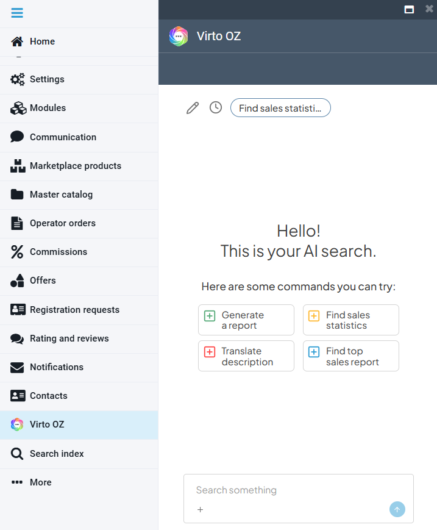

# Virto OZ

You can address **Virto OZ**, our AI assistant, through a dedicated blade. From the blade, you can:

* Use the predefined prompts, the task shortcuts offered for the current blade.
* Add prompts of your own, in natural language.

{: style="display: block; margin: 0 auto;" }

Virto OZ both answers questions and carries out actions on your behalf, showing the result for you to review before it is saved.

The possible scenarios are:

* **Search and analysis**: Locate orders, products, or offers with natural language queries, and run simple analytical requests such as totals or summaries for a given period.
* **Product and catalog management**: Generate and translate product descriptions and localized names, and fill in product properties.
* **Offer management**: Create and update offers, set prices and inventory, distribute stock across warehouses, and set availability dates.

 
 
********

    <a href="../communication">← Communication</a>
    <a href="../../Vendor-portal/overview">Vendor portal overview →</a>

