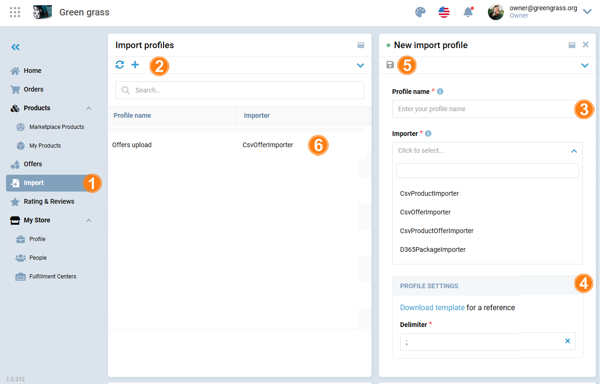

# Import 

To upload large volumes of products and offers simultaneously, vendors can use the **Import** section:

1. Click **Import** in the main menu.
1. In the next blade, click **Add** in the toolbar to add new profile for import.
1. In the next blade, enter profile name, then select importer type from a dropdown list:
    * **CsvProductImporter** to upload product details only.
    * **CsvOfferImporter** to upload offers without changing the product details.
    * **CsvProductOfferImporter** to upload both product details and their associated offers in one go.
    * **D365PackageImporter** to import data specifically from Microsoft Dynamics 365, using its package format.
1. After you fill in the above fields, you can download a template for reference and set a delimiter.
1. Click **Save** in the toolbar to save the changes.
1. Your newly created profile appears in the list. Click on it.

    

1. In the next blade, browse your CSV file or enter its URL.
1. Click **Start import**. You can monitor the upload status below.

When you see the **Completed** status, your products have been successfully uploaded.

 
 
********

    <a href="../offers">← Offers</a>
    <a href="../rating-and-reviews">Rating and reviews →</a>

