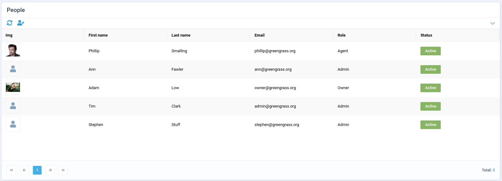
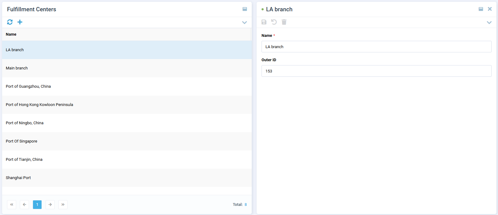

# My Store

The **My Store** section provides vendors with essential tools to manage their store's information and operations. It consists of three key subsections:

* [Profile.](my-store.md#profile)
* [People.](my-store.md#people)
* [Fulfillment Centers.](my-store.md#fulfillment-centers)

## Profile

In this subsection, you can manage your company's basic information:

* Provide your company name and detailed information about the company.
* Enter your company address.
* Upload a company logo.
* View the commission rate assigned to you by the marketplace operator.

## People

This subsection allows you to manage your team members:

* Add employees to your vendor account.
* Upload photos of your employees.
* Activate or deactivate employee accounts.
* Delete employees when necessary.
* Assign roles to employees from a dropdown list, which can restrict access to certain functions within the vendor portal.
* Invite employees.

## Fulfillment centers

This subsection is designed for managing the inventory aspects of your store:

* View the list of available fulfillment centers.
* Add new fulfillment centers to your store's operations.
* Assign external IDs to fulfillment centers for synchronization purposes, such as synchronizing inventory across different systems.

 
 
********

    <a href="../rating-and-reviews">← Rating and reviews</a>

