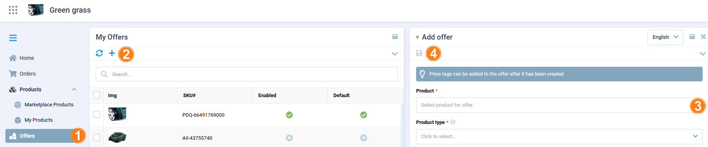
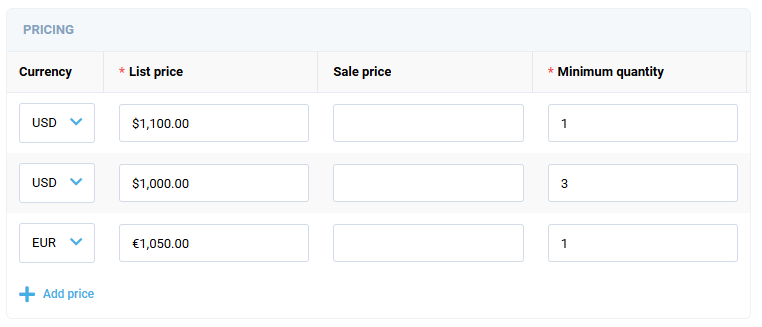
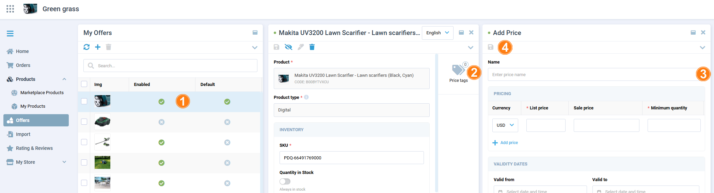
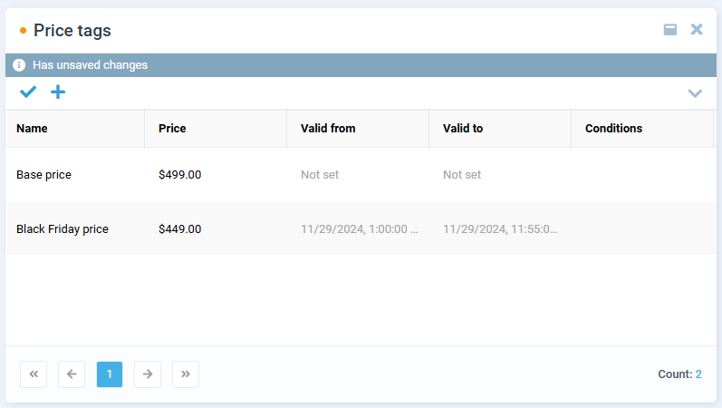

# Offers and Price Tags

The Offers section includes all the offers created by the vendor. Offers are added to product descriptions after they have been approved by the operator portal manager and represent variations of the products.

To complete the product description:

1. [Add offers to the product.](offers.md#add-offers-to-product)
1. [Add price tags to the offers.](offers.md#add-price-tags-to-offer)

## Add offers to product

You can add offers from the Products sections [to your own](products-management.md#add-offer-to-own-product) or [to another vendor's product](products-management.md#add-offer-to-another-vendors-product). Here is another way to add offers to your own product:

1. Click **Offers** in the main menu.
1. In the next blade, click {: width="25"} in the toolbar to add a new offer.
1. In the next blade, select a product for offer from a dropdown list and fill in the required fields.
1. Click {: width="25"} in the toolbar to save the changes.

    

Your offer has been added to the product. Now you can add price tags to the offer.

## Add price tags to offer

For various pricing strategies a vendor might set different price tags for a single product:

1. Select an offer from the offers list.
1. In the next blade, click on the **Price tags** widget.
1. In the next blade, fill in the required fields.

    !!! note
        The Vendor portal supports multi-currencies pricing and volume-based pricing (configured through the [Store module](../../../../platform/user-guide/store/configuring-store)).

        

1. Click {: width="25"} in the toolbar to save the changes.

    

Your price tag has been added to the offer:

