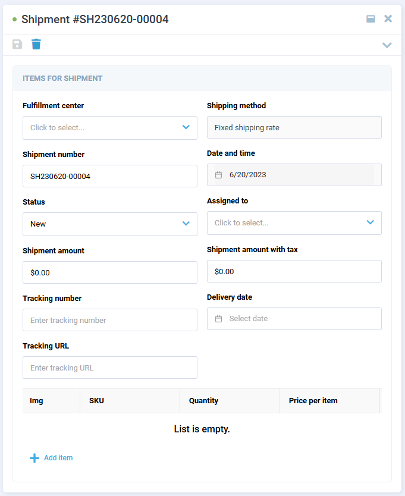

# Orders

The Order segment contains all orders created by the buyers. Here vendors can:

* [Edit orders.](orders.md#edit-order)
* [Process orders.](orders.md#process-order) 
* [Create shipments.](orders.md#create-shipment)

## Edit Order

To edit the order:

1. Click **Orders** in the main menu to open the list of the received orders.
1. In the next blade, select the desired order. The order details will open in the next blade.
1. Click **Edit** in the toolbar.
1. Edit the item quantity.
1. Edit unit price.

    

1. Click {: width="25"} in the toolbar to save the changes. Or click {: width="25"} to cancel the changes.

Your modifications have been applied. 

## Process Order

The newly created orders can be processed as follows:

1. Confirm or cancel the new order. Cancelled orders cannot be further processed.
1. The confirmed order can be packaged or cancelled. Cancelled orders cannot be further processed.
1. The packaged orders can be shipped. Further processing is impossible.

    

!!! note
    Once an order status changes from **New**, the edit button will no longer be available.

{: width="25"} [Setting order states and order flows](../Operator-portal/state-machines.md)

## Create Shipment

To create an order order shipment:

1. Click **Orders** in the main menu to open the list of the received orders.
1. In the next blade, select the desired order. The order details will open in the next blade.
1. In the next blade, click on the **Shipping** widget.
1. In the next blade, click {: width="25"} to add a new shipment.

    

1. In the next blade, fill in the following fields:

    

1. Click {: width="25"} in the toolbar to save the changes.

A new shipment has been created.

!!! note
    Users can also [create shipment documents in the Platform](../../../../platform/user-guide/order-management/managing-documents#create-shipment-documents).

