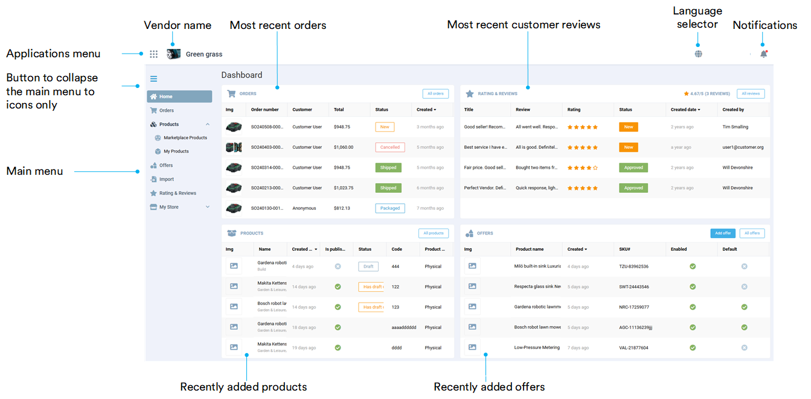

# Overview

The Vendor Portal brings a set of tools to complete all Marketplace related tasks for a vendor. Here a vendor will be able to upload catalog, manage offers (prices and inventory), process orders and much more. It is designed to properly resize on the smaller screens so that a vendor would be able to complete his tasks on mobile devices without having to search for the desktop size screen. So the marketplace will always be in the hands of a vendor.

Open the Vendor Portal homepage to see its structure and main features:

## Key features

The Vendor Portal suggests the following key features for vendors:

* [Products management.](products-management.md)
* [Offers management.](offers.md)
* [Orders processing.](orders.md)
* [Rating and reviews overview.](rating-and-reviews.md)
* [Employees management.](my-store.md#people)
* [Fulfillment centers management.](my-store.md#fulfillment-centers)
* [Organization details editing.](my-store.md#profile)

 
 
********

    <a href="../../Operator-portal/overview">← Operator Portal overview</a>
    <a href="../orders">Orders →</a>

