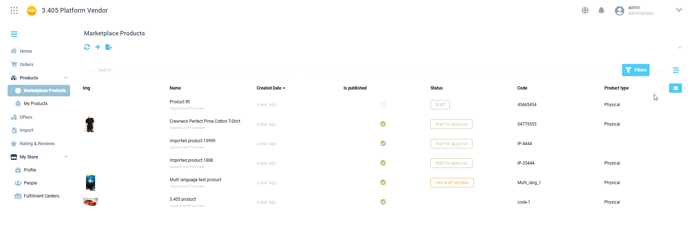
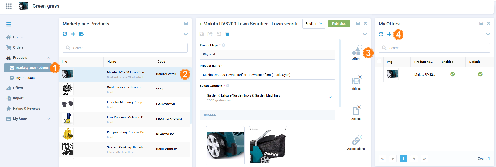
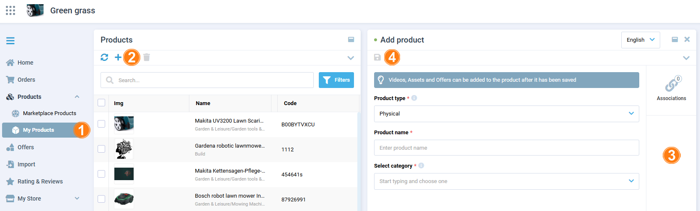
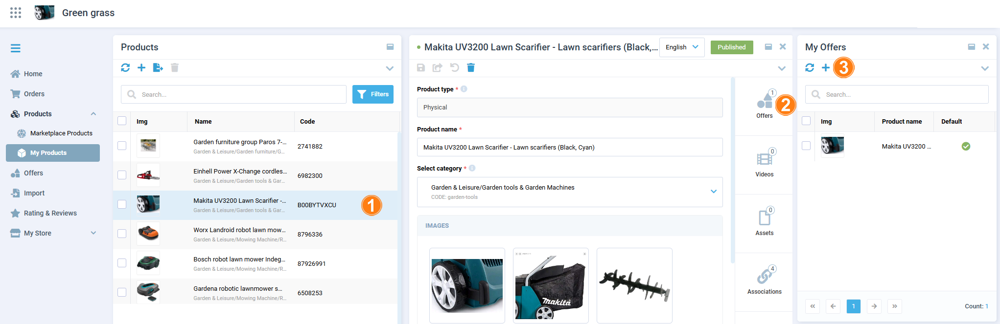
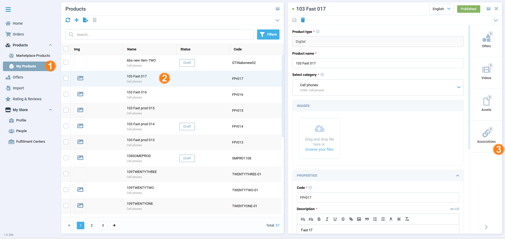
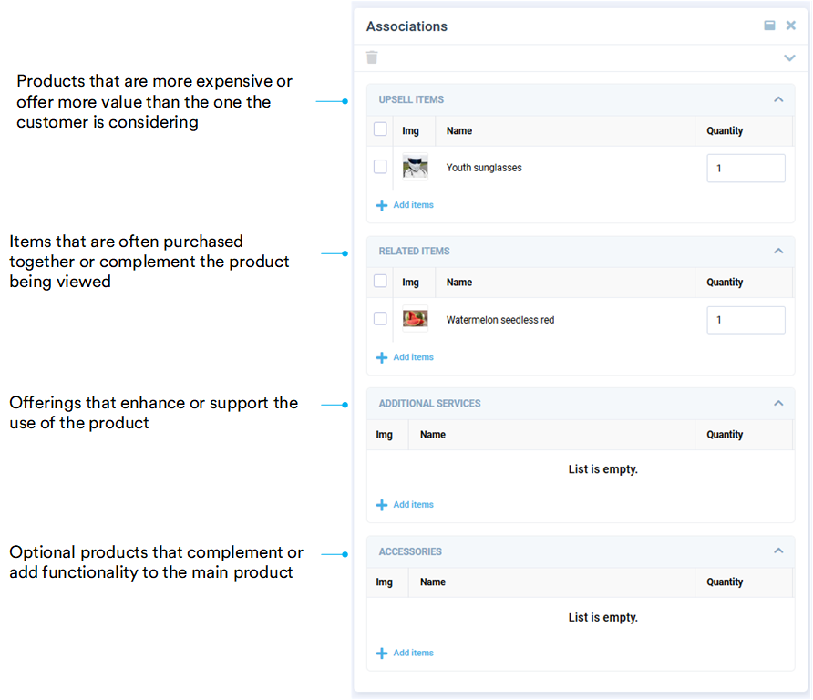

# Products Management

The **Products** menu item includes:

- **Marketplace Products**: Products uploaded by all vendors in the marketplace. Use this section to [add your own offer to another vendor's products](products-management.md#add-offer-to-another-vendors-product). 
- **My Products**: Products uploaded by the current vendor in their marketplace. Use this section to [add your own products](products-management.md#add-own-product) and [offers](products-management.md#add-offer-to-own-product) or [manage product associations](products-management.md#manage-product-associations). 

A product can be associated with multiple offers, each of which provides a specific product variation, its price, and its inventory. Each offer can contain multiple price tags, reflecting various pricing strategies or conditions. In the example below,  the product ("Laptop Model A") is associated with different offers, each offer has multiple price tags:

| **Product**         | **Offer**                             | **Price Tag**            | **Price**       | **Condition/Note**                |
|---------------------|---------------------------------------|--------------------------|-----------------|-----------------------------------|
|   Laptop Model A    |   8GB RAM, 256GB SSD                  | Standard Price           | $799.99         | Regular price                     |
|                     |                                       | Bulk Purchase Price      | $749.99         | When buying 5 or more             |
|                     |                                       | Holiday Sale Price       | $699.99         | Valid during holiday sale         |
|                     |   16GB RAM, 512GB SSD                 | Standard Price           | $999.99         | Regular price                     |
|                     |                                       | Loyalty Member Price     | $949.99         | For loyalty program members       |
|                     |                                       | Pre-Order Price          | $969.99         | Available for pre-orders only     |
|                     |   16GB RAM, 1TB SSD, Refurbished      | Standard Price           | $849.99         | Regular price for refurbished unit|
|                     |                                       | Clearance Price          | $799.99         | Clearance sale                    |
|                     |                                       | Flash Sale Price         | $749.99         | Limited-time offer                |

!!! note
    You can view products either as a list or organized by category:

    

## Add offer to another vendor's product

If you want to add your own offer for a product listed by another vendor:

1. Click **Marketplace Products** in the main menu to open the list of all products in the marketplace.
1. In the next blade, click on the desired product to open its details.
1. In the next blade, click on the **Offers** widget.
1. In the next blade, click {: width="25"} in the toolbar to add your own offer.

    

1. In the next blade, fill in the required fields.
1. Click {: width="25"} in the toolbar to save the changes.

Your offer has been added to the list of offers for the product. Complete your offer by [adding price tags](offers.md#add-price-tags-to-offer). 

## Add own product 

To add your own product to the marketplace:

1. Click **My Products** in the main menu to open the list of your products.
1. In the next blade, click {: width="25"} in the toolbar to add a new product.
1. In the next blade, enter all the descriptive data of the product, such as name, description, code, image(s), etc.

    !!! note
        A vendor can only upload products to the categories assigned to him by a marketplace operator. When a Vendor adds a product, it can only be assigned to one category from the list available to him.

1. Click {: width="25"} in the toolbar to save the changes.

    

1. Click {: width="25"} to submit your product for approval by an Operator portal manager. Only after the product has been approved and the offer for the product has been created it will be available for purchase by a customer.

{: width="25"} [Product approval process](../Operator-portal/marketplace-products.md#approve-product)

Now you can add offer to your product.

### Add offer to own product

After your product has been approved by an Operator portal manager it appears in the list of vendor's products with the **Is published** status. Now you can add your offers (variations) to the published product:

1. Click on the published product in the list of products.
1. In the next blade, click on the **Offers** widget. 
1. In the next blade, click {: width="25"} in the toolbar to add your own offer.

    

1. In the next blade, fill in the required fields.
1. Click {: width="25"} in the toolbar to save the changes.

Your offer has been added to the product. Another way to add offers to your products is described [here](offers.md#add-offers-to-product).

Complete your offer by [adding price tags](offers.md#add-price-tags-to-offer).

## Manage product associations

To increase sales and improve product discovery, Vendors can manage product associations:

1. Click **My Products** in the main menu to open the list of your products.
1. In the next blade, select the desired product.
1. In the next blade, click on the **Associations** widget.

    

1. In the next blade, add associations to the product:

    

The associations have been added.