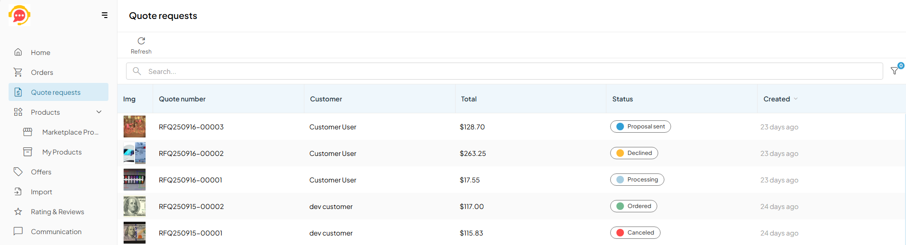

# Quotes 

The Quotes segment contains all quotes submitted to the vendor:

Clicking a quote opens its details. The vendor can either accept the quoted price or modify it.

The created quotes are processed in accordance with the defined [states flow](../Operator-portal/state-machines.md). In this example, the quotes are processed as follows:

1. The submitted quotes require processing. The vendor can either send a proposal or cancel it. Canceled quotes cannot be further processed.
1. If the vendor sends a proposal, the buyer can either place an order if the proposal is acceptable, or decline it. 

    {: style="display: block; margin: 0 auto;" }

{: width="25"} [Setting order states and order flows](../Operator-portal/state-machines.md)

  
  

    <iframe loading="lazy" class="sl-demo" src="https://virtocommerce.storylane.io/demo/le1gzcbrxjyl?embed=inline" name="sl-embed" allow="fullscreen" allowfullscreen style="position:absolute;top:0;left:0;width:100%!important;height:100%!important;border:1px solid rgba(63,95,172,0.35);box-shadow: 0px 0px 18px rgba(26, 19, 72, 0.15);border-radius:10px;box-sizing:border-box;"></iframe>
  

 
 
********

    <a href="../orders">← Orders</a>
    <a href="../products-management">Products →</a>

