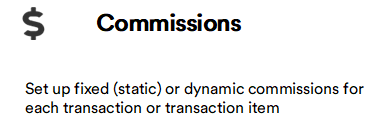
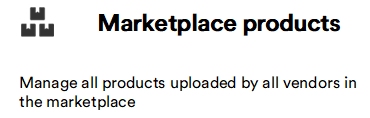
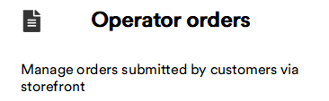
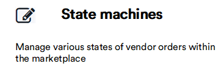
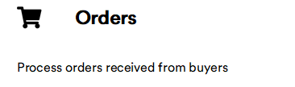
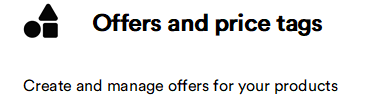
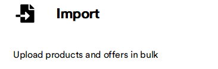

# Marketplace 

Marketplace product introduces a list of predefined features to fulfill common and complex tasks related to the B2B marketplace management. It uses the Virto Atomic architecture principles to bring extensibility to the product to adjust it to the specific project needs.

Our Marketplace solution provides separate self-service portals to manage a range of tasks for each of the primary roles in marketplace management:

* [Operator portal](Operator-portal/overview.md) for operators, i.e. marketplace owners or representatives.
* [Vendor portal](Vendor-portal/overview.md) for vendors, also known as sellers, merchants, distributors, suppliers, etc.

=== "Operator portal"

    The Operator Portal shares many functionalities with the Platform. You can refer to the Platform user documentation for guides on modules like [Catalog](../../../platform/user-guide/catalog/overview), [Pricing](../../../platform/user-guide/pricing/overview), [Notifications](../../../platform/user-guide/notifications/overview), and more. Below are the marketplace specific features:

    |Item|Description|
    |---|---|
    |  | <ul><li> [Add new category to master catalog](Operator-portal/master-catalog.md#add-new-category)</li><li> [Add properties to category](Operator-portal/master-catalog.md#add-properties-to-category) </li></ul>|
    |  | <ul><li> [Add](Operator-portal/Commission-fees-setup/static-commission-fees.md#add-static-commission), [edit](Operator-portal/Commission-fees-setup/static-commission-fees.md#edit-static-commission), or [delete static commissions to vendor](Operator-portal/Commission-fees-setup/static-commission-fees.md#delete-static-commission)</li> <li> [Assign static commission to vendor](Operator-portal/Commission-fees-setup/static-commission-fees.md#assign-static-commission) </li> <li>[Add and assign dynamic commission to vendor or product](Operator-portal/Commission-fees-setup/dynamic-commission-fees.md#add-dynamic-commission)</li> <li>[Edit](Operator-portal/Commission-fees-setup/dynamic-commission-fees.md#edit-dynamic-commission) or [delete dynamic commission](Operator-portal/Commission-fees-setup/dynamic-commission-fees.md#delete-dynamic-commission) </ul>|
    |  | <ul><li> [Onboard (add) new vendors](Operator-portal/Vendors-management/vendor-onboarding.md)</li> <li> [Manage vendor from Operator portal](Operator-portal/Vendors-management/vendor-management.md#manage-vendor-from-operator-portal)</li> <li> [Manage vendor from Vendor portal](Operator-portal/Vendors-management/vendor-management.md#log-in-to-vendor-portal-on-vendor-behalf) </li></ul>|
    |  | <ul><li> [Approve vendor's products](Operator-portal/marketplace-products.md#approve-product)</li> <li> [Decline vendor's products](Operator-portal/marketplace-products.md#decline-product)</li><li> [Manage product from Vendor portal](Operator-portal/marketplace-products.md#manage-product-from-vendor-portal)</li></ul>|
    |  |  <ul><li> [Edit offers, product availability, and price tags](Operator-portal/offers.md)</li></ul>|
    |  |  <ul><li> [View submitted orders](Operator-portal/operator-orders.md#view-orders)</li> <li> [Manage submitted orders](Operator-portal/operator-orders.md#manage-orders)</li></ul> |
    |  |  <ul><li> [View, add, or configure order processing workflows](Operator-portal/state-machines.md)</li></ul>|

=== "Vendor portal"

    |Item|Description|
    |---|---|
    |  | <ul><li> [Edit orders received from buyers](Vendor-portal/orders.md#edit-order)</li><li> [Confirm, cancel, pack, and ship orders](Vendor-portal/orders.md#process-order) </li><li> [Create shipment documents](Vendor-portal/orders.md#create-shipment) </li></ul>|
    |  | <ul><li> [Add products to catalog](Vendor-portal/products-management.md#add-own-product)</li><li> [Add offers to own products](Vendor-portal/products-management.md#add-offer-to-own-product) </li><li> [Add offers to another vendor's products](Vendor-portal/products-management.md#add-offer-to-another-vendors-product) </li> <li>[Add product associations](Vendor-portal/products-management.md#manage-product-associations) </li></ul>|
    |  | <ul><li> [Add offers to your products](Vendor-portal/offers.md#add-offers-to-product)</li><li> [Add price tags to offers](Vendor-portal/offers.md#add-price-tags-to-offer) </li></ul>|
    |  | <ul><li> [Import products and offers in bulk using CSV files](Vendor-portal/import.md)</li></ul>|
    |  | <ul><li> [Monitor feedback submitted by buyers](Vendor-portal/rating-and-reviews.md)</li></ul>|
    |  | <ul><li> [Manage your company's basic information](Vendor-portal/my-store.md#profile)</li><li> [Manage your team members](Vendor-portal/my-store.md#people) </li><li> [Manage the inventory aspects and fulfillment centers](Vendor-portal/my-store.md#fulfillment-centers) </li></ul>|    