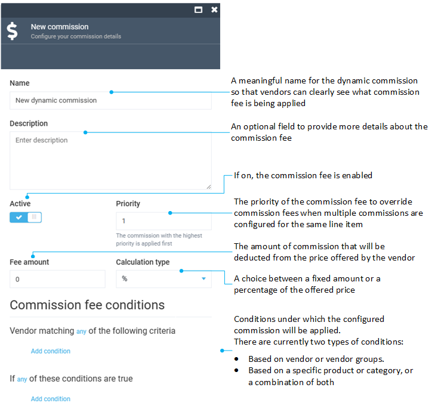

# Dynamic commission fees

Dynamic commission fees allow to flexibly configure a commission fee that overrides a static commission assigned to the Vendor. It is common to use dynamic when there is a need to override static commissions for a particular products category or a specific product.

## Add new dynamic commission

To add new dynamic commission:

1. Click **Commissions** in the main menu.

1. In the next blade, select **Dynamic**.

1. In the **Dynamic commissions** blade, click **Add** in the toolbar to add a new dynamic commission. 

1. In the new blade, fill in the following fields: 

    

1. Click **Create** to save changes.

## Edit existing dynamic commission

To edit a dynamic commission:

1. Click **Commissions** in the main menu.

1. In the next blade, select **Dynamic**.

1. Select the commission you need to edit.

1. In the next blade, edit the desired fields.

1. Click **Save** in the toolbar to save changes.

## Delete existing dynamic commission

To delete a dynamic commission:

1. Click **Commissions** in the main menu.

1. In the next blade, select **Dynamic**.

1. Select the commission you need to delete.

1. In the next blade, click **Delete** in the toolbar.

1. Confirm deletion.
