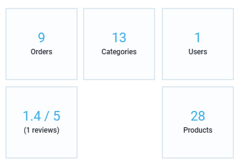
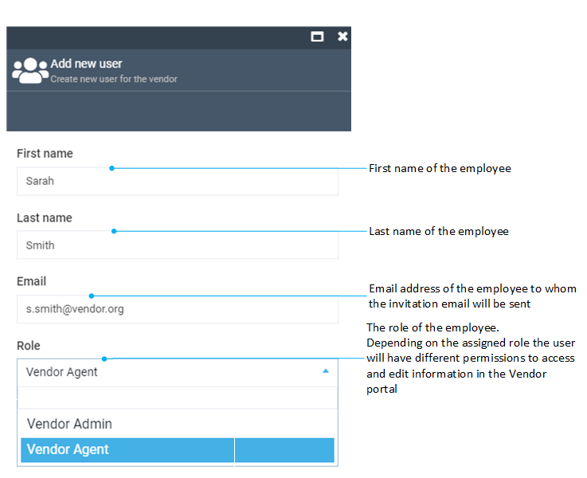
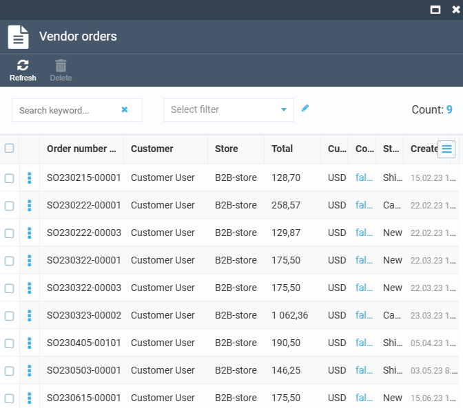
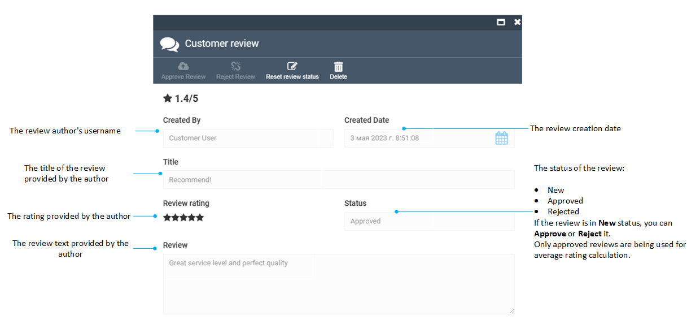

# Vendor management

In this article, we will go through the step-by-step process of editing vendor information and optimizing product management, as well as learning how to assign categories and subcategories to vendors for seamless product uploads. 

## Edit vendor

To edit a vendor:

1. Click **Vendor** in the main menu.
1. Select the vendor you need to edit.
1. In the next blade, edit the desired fields.
1. Click **Save** in the toolbar to save changes.

## Vendor tasks and entities

When you go to the vendor details blade, you see a list of widgets that are shortcuts to specific entities related to the vendor, such as vendor uploaded products, offers, vendor orders, and more. 

### Products

The **Products** widget displays a list of products uploaded by the vendor. From here, you can view, edit, approve, or decline the vendor's products. 

For more information, refer to the [Catalog management](../../Vendor-portal/products-management-by-vendor.md) page.

### Categories

The **Categories** widget allows you to manage the categories to which a vendor can upload products. Vendors can only upload products to categories and subcategories that are assigned to them.

To assign a category or a set of categories to the vendor:

1. Click the **Categories** widget.
1. In the next blade, click **Add** in the toolbar.
1. Check categories to assign to the vendor.
1. Click **Map** in the toolbar.

To remove categories assigned to the vendor:

1. Click the **Categories** widget.
1. In the next blade, check categories to remove from the Vendor.
1. Click **Delete** in the toolbar.
1. Type **Yes** to confirm the deletion, and then click **Confirm**.

### Users. Employees management

The **Users** widget allows you to view and manage the vendor's employees. Here you can add employees, edit existing employee details, change the role for the employee, re-send the invitation email, or delete unused employee accounts.

#### Add new employee

To invite a new employee to the vendor:

1. Click the **Users** widget.
1. In the **Vendor users** blade, click **Add** in the toolbar.
1. In the new blade, fill in the following fields:

    

1. Click **Invite**.

#### Edit employee

To edit an employee:

1. Click the **Users** widget.
1. In the **Vendor users** blade, select the employee you need to edit.
1. Edit the desired fields.
1. Click **Save** in the toolbar.

#### Re-send invitation

This feature can be useful if an employee did not receive the initial invitation email for various reasons, or if the invitation activation link has expired. 

To resend an invitation email with the new activation link:

1. Click the **Users** widget.
1. In the **Vendor users** blade, select the employee you need to resend the invitation to.
1. Click **Resend invite** in the toolbar.

#### Delete employee

To delete an employee:

1. Click the **Users** widget.
1. In the **Vendor users** blade, check the employee(s) you need to delete.
1. Click **Delete** in the toolbar.
1. Confirm the deletion.

### Orders

Although there is a separate **Operator orders** menu where an operator can view customer orders, there is an option to view supplier-related orders after the original customer order has been split: 

1. Click the **Orders** widget to view supplier orders. 
1. Click an order to view its details: customer details, delivery details, items ordered, quantities and prices, status, and more.

    

### Reviews

The **Reviews** widget provides customer feedback on the service level of the vendor. The widget shows the average rank of the vendor and a number of customer reviews for the Vendor.

[Read more about Rating and reviews](){ .md-button }

To view, approve, or reject customer reviews:

1. Click the **Reviews** widget to open a list of reviews left for the vendor by the customers.
1. Click the review item in the list to see its details.
    

