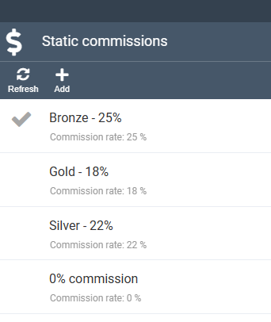
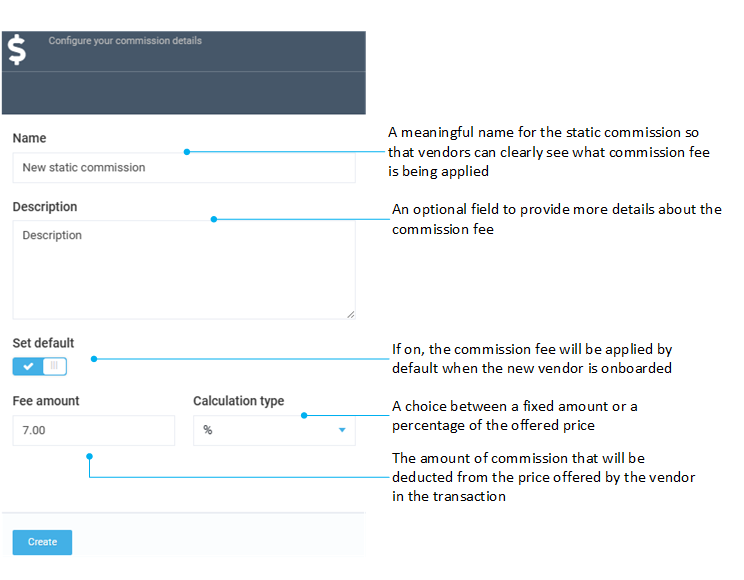

# Static commission fees

Static commission fees allow to configure commissions percentage or fixed that would be assigned to a Vendor and applied (deducted) by default from every transaction (order) of that Vendor. The static commission fee can be set as a percentage of the original transaction OR as a fixed amount.

## Assign static commission fee

To assign a static commission fee to a Vendor:

1. Click **Vendors** in the main menu to open the list of vendors.
1. Select the desired Vendor from the **Vendors** blade to open the vendor details. 
1. Click {: width="20" height="20"} next to the **Commission** field to open the **Static commissions** blade. 
1. Select one of the predefined commission fees or create a new one:

    

!!! Note 
    It is common to define Vendor tiers in the marketplace and configure commissions based on the defined vendor levels (e.g. Bronze, Silver, Gold).

## Add new static commission

To add new static commission:

1. Click **Commissions** in the main menu.

1. In the next blade, select **Static**.

1. In the **Static commissions** blade, click **Add** in the toolbar to add a new static commission. 

1. In the new blade, fill in the following fields:

    

1. Click **Create** to save changes.

## Edit existing static commission

To edit a static commission:

1. Click **Commissions** in the main menu.

1. In the next blade, select **Static**.

1. Select the commission you need to edit.

1. In the next blade, edit the desired fields.

1. Click **Save** in the toolbar to save changes.

## Delete existing static commission

!!! Note
    Default commission fee can not be deleted.

To delete a static commission:

1. Click **Commissions** in the main menu.

1. In the next blade, select **Static**.

1. Select the commission you need to delete.

1. In the next blade, click **Delete** in the toolbar.

1. Confirm deletion.

