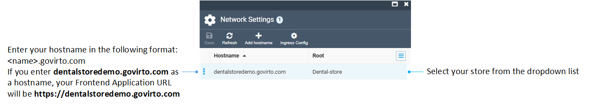
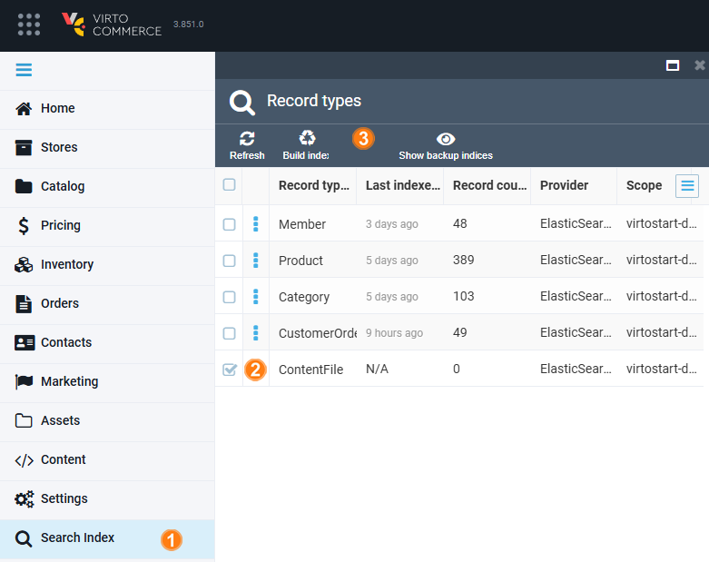

# Deploy on Virto Cloud

Complete the steps described below to deploy Platform and Frontend Application on Virto CLoud. Within this guide, we are going to create a dental store filled with all kinds of dental products.

## Log in to new account

1. Use a new account to [enter the Virto Cloud portal](https://portal.virtocommerce.cloud/#!/login). Our specialists provide every client with login and password for a new account.
1. The portal homepage opens:

    

## Add new environment

You have two options to create environments: 

* Through the Cloud Portal interface if you prefer a guided, visual process. 
* [Via the CLI](create-environment-via-cli-and-vc-build.md) if you need more scriptable, or automated setup options. 

To add a new environment through the Cloud Portal:

1. Click **Environments** in the main menu.
1. In the next blade, click **Add** in the toolbar. 
1. The following blade opens:

    

    Set the following parameters:

    * Environment name (**Dentalstoredemo** in our example).
    * Service plan.
    * Database technology.

1. Click on the **Applications** widget:
    1. In the next blade, click **Platform** to configure the highlighted Platform system settings, then click **Save** in the toolbar:

        

        !!! note
             The dropdown lists contain backend images and image tags provided by Virto Commerce, such as stable bundle images, as well as any custom images you’ve uploaded. For the purpose of this guide, it's best to select the latest (top) possible option available in the dropdown.

    1. Click **Frontend** to configure **System Settings**, then click **Add**, then **Save** in the toolbar:

        

        !!! note
            You can find and copy the theme latest release URL [on GitHub](https://github.com/VirtoCommerce/vc-theme-b2b-vue/releases/latest):

            {: width="400"}

1. Click **Create** in the **New Environment** blade. The system will check for available resources and, if necessary, allocate additional virtual machines to run your application. This process may take up to 5 minutes. Once you see the **Healthy** and **Synced** statuses, you have a fully functional environment, including the following components:

    * Elasticsearch 8.
    * SQL Database.
    * Redis Cache.
    * File Storage System.

## Sign in to backend

Once setup is complete, your environment appears in the list. Click on it to get a link to your application:

To sign in for the first time:

1. Click on the link highlighted above. The login page opens.

    !!! note
        SSL certificates are integrated by default and are automatically renewed, ensuring continuous security.

1. Log in using the default credentials: **admin** as the username and **store** as the password.

    

Now you can configure your Platform.

## Select to create own store from scratch

You will be offered to use sample data (B2B Sample Store), or create your store from scratch (Empty). For the purpose of this guide, we are going to create store from scratch:

## Set own credentials

Next you will be forced to set your own credentials:

!!! warning
    Make sure to save your credentials. Without them, you won’t be able to sign in again.

!!! note
    You can configure additional authentication methods, such as signing in via [Google](/storefront/developer-guide/latest/authentication/adding-google-as-sso-provider#manage-platform-settings) or [Entra ID (formerly Azure AD)](/storefront/developer-guide/latest/authentication/adding-sso-provider).

## Create catalog

To create a store, you must first create a catalog (more specifically, **master catalog**):

1. Click on the **Catalog** module in the main menu.
1. In the next **Catalog** blade, click **Add** in the toolbar.  
1. In the **New catalog** blade, choose the catalog type: physical or virtual. In our example, we are creating a physical catalog.

    {: width="25"} [Learn more about physical and virtual catalogs](../../user-guide/catalog/add-new-catalog)

1. In the next blade, enter the catalog's name (Dental Demo in our case).
1. (Optional) Click on the **Languages** widget to select the required languages in the next blade.
1. (Optional) Click **Save** in the toolbar.
1. Click **Create** to save the changes.

You catalog appears in the list of catalogs.

## Create new store

We are going to create a new store based on the previously created catalog:

1. Click **Stores** in the main menu.
1. In the next blade, click **Add** in the toolbar.
1. In the next blade, fill in the following fields (all are required):

    !!! note
        Remember that the store code should be the same as the name of your Frontend Application specified in the **Frontend system settings** when adding a new environment.

    

1. Click **Create**. Your new store is created, its details open in a new blade.

## Set Frontend Application URL

To set a Frontend Application URL:

1. Open the Portal, then click **Environments** in the main menu.
1. In the next blade, select your newly created environment from the list.
1. In the next blade,  click on the **Network settings** widget.
1. In the next blade, click **Add hostname** in the toolbar.
1. In the next blade, add a hostname and select a root from the dropdown list: 

    

1. Click **Save** in the current, then in the previous two blades.
1. Refresh the list of environments and select your new environment. The Frontend Application URL appears in the URLs list.

    

1. Copy this URL.
1. Open the **Platform** --> **Stores** --> **Your store**.
1. Paste the URL to the **Store URL** field.

    

1. Click **Save** to save the changes.

The Frontend Application URL has been added.

## Configure paths for your store 

To start using your applications, you need to configure the paths and routes corresponding to various services and endpoints that your environment will interact with:

1. In the Cloud Portal, go to **Environments** --> Your environment --> **Network settings**.
1. Select your network.
1. In the next blade, click **Add path** in the toolbar to add the following paths and routes: 

    | Path          | Route     |
    |---------------|-----------|
    | /xapi         | Platform  |  
    | /files        | Platform  |    
    | /connect/token| Platform  |    
    | /graphql      | Platform  |    
    | /revoke/token | Platform  |    
    | /api/files    | Platform  |    
    | /externalsignin| Platform |    
    | /signin-oidc  | Platform  |    
    | /signin-google| Platform  |

    

1. Click **Save** in the current blade, then in the previous two blades. 

Your Frontend Application paths have been successfully added.

## Review search index

Verify that all the records you added have been indexed:

1. Click **Search index** in the main menu.
1. In the next blade, check if all record types have been indexed. If you find any unindexed records, select them.
1. Click **Build index** in the toolbar.

    

1. Click **Build** in the popup window.

All added records have been indexed.

You can start using your environments!

 
 
********

    <a href="../">← Overview </a>
    <a href="../create-environment-via-cli-and-vc-build">Create environment via CLI and VC Build →</a>

