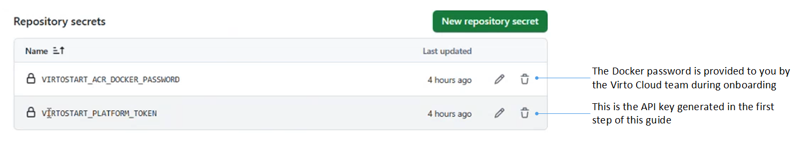

# Enable GitOps

To ensure that your environments are always up to date with the latest configurations, enable GitOps.

For demonstration purposes, let's update the Platform from version 3.851 to 3.852:

!!! warning
    When upgrading to a version significantly beyond the current one, it is recommended to first test it on a local machine to check module compatibility with the new version.  If a module version is incompatible with the Platform, the system may show a **Degraded** status during the update. Refer to the [Troubleshooting](enable-gitops.md#troubleshooting) section to learn how to identify the causes of errors.

## Set up Virto Cloud Portal

1. Open the Virto Cloud Portal and select **Environments** in the main menu.
1. In the next blade, click **Api key** in the toolbar. The generated API key opens in the next blade. Copy it to clipboard to use later.
1. Select your environment.
1. In the next blade, switch the **GitOps** option to on.
1. Click **Save** in the toolbar.
1. Click **Download manifest**. 

## Set up GitHub

1. Download the [initial GitOps template for Virto Cloud](https://github.com/VirtoCommerce/vc-deploy-dev/tree/template/) as a ZIP archive (click **Code**, then **Download ZIP**): 

    

    It contains the minimal setup required for Virto Cloud and GitHub.

1. Create a new repository to store your configuration. Go to your personal or organization account in GitHub, open the **Repositories** tab, then click **New**. Give it a descriptive name (**vc-deploy-dental** in our case).
1. Clone the repository, open it locally.
1. Unzip and copy the downloaded template structure into the cloned repository.
1. Make the first commit and open the template. Adjust the files from the template to link it to your environment:

    

1. Commit and push changes to your repository.

### Manage secrets

1. In your repository, go to **Settings** --> **Secrets and variables** --> **Actions** --> **New repository secret**.
1. Add the secrets (VIRTOSTART_ACR_DOCKER_PASSWORD and VIRTOSTART_PLATFORM_TOKEN), that are required for the automation workflows to access Virto Cloud and deploy changes:

    

    !!! note
        The secrets can be edited. However, you will not see previously saved values when editing. 

## Run workflows

Let's check how the following workflows work:

* [Cloud infra deployment.](enable-gitops.md#cloud-infra-deployment)
* [Cloud platform deployment.](enable-gitops.md#cloud-platform-deployment)

### Cloud infra deployment

1. In your repository, go to **Actions** tab, then click **Cloud infra deployment**.
1. By default, this action is triggered automatically when there’s a commit to the main branch. Alternatively, you can start it manually by clicking **Run workflow**:

    

1. Monitor the update process:
    
    
    
The **Synced** and **Healthy** statuses indicate that the process is complete.

### Cloud platform deployment

1. In your repository, go to **Actions** tab, then click **Cloud platform deployment**.
1. By default, this action is triggered automatically when there’s a commit to the main branch. Alternatively, you can start it manually by clicking **Run workflow**:

    

1. Monitor the update process:

    
    
The **Synced** and **Healthy** statuses indicate that the process is complete.

The Platform version has been successfully updated:

## Troubleshooting

If you encounter issues, such as a **Degraded** status, you can identify the cause as follows:

1. Go to **Environments** --> Your environment --> **Applications** --> **Platform**
1. Click **Logs** in the toolbar.
1. The Platform logs open in the next blade. Find the degradation reason. 
1. If you need any assistance resolving the error, please [contact our support team](http://help.virtocommerce.com).

 
 
********

    <a href="../create-page-in-builder-io">← Create page in Builder.io </a>

