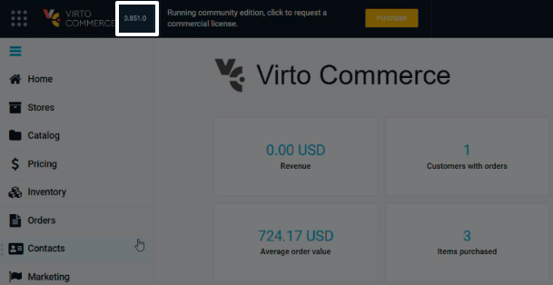
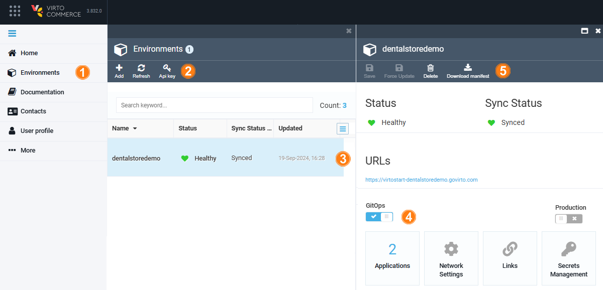
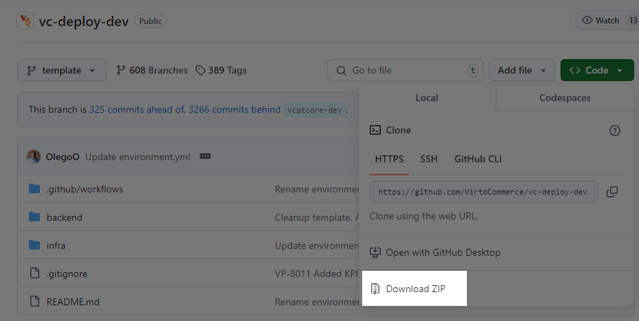
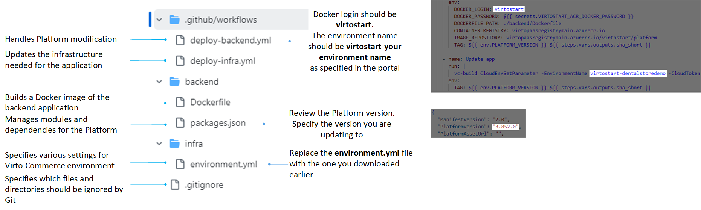
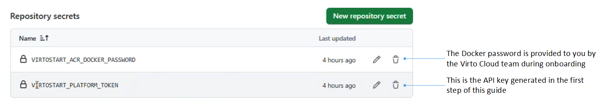
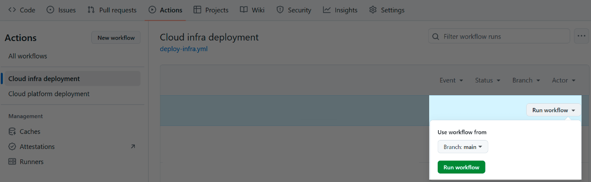
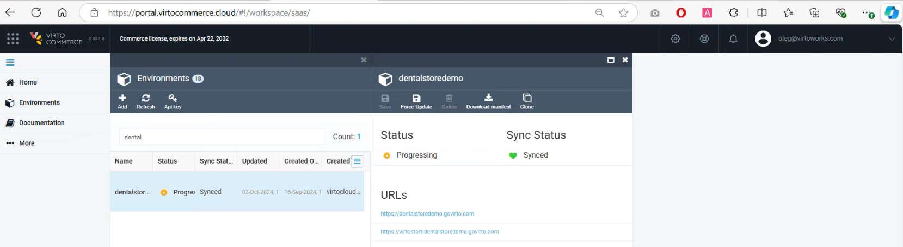
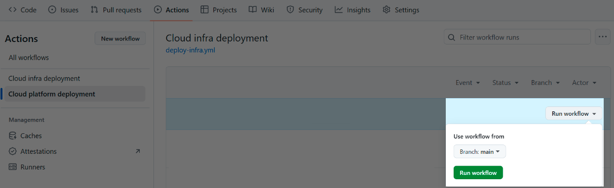
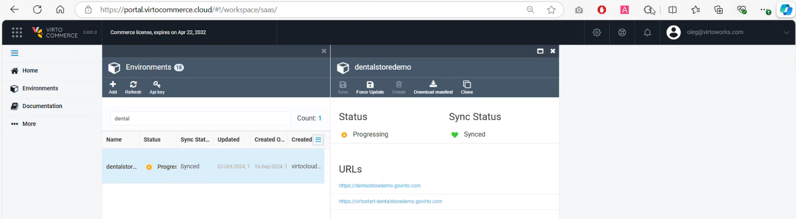
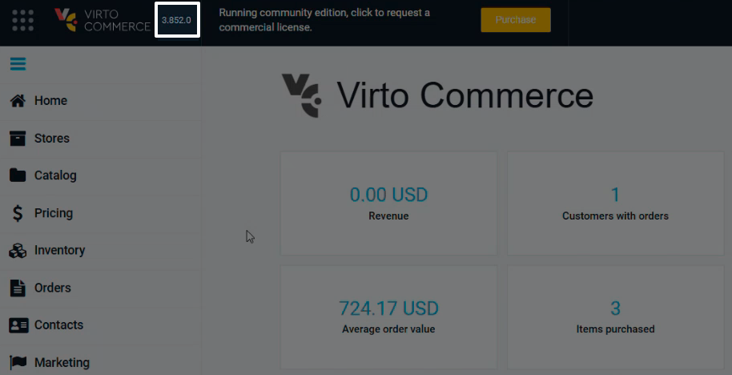

# Enable GitOps

To ensure that your environments are always up to date with the latest configurations, enable GitOps.

For demonstration purposes, let's update the Platform from version 3.851 to 3.852:

{: style="display: block; margin: 0 auto;" }

!!! warning
    When upgrading to a version significantly beyond the current one, it is recommended to first test it on a local machine to check module compatibility with the new version.  If a module version is incompatible with the Platform, the system may show a **Degraded** status during the update. Refer to the [Troubleshooting](enable-gitops.md#troubleshooting) section to learn how to identify the causes of errors.

## How GitOps works on Virto Cloud

With GitOps, a Git repository is the single source of truth for your environment's configuration and deployed versions. You do not change a running environment from the portal. Instead, you commit a change to the repository, for example a new Platform image tag or a module version, and the rest is automated.

Virto Cloud runs on Kubernetes and uses Argo CD to continuously reconcile your environment with the state declared in your repository:

1. You commit and push a change to your deployment repository.
1. A GitHub Actions workflow builds and pushes the required artifacts, then updates the environment.
1. Argo CD detects the change and reconciles the environment so that it matches the repository.
1. The portal reports the result as [sync and health statuses](#sync-and-health-statuses).

Every change is auditable and repeatable: the repository history is the deployment history, and rolling back is a Git operation.

## Set up Virto Cloud Portal

1. Open the Virto Cloud Portal and select **Environments** in the main menu.
1. In the next blade, click **Api key** in the toolbar. The generated API key opens in the next blade. Copy it to clipboard to use later.
1. Select your environment.
1. In the next blade, switch the **GitOps** option to on.
1. Click **Save** in the toolbar.
1. Click **Download manifest**. 

{: style="display: block; margin: 0 auto;" }

## Set up GitHub

1. Download the [initial GitOps template for Virto Cloud](https://github.com/VirtoCommerce/vc-deploy-dev/tree/template/) as a ZIP archive (click **Code**, then **Download ZIP**): 

    {: style="display: block; margin: 0 auto;" }

    It contains the minimal setup required for Virto Cloud and GitHub.

1. Create a new repository to store your configuration. Go to your personal or organization account in GitHub, open the **Repositories** tab, then click **New**. Give it a descriptive name (**vc-deploy-dental** in our case).
1. Clone the repository, open it locally.
1. Unzip and copy the downloaded template structure into the cloned repository.
1. Make the first commit and open the template. Adjust the files from the template to link it to your environment:

    {: style="display: block; margin: 0 auto;" }

1. Commit and push changes to your repository.

### Repository structure

The template contains the minimal set of files that link your repository to your Virto Cloud environment:

| Path | Purpose |
| --- | --- |
| **infra/environment.yml** | Declares the environment and ties the repository to it. Edit this to point the template at your environment. |
| **backend/packages.json** | Lists the Platform version and the modules, with their versions and sources, to install. |
| **backend/Dockerfile** | Builds the Platform backend image that the environment runs. |
| **.github/workflows/deploy-infra.yml** | The **Cloud infra deployment** workflow. |
| **.github/workflows/deploy-backend.yml** | The **Cloud platform deployment** workflow. |

### Manage secrets

1. In your repository, go to **Settings** --> **Secrets and variables** --> **Actions** --> **New repository secret**.
1. Add the secrets (VIRTOSTART_ACR_DOCKER_PASSWORD and VIRTOSTART_PLATFORM_TOKEN), that are required for the automation workflows to access Virto Cloud and deploy changes:

    {: style="display: block; margin: 0 auto;" }

    !!! note
        The secrets can be edited. However, you will not see previously saved values when editing. 

## Run workflows

Let's check how the following workflows work:

* [Cloud infra deployment.](#cloud-infra-deployment)
* [Cloud platform deployment.](#cloud-platform-deployment)

### Cloud infra deployment

1. In your repository, go to **Actions** tab, then click **Cloud infra deployment**.
1. By default, this action is triggered automatically when there’s a commit to the main branch. Alternatively, you can start it manually by clicking **Run workflow**:

    {: style="display: block; margin: 0 auto;" }

1. Monitor the update process:
    
    {: style="display: block; margin: 0 auto;" }
    
The **Synced** and **Healthy** statuses indicate that the process is complete.

### Cloud platform deployment

1. In your repository, go to **Actions** tab, then click **Cloud platform deployment**.
1. By default, this action is triggered automatically when there’s a commit to the main branch. Alternatively, you can start it manually by clicking **Run workflow**:

    {: style="display: block; margin: 0 auto;" }

1. Monitor the update process:

    {: style="display: block; margin: 0 auto;" }
    
The **Synced** and **Healthy** statuses indicate that the process is complete.

The Platform version has been successfully updated:

{: style="display: block; margin: 0 auto;" }

## Sync and health statuses

Virto Cloud reports the outcome of each deployment through the Argo CD sync and health statuses shown next to the environment and its applications:

| Status | Meaning |
| --- | --- |
| **Synced** | The environment matches the configuration declared in your repository. |
| **Healthy** | The application started and is running normally. |
| **Degraded** | The application failed to reach a healthy state, for example because a module version is incompatible with the Platform. |

While a workflow runs, an application is briefly out of sync until Argo CD finishes reconciling it. **Synced** together with **Healthy** indicates the deployment is complete. A **Degraded** status calls for the [Troubleshooting](#troubleshooting) steps below.

## Roll back changes

Because the repository is the source of truth, you roll back by reverting the change in Git rather than editing the environment directly:

1. Revert the commit that introduced the problem, for example with `git revert`, or change the version back in **backend/packages.json**.
1. Commit and push to the main branch.
1. The deployment workflow runs again, and Argo CD reconciles the environment back to the previous state.

## Troubleshooting

If you encounter issues, such as a **Degraded** status, you can identify the cause as follows:

1. Go to **Environments** --> Your environment --> **Applications** --> **Platform**
1. Click **Logs** in the toolbar.
1. The Platform logs open in the next blade. Find the degradation reason. 
1. If you need any assistance resolving the error, please [contact our support team](http://help.virtocommerce.com).

 
 
********

    <a href="../create-page-in-builder-io">← Create page in Builder.io </a>

