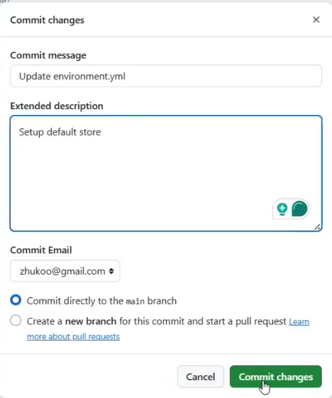
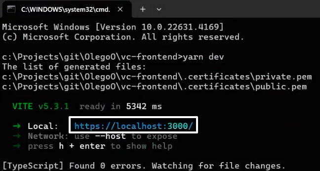

# Virto Commerce Frontend Customization and Deployment on Virto Cloud

This guide provides detailed instructions to help you customize the Virto Commerce Frontend application and deploy it to the Virto Cloud environment. Complete the following steps:

1. [Ensuring local machine connectivity.](#ensure-local-machine-connectivity)
1. [Forking the frontend repository.](#fork-frontend-repository)
1. [Customizing frontend.](#customize-frontend)
1. [Preparing application for deployment.](#prepare-application-for-deployment)
1. [Preparing artifact for release.](#prepare-artifact-for-release)
1. [Releasing Frontend Application.](#release-frontend-application)
1. [Deploying customized Frontend Application.](#deploy-customized-frontend-application)
1. [Verifying results.](#verify-result)

This guide outlines the steps for customizing the Virto Commerce Frontend and deploying it to Virto Cloud.

## Ensure local machine connectivity

Let's explore some methods of identifying stores:

1. Identification via Platform:

    1. Open the Platform, then go to **Stores** --> **Your store** (Dental Demo Store in our case) --> **Store URL**.
    1. Ensure the store URL is specified correctly:

        {: style="display: block; margin: 0 auto;" }

1. Identification via **environment.yml**:

    1. Open your GitHub repository, then go to **Files** --> **environment.yml**.
    1. Copy the code of the store from **Platform** --> **Stores** --> **Your store** (Dental Demo Store in our case) --> **Store URL**:

        {: style="display: block; margin: 0 auto;" }

    1. Paste it to the **environment.yml** file:

        {: style="display: block; margin: 0 auto;" }

        After this, any undefined query will automatically redirect to the specified store. 
    
        !!! note
            This is for demonstration purposes only. To fully meet security requirements, specify allowed local hosts ports.   

    1. Commit the changes:

        {: style="display: block; margin: 0 auto;" }

    1. Go to the **Actions** tab to confirm the action is running:

        {: style="display: block; margin: 0 auto;" }

## Fork Frontend repository

1. Open the [Virto Commerce Frontend repository](https://github.com/VirtoCommerce/vc-frontend).
1. Click on the **Fork** button. GitHub will prompt you to choose where to fork the repository, usually defaulting to your own GitHub account.
1. Click **Create fork**:

    {: style="display: block; margin: 0 auto;" }

1. Open the forked repository in your GitHub account:

    {: style="display: block; margin: 0 auto;" }

1. Follow the **Getting started** instructions to start working with your copy.

## Customize Frontend

Add themes, logos, icons, configure the catalog and categories, setup the main menu and footer as described in previous guides. Additionally: 

1. Add **.env** file to your forked frontend repository to specify the backend application URL: 

    {: style="display: block; margin: 0 auto;" }

1. Use `yarn dev`to run your Frontend Application on your local machine. 
1. Use the provided URL to open your Frontend Application:

    {: style="display: block; margin: 0 auto;" }

Your application runs correctly with all customizations applied:

{: style="display: block; margin: 0 auto;" }


## Prepare application for deployment

1. Run `yarn build` to build and package the modified application, preparing it as an artifact for deployment. 
1. The **dist** folder containing artifacts appears in the forked repository:

    {: style="display: block; margin: 0 auto;" }


## Prepare artifact for release

For demonstration purposes, let's release the artifact manually. A typical Virto Commerce Frontend Application release contains a ZIP file with the following structure:

```text
├── vc-theme-b2b-vue-....zip  
|   ├── default               
|   |   ├── assets
|   |   |   └──...
|   |   ├── config
|   |   |   └──...
|   |   ├── content
|   |   |   └──...
|   |   ├── static
|   |   |   └──...
|   |   ├── firebase-messaging-sw.js
|   |   ├── index.html
|   |   ├── robots.txt
```


The **default** folder contains the artifacts similar to those created in the previous step. 

Let's create a ZIP archive with the artifacts generated in the previous step:

1. Create a folder and name it according to the current project (vc-dental-store-2.6 in our case).
1. Inside this folder, create another folder named **default**.
1. Copy the previously prepared artifacts and paste them into the **default** folder.
1. Zip the **vc-dental-store-2.6** folder.


## Release frontend application

1. Go to your forked repository.
1. Click **Releases**.
1. Click **Create a new release**.
1. Name your release, select a tag from the dropdown list, and attach your ZIP archive:

    {: style="display: block; margin: 0 auto;" }

1. Click **Publish release**.

The release is now published. 


## Deploy customized Frontend Application

1. Copy the link to the released artifact:

    {: style="display: block; margin: 0 auto;" }

1. Open your previously created repository (vc-deploy-dental in our case) and go to **infra** --> **environment.yml** to paste the link as follows:

    {: style="display: block; margin: 0 auto;" }

1. Click **Commit changes**.
1. Trigger the deployment process in Virto Cloud to deploy the customized frontend application.

## Verify result

Once the deployment is complete, verify the application within the Virto Cloud environment to ensure that all customizations have been applied and are functioning correctly.
