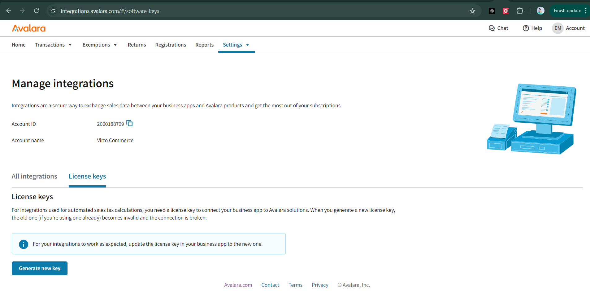

# Integrations Configuration 

* [Avalara](#avalara)
* [Builder.io](#builderio-integration)

## Avalara

Virto Commerce provides real time integration with Avalara Tax automation via the AvaTax module. The module is officially [certified by Avalara](https://www.avalara.com/integrations/virto-commerce) to be compatible with Avalara API. AvaTax automatically calculates sales and use tax for transactions, invoices, and other activity powered by Virto Commerce. Virto Commerce sends transaction data to AvaTax, and AvaTax sends back the tax total. Customers, salespeople, and others can see the tax owed in real time.

To start using AvaTax:

1. [Register in Avalara.](https://www.avalara.com/us/en/index.html)

    You will further need:

    * Link to Avalara API service.
    * Link to Avalara admin page.
    * Avalara account number.
    * Avalara license key.

    {: style="display: block; margin: 0 auto;" }

1. Set up Virto Cloud portal:

    1. Go to **Virto Cloud Portal** --> **Your environment** (Dentalstoredemo in our case) --> **Applications** widget --> Platform **Application settings**.
    1. Add Avalara account number and Avalara license key:

        {: style="display: block; margin: 0 auto;" }

    1. Click **Save** in the toolbar to apply the changes.

1. Set up Platform according to [this guide](https://docs.virtocommerce.org/platform/user-guide/integrations/avalara/taxes-calculation/#send-orders-automatically).

## Builder.io integration

Builder.io is an intuitive solution that allows anyone on your team to manage Frontend Application pages without having to rely on developers. As long as Virto Frontend Application has native integration with Builder.io, you can start using it right away:

1. Enable Builder.io using [this guide](https://docs.virtocommerce.org/platform/user-guide/integrations/builder-io/getting-started/).
1. Start using Builder.io according to [this guide](https://docs.virtocommerce.org/platform/user-guide/integrations/builder-io/use-builder-io/).

{: width="25"} [Builder.io Integration](https://docs.virtocommerce.org/platform/user-guide/integrations/builder-io/overview/)