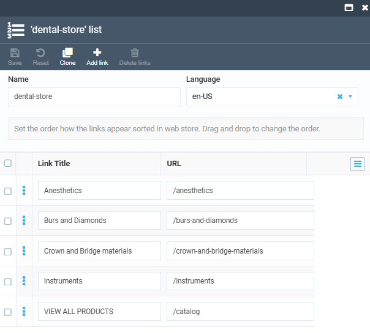

# Main Menu Setup

By default, catalog menu is automatically generated based on the existing categories. Let's create own menu and add a **View all products** category:

1. Go to **Content** --> Your store --> **Link lists**.
1. In the next blade, click **Add** in the toolbar.
1. In the next blade, let's create root categories as follows:

    

1. Click **Create**. Your link list appears in the previous blade.
1. Click **Add** in the **Link lists** blade.
1. In the next blade, let's create subcategories as follows:

    

1. Click **Create**. Your link list appears in the previous blade.

    Continue adding subcategories to the root categories according to the example above.

1. Copy the name of your root link list (**dental-store** in our example).
1. Go to **Stores** --> Your store --> **Settings**.
1. In the **Settings** blade, find **Virto Commerce Frontend** settings and paste the name of the root link list into the **Top level catalog linked list** field:

    

Your new dropdown menu appears in the Frontend Application.

 
 
********

    <a href="../store-configuration">← Configure store </a>
    <a href="../footer-creation">Set up footer →</a>

