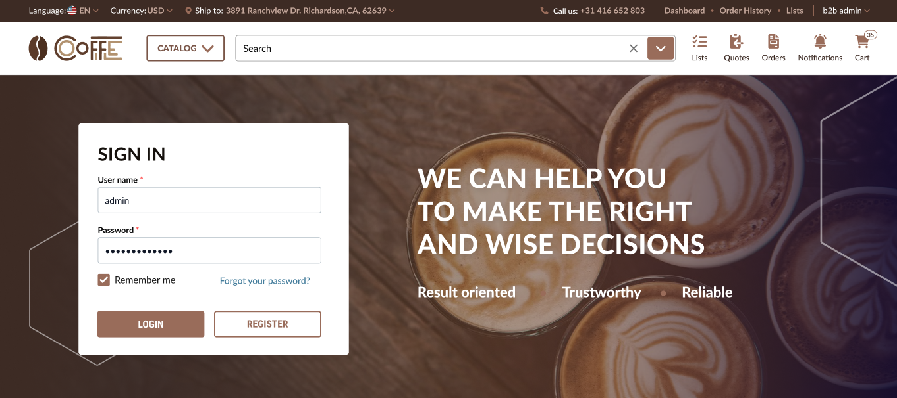

# Store Branding

Once your store is created, you can customize its branding by:

* Replacing the default Virto Commerce logo and favicon with your own.
* Updating the native theme colors to reflect your corporate brand.

## Prepare logos and favicon

For test purposes, you can use any PNG, GIF, or SVG image (for logo) or PNG, JPEG, or WEBP image (for favicon).   

For finalized branding, you can prepare logo and favicon images according to the requirements in our [figma project](https://www.figma.com/design/tSeAtWkt4DOj0khZ8Fi8wY/%F0%9F%90%B3-OCEAN-BLUE-%E2%80%A2-Storefront-screens?node-id=4142-36381&t=hwbdIQc7jxZ4YJPZ-4) or use it as a sample as follows:

1. Clone the project.
1. Replace logos and favicon with your own images.
1. Use the preview feature to evaluate the result.
1. Export the final version of your images.

Now, you can use the images to replace default logos and favicon.

## Enable white labeling

To enable white labeling:

1. Click **Stores** in the main menu.
1. In the next blade, select the desired store.
1. In the next blade, click on the **White labeling** widget.
1. In the next blade, turn the white labeling option to on.

White labeling has been enabled.

## Customize logo and favicon

To replace default logos and favicons with your own images:

1. In the **White Labeling** blade, click on the **Logo** widget to upload your company's logo.
1. Click on the **Favicon** widget to upload your favicon.
1. Click **Save** in the toolbar, then click **Save** in the previous blade.

Your changes have been applied.

## Apply theme color scheme

You can personalize your store by applying a [custom theme](../../../storefront/developer-guide/theme-customization/theme-customization) or choosing from the ready-to-use color schemes designed by Virto Commerce. Each release includes a set of default color presets, with new ones added several times a year. To access the latest default color presets, users can simply download the updated theme. Currently, the following out-of-the-box color schemes can be applied to your store:

=== "purple-pink"

    

=== "black-gold"

    

=== "watermelon"

    

=== "coffee"

    

=== "ocean"

    

=== "peach"

    

{: width="25"} [Theme customization](../../../storefront/developer-guide/theme-customization/theme-customization)

For the purpose of this guide, a color scheme named **safco** has been created by the developers. To apply a new color scheme to your store:

1. Select one of the out-of-the-box color schemes or your custom scheme (**safco**) and copy its name without extension to clipboard:
1. Go to **Stores** --> Your store --> **White labeling**.
1. In the **White labeling** blade, click {: width="25"} next to the **Theme preset name**.
1. In the next blade, click **Add** in the toolbar.
1. Paste the filename to the new field and click {: width="25"} to save the changes.
1. Click **Save** in the toolbar.
1. In the previous blade, select the newly added theme from the dropdown list. 
1. Click **Save** in the toolbar. 

Your new color scheme has been applied:

 
 
********

    <a href="../footer-creation">← Set up footer </a>
    <a href="../create-page-in-builder-io">Create page in Builder.io →</a>

