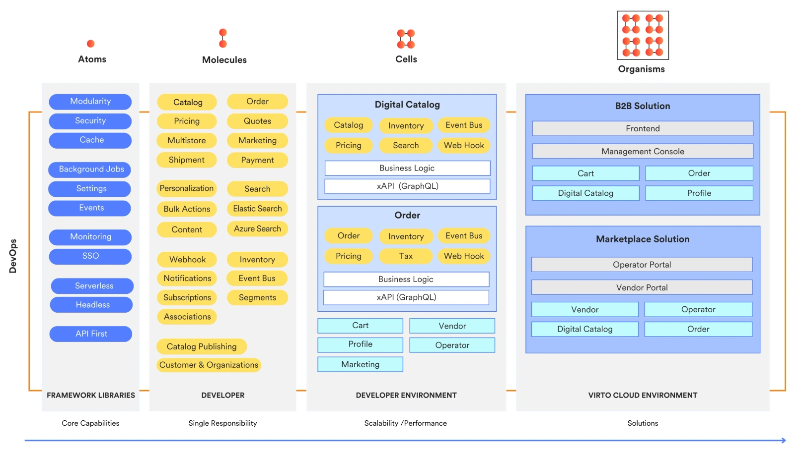

# Virto Atomic Architecture

Virto Commerce views e-commerce platforms as integrated ecosystems composed of various components, such as product catalogs, order management systems, pricing mechanisms, sellers, and customer profiles that function cohesively. We refer to this approach as **Virto Atomic Architecture™ (VAA)**. It includes four key elements: 

* [Atoms.](atomic-architecture.md#atoms)
* [Molecules.](atomic-architecture.md#molecules)
* [Cells.](atomic-architecture.md#cells)
* [Organisms.](atomic-architecture.md#organisms)

## Atoms

Atoms are the fundamental building blocks. These core components include security protocols, modular structures, caching mechanisms, and serverless functions. Atoms are highly reusable, enabling developers to construct more complex systems (referred to as molecules) for functionalities such as pricing, inventory management, order processing, search capabilities, and notification systems.

Atoms facilitate efficient operation across the Platform and can be deployed in various parts of the system either in their original form, modified, or created from scratch as required.

## Molecules

Molecules are formed from atoms to perform specific functions, such as managing product catalogs, establishing pricing, executing search queries, or triggering webhooks. Each molecule is designed to handle a distinct operation, ensuring efficient processing.

For example, the Catalog molecule is responsible for organizing products, the Price molecule focuses on pricing strategies, and Webhook molecules manage event capturing and notifications.

Each molecule is API-driven, single accountable and has its own dedicated storage. In addition, users can create custom molecules to meet specific business needs, such as dynamic pricing tools or loyalty programmes. This increases the adaptability of the architecture.

## Cells

Cells represent functional units of the eCommerce ecosystem. They comprise sets of molecules integrated by a common functional context to execute comprehensive business scenarios.

For example, a digital catalog acts as a cell, requiring the integration of molecules such as catalog management, pricing, inventory control, search functionalities, and event buses — all interconnected through APIs. Each cell operates autonomously and can be reused or repurposed as necessary.

Cells are essential for the growth and evolution of the e-commerce Platform. They allow for enhancements, combinations, or custom developments to meet specific business needs.

## Organisms

Organisms are business applications that consist of multiple cells working collaboratively to deliver complex eCommerce functionalities.

A B2B marketplace solution needs different parts like digital catalogs, order processing, and user profiles to work together smoothly for a good customer experience. These parts make up a system that can grow and adapt as the business changes, allowing it to stay flexible and meet new demands.

The flexibility of these systems in VAA allows them to evolve to fit specific business goals.

 
 
********

    <a href="../../getting-started/installation-guide/windows">← Installation guide</a>
    <a href="../01-tech-stack">Technology stack →</a>

