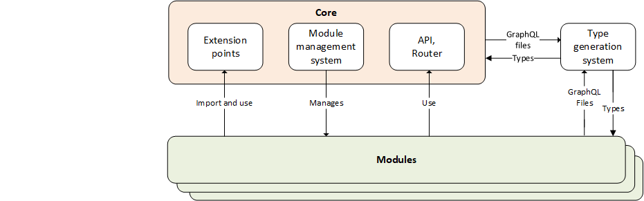

# Modules Architecture

This document provides an overview of the Virto Commerce modules architecture. The modular approach enhances scalability, maintainability, and flexibility, allowing seamless integration of new functionalities.


## Key concepts

The key concept of modules architecture are as follows:

| Concept                   | Description                                                                                       | Role and Dependencies                                                |
|---------------------------|---------------------------------------------------------------------------------------------------|----------------------------------------------------------------------|
| Core                      | The foundation of the application, including API, router, and other essential components.         | It provides:<br> - API extensions for modules.<br> - A wrapper for module management system. <br> - A structure independent of type generation. |
| Module                    | An independent feature unit extending functionality with minimal Core impact. It encapsulates its own components, services, APIs, and configurations. | - Interacts with the Core by injecting custom components through predefined extension points. <br> - Interacts with its own settings from the module management system.<br> - Supplies GraphQL documents to the type generation system.  |
| Extensions                | Expansion points provided by the Core, acting as APIs or "branches."      | - Used by modules to seamlessly integrate functionality without modifying the Core.<br> - Used within the Core. <br> - Bridge the gap between application memory and modules. <br> - Do not interact with the module management system or type generation system. <br> **Existing extensions**: <br> - client-app/shared/common/composables/useCustomProductComponents.ts <br> - client-app/shared/layout/composables/useCustomAccountLinkComponents.ts <br> - client-app/shared/layout/composables/useCustomMobileMenuLinkComponents.ts <br> - client-app/shared/layout/composables/useCustomHeaderLinkComponents.ts <br> - client-app/shared/layout/composables/useCustomMobileHeaderComponents.ts |
| Module management system  | A decision-making point and business logic handler within the Core.  | - Manages components by being imported into Core and Modules. <br> - Does not interact with extensions or type Generation system. |
| Type generation system    | Facilitates the creation of types and constants for GraphQL API.         | - Ensures clean separation between Core and modules.<br> - Has no dependencies on the module management system or extensions. |


{ align=center }

## Module folder structure

A well-structured module ensures clarity and ease of maintenance. Below is the recommended module structure:

```json
your-module/
├── api/ // All API-related code, including GraphQL schemas and generated types. 
│   ├── graphql/
│   │   └── types.ts
├── components/ // Vue components specific to the module.
│   └── YourComponent.vue
├── composables/ // Vue composables (hooks) for shared logic within the module
│   └── useYourFeature.ts
├── pages/ // Module-specific pages that integrate with the application's routing.
│   ├── YourModulePage.vue
│   └── index.ts
├── localization/ // Localization files for supporting multiple languages.
│   ├── en.json
│   └── de.json
├── types/ // TypeScript interfaces and types for the module.
│   └── index.ts
└── index.ts // Entry point exporting public APIs (mainly init function).
```


### API

Modules interact with the backend through GraphQL. Each module should define its own GraphQL schemas in the **api/graphql/** directory.

**Example query**:

```graphql
    query GetData($after: String, $first: Int, $storeId: String) {
      getData(after: $after, first: $first, storeId: $storeId) {
        items {
          id
          isActive
        }
        totalCount
      }
    }
```

#### Generate GraphQL types

Each module includes its own GraphQL types, often generated via the **scripts/graphql-codegen/generator.ts** file.

```bash
yarn generate:graphql-types
```

### Localization

Supporting multiple languages enhances user experience. Each module manages its own localization files.

**Example structure**:

```
your-module/
└── localization/
    ├── en.json
    └── es.json
```

**Example localization file (en.json)**:

```json
{
  "your_module": {
    "title": "Your Module",
    "description": "Description of your module."
  }
}
```

### Pages and routing

Modules can:

* [Introduce their own pages.](#add-pages)
* [Extend application routing.](#register-routes)

#### Add pages

```
your-module/
└── pages/
    ├── YourModulePage.vue
    └── AnotherModulePage.vue
```

#### Register routes

Modules register their routes through an `init` function, typically in **app-runner.ts**.

**Example init function**:

```typescript
export async function init(router: Router, i18n: I18n): Promise<void> {
  const route = {
    path: "/your-module",
    name: "YourModule",
    component: defineAsyncComponent(() => import("./pages/YourModulePage.vue")),
  };
  router.addRoute(route);
}
```

## Modularity

Our application architecture embraces **modularity** to foster a clean, organized, and scalable codebase.

Its core ideas are:

- **Separation of Concerns:** Each module handles a specific feature or domain.
- **Encapsulation:** Modules encapsulate their own logic, reducing dependencies.
- **Scalability:** Easily add or remove modules without impacting the entire system.

Its aims are:

- **Maintainability:** Simplify updates and bug fixes by isolating changes.
- **Collaboration:** Enable multiple developers to work on different modules simultaneously.
- **Consistency:** Adhere to standardized patterns and structures across modules.


## Best practices

To ensure consistency and high quality across all modules, follow these best practices:

* Consistent structure:
    * Adhere to the recommended folder structure.
    * Keep related files grouped together.

* Isolate module logic:
    * Avoid cross-module dependencies unless necessary.
    * Use the module's composables for shared logic.

* Type safety:
    * Define clear TypeScript types in the **types/** directory.
    * Ensure all API interactions use generated GraphQL types.

* Documentation:
    * Document public APIs, components, and composables.
    * Keep the **README.md** updated with relevant information.

* Naming conventions:
    * Use clear and descriptive names for files and functions.
    * Follow the project's naming guidelines.

* Testing:
   * Write unit and integration tests for module functionalities.
   * Ensure tests are located alongside the code they test.

## Conclusion

Virto Commerce's modular architecture allows developers to build, extend, and maintain functionalities with minimal dependencies on the **Core**. By following best practices and leveraging extension points, developers can ensure a scalable and maintainable application.

Happy coding! 🚀