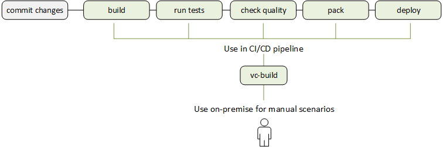

# Build Automation

The `vc-build` tool streamlines various build scenarios for solutions based on VirtoCommerce. Its builder-server agnostic nature and cross-platform support make it adaptable to any CI/CD pipeline or local development setup.
<br>
<br>
<br>


  
## Clean

To clean your bin, objects, and artifacts directories, run:

```console
vc-build clean
```

## Restore

To restore nuget dependencies, run:

```console
vc-build restore
vc-build restore -NugetConfig <path to nuget config>
```

**Parameters:**

* `-NugetConfig`: Specifies the path to the NuGet configuration file.

## Compile

To compile .NET Core solution, run:

```console
vc-build compile -configuration <Debug|Release>
```

**Parameters:**

* `-configuration <Debug|Release|CONFIGURATION>`: Defines the build configuration. The default configuration for build on build server is `Release`, on the local machine is `Debug`, but you can override the build configuration settings in your project.


## Test

To compile the solution and execute all unit tests discovered from the projects located in the solution folder and satisfied by the mask `*.Tests|*.Testing`, run: 

```console
vc-build test (with no args)
```

**Parameters:**

* `-TestsFilter` (optional): Allows filtering of tests based on criteria.

    ```console
    vc-build Test -TestsFilter "Category!=IntegrationTest"
    ```

This command also generates a test coverage and overall stats report.

??? Example

    ```console
    vc-build test

    Starting test execution, please wait...
    A total of 1 test files matched the specified pattern.
    Passed!  - Failed:     0, Passed:    48, Skipped:     0, Total:    48, Duration: 4 s - VirtoCommerce.CatalogCsvImportModule.Tests.dll (netcoreapp3.1)

    Calculating coverage result...
    Generating report 'c:\Projects\VirtoCommerce\V3\Modules\vc-module-catalog-csv-import\.tmp\coverage.xml'
    ++++
    | Module                                    | Line   | Branch | Method |
    ++++
    | VirtoCommerce.CatalogCsvImportModule.Core | 77,17% | 73,38% | 72,83% |
    ++++
    | VirtoCommerce.CatalogCsvImportModule.Data | 56,47% | 52,15% | 56,86% |
    ++++

    ++++
    |         | Line   | Branch | Method |
    ++++
    | Total   | 65,23% | 60,64% | 66,66% |
    ++++
    | Average | 66,81% | 62,76% | 64,84% |
    ++++


    ═══════════════════════════════════════
    Target             Status      Duration
    ───────────────────────────────────────
    Restore            Executed        0:04
    Compile            Executed        0:08
    Test               Executed        1:09
    ───────────────────────────────────────
    Total                              1:22
    ═══════════════════════════════════════
    ```

## Pack

The `Pack` command compiles the solution and creates NuGet packages from the projects located in the solution folder. By default, packages are built using the Release configuration, but you can specify a different configuration, such as Debug, with the `-configuration` parameter.

```console
vc-build pack
```

**Parameters:**

* `-configuration` (optional): Specifies the build configuration to use, either `Debug` or `Release`.

    ```console
    vc-build pack -configuration <Debug|Release>
    ```

This command generates NuGet packages for projects with `<IsPackable>` set to `True` in the **.csproj** file.

The result of this target is NuGet packages that are stored in the `artifacts` path of the module's root folder. If you execute this target for the platform solution, the version is taken from `Directory.Build.props`. If you execute this target for a module solution, the version is taken from the module manifest file.

## PublishPackages

To push discovered NuGet packages to a server and publish them, run:

```console
vc-build publishPackages -source <SOURCE> -apiKey <API_KEY>
```

It pushes the NuGet packages discovered in the `artifacts` folder to the server specified by the `-source` parameter and publishes them:

```console
vc-build publishPackages -source C:\local-nuget 
```

**Parameters:**

* `-source <SOURCE>`: Specifies the server URL. NuGet identifies a UNC or local folder source and simply copies the file there instead of pushing it using HTTP. If `-source` is not set the default NuGet server `https://api.nuget.org/v3/index.json` will be used.

* `-apiKey <API_KEY>`: The API key for the server.

## Compress 

The `Compress` command creates an archive of the artifacts, including only necessary files and filtering out excess. By default, it uses the Release configuration, but you can specify a different one using the `-configuration` parameter. Additionally, you can provide a custom NuGet configuration file using `-NugetConfig`.

```console
vc-build compress
```

**Parameters:**

* `-configuration` (optional): Defines the build configuration, such as `Release` or `Debug`.

    ```console
    vc-build compress -configuration <Release|Debug>
    ```

* `-NugetConfig` (optional): Specifies the path to a custom NuGet configuration file.

    ```console
    vc-build compress -NugetConfig <path to nuget config>
    ```


## DockerLogin  

The `DockerLogin` command logs you into Docker. You can specify registry URL, username, and password as parameters.

```console
vc-build dockerlogin -DockerRegistryUrl https://myregistry.com -DockerUsername user -DockerPassword 12345
```

## BuildImage

To build docker image, run:

```console
vc-build BuildImage -DockerfilePath ./dockerfile -DockerImageFullName myimage:tag
```

## PushImage

To push docker image to the remote registry, run:

```console
vc-build PushImage -DockerImageFullName myimage:tag
```

## BuildAndPush

To build and push docker image, run: 

```console
vc-build BuildAndPush -DockerRegistryUrl <registry url> -DockerUsername <username> -DockerPassword <password> -DockerfilePath ./dockerfile -DockerImageName myimage -DockerImageTag tag1 tag2 tagN
```

**Parameters**:

* `-DockerImageTag`: Receives an array of tags. 

!!! note
    If you are already signed in to Docker CLI, you do not need to pass the `DockerPassword` parameter.


## QuickRelease

The `QuickRelease` command automates the release process by creating a release branch from `dev`, merging it into `master`, incrementing the version in `dev`, and then deleting the `release/*` branch.

```console
vc-build QuickRelease
```

**Parameters:**

* `-Force` (optional): Forces the quick release process even if conflicts or issues arise.

    ```console
    vc-build QuickRelease -Force
    ```

This command streamlines the release cycle, quickly preparing the latest version for production.

## Publish

The `Publish` command prepares the application for deployment by running `dotnet publish`, packaging the application and its dependencies into a publishable format.

```console
vc-build publish
```

This command readies the application for deployment, compiling and organizing the necessary files.

## WebPackBuild

The `WebPackBuild` command builds the frontend assets by first installing npm dependencies and then running Webpack to compile JavaScript and other static resources.

```console
vc-build WebPackBuild
```

This command compiles all frontend assets, ensuring they are optimized and ready for deployment.

## PublishModuleManifest

The `PublishModuleManifest` command updates the `modules_v3.json` file with the current artifact’s `module.manifest` information, ensuring module metadata is accurate and up-to-date.

```console
vc-build PublishModuleManifest
```

This command keeps the module registry current, providing accurate module information for the platform.

## SonarQubeStart

The `SonarQubeStart` command initiates a SonarQube analysis session with `dotnet sonarscanner begin`, accepting various parameters to configure the scanning environment.

```console
vc-build SonarQubeStart -SonarBranchName dev -SonarAuthToken *** -RepoName vc-module-marketing
```

This command sets up SonarQube for code quality analysis, preparing it to scan the codebase.

## SonarQubeEnd

The `SonarQubeEnd` command finalizes the SonarQube analysis session with `dotnet sonarscanner end`, completing the scanning process.

```console
vc-build SonarQubeEnd -SonarAuthToken %SonarToken%
```

This command completes the code quality scan and submits the results to SonarQube.

## Release

The `Release` command facilitates the creation of a GitHub release, with parameters such as `GitHubUser`, `GitHubToken`, and `ReleaseBranch` to specify the release details.

```console
vc-build release -GitHubUser VirtoCommerce -GitHubToken %token%
```

This command automates the GitHub release process, packaging and publishing the latest version.
