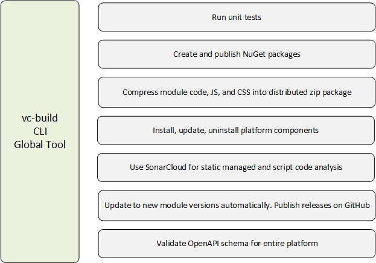

# Overview

The Virto Commerce Global Tool (vc-build) is the official CLI [.NET Core GlobalTool](https://docs.microsoft.com/en-us/dotnet/core/tools/global-tools) that helps you:

* Build, test and deploy releases.
* Create and push NuGet packages.
* Provide package management for projects based on VirtoCommerce.
* Automate common DevOps tasks. 

It is powered by [nuke.build](https://nuke.build/) - a cross-platform build automation system with C# DSL, that provides an approach to embrace existing IDE tooling and state where everyone in a team can manage and change the build scenarios. This allows writing build scenarios in C# and debugging them in Visual Studio. Also, along with cross-platform support, it was the best choice for us to build our own build automation solution on top of this project.

## Key features

* [Build automation:](build-automation.md) 

    * Build and bundle a module project (both managed and scripted parts).
    * Discover and run all the unit tests from the solution.
    * Create and publish NuGet packages for projects from your solution, this can be helpful if you intend to re-use a module's logic in another project, you will be able to quickly publish the needed version as a NuGet package. In the private or public NuGet registry.
    * Include targets that allow performing various additional quality checks such as static code analysis (currently we support out-of-the-box integration with SonarCloud).

* [Packages management:](package-management.md) 

    * Install, update, and uninstall modules. 
    * Install and update platform application.
    * Prepare backend package with specific versions of the platform and modules from the manifest file.
  
* [Platform cold start optimization and data migration (WIP):](cold-start-data-migration.md)

    * Platform start optimization (slow run on Azure case).

* [Grab migrator utility quickstart:](grab-migrator.md)

    * Get idempotent SQL scripts for all modules EF migrations with the ability to apply them in a specific order without installed platform and source code.

