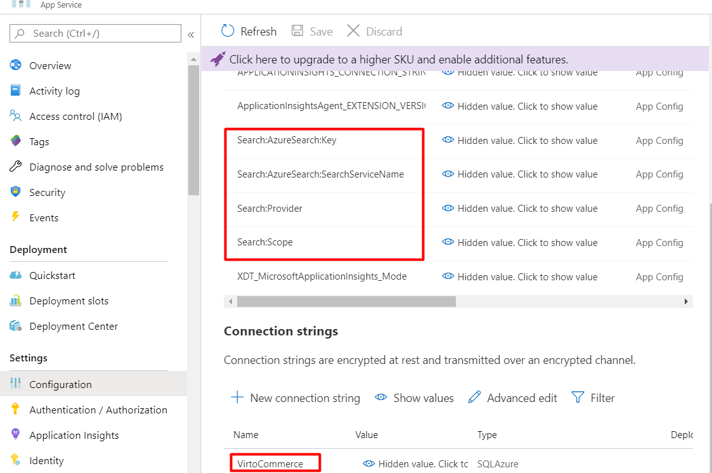

# Appsettings.json
As Virto Commerce Platform is an ASP.NET Core based application, it can be configured as described in [this Microsoft article](https://docs.microsoft.com/en-us/aspnet/core/fundamentals/configuration/?view=aspnetcore-3.1).

## Configuration settings

The configuration keys are hierarchical, and the most convenient way to manage them is to work with the **appsettings.json** file. The following sections, organized by configuration node and alphabetically, show the general structure of the file, provide defaults, and explain what each key is.

!!! note
    All settings listed below are optional unless marked **Required**.

### ConnectionStrings

These **required** settings represent connection strings for VC Platform and modules.

| Node          | Sample value           | Description  |
| ------------- | --------------------------------- | ------------ |
| VirtoCommerce | `Data Source=(local);Initial Catalog=VirtoCommerce3;Persist Security Info=True;User ID=virto;Password=virto; MultipleActiveResultSets=True;Connect Timeout=30` | This required setting is used to provide the VC Platform system connection string to the SQL Server database. VC modules would revert to this connection string if no specific connection string is defined. |
| E.g., VirtoCommerce.Catalog  | `Data Source=(local);Initial Catalog=VirtoCommerceCatalog;Persist Security Info=True;User ID=virto;Password=virto; MultipleActiveResultSets=True;Connect Timeout=30` | Other module-specific connection string(s). E.g., Virto Commerce Catalog module will use the `VirtoCommerce.Catalog` connection string if it is defined. |                           |
| RedisConnectionString | `"localhost"` | StackExchange.Redis Configuration string.<br>{: width="25"} [Redis Configuration](https://stackexchange.github.io/StackExchange.Redis/Configuration) |

###  VirtoCommerce

This configuration node defines the system settings of the VC Platform.

| Node                      | Default or sample value                                           | Description                                                                                                   |
| ------------------------- | ----------------------------------------------------------------- | ------------------------------------------------------------------------------------------------------------- |
| CountriesFilePath         |`"localization/common/countries.json"`                             | Local path for the country list, which, by default,<br>includes all countries of the world.                      |
| CountryRegionsFilePath    |`"localization/common/countriesRegions.json"`                      | Local path for state/province list. <br>By default, includes the US states and Canada's provinces.                |
| LicenseActivationUrl      |`"https://virtocommerce.com/admin/api/licenses/activate/"`         | VC Platform license activation service URL.                                                                   |
| LicenseFilePath           |      `"App_Data/VirtoCommerce.lic"`                               | VC Platform license file location.                                                                            |
| LocalUploadFolderPath     | `"App_Data/Uploads"`                                              | The **Uploads** folder location.                                                                                |
| SampleDataUrl             | `"http://virtocommerce.azureedge.net/sample-data"`                | URL to download sample data upon the initial Platform setup.                                                  |
| AllowInsecureHttp         | `true`<br>`false`                                                 | Manages how the OpenID Connect server (ASOS) handles <br>the incoming requests: whether those arriving to non-HTTPS endpoints<br>should be rejected or not. By default, this property is set to false<br>to help mitigate the man-in-the-middle attacks.                                                                                  |
| Hangfire                  |                                                                   | Background processing library (Hangfire) configuration.<br><br> `JobStorageType`: Current job storage.<br>Supported values: `Memory`, `SqlServer`.<br> `UseHangfireServer`: Enables or disables Hangfire for this app instance.<br> `AutomaticRetryCount`: Maximum number of automatic retry attempts. <br>`SqlServerStorageOptions`: Hangfire.SqlServer.SqlServerStorageOptions.<br>{: width="25"} [Hangfire's SQL Server Configuration](https://docs.hangfire.io/en/latest/configuration/using-sql-server.html#configuration)|
| Swagger                   |                                                                   | Allows you to disable Swagger initialization upon platform<br>startup to prevent access to Swagger UI and documents.
| GraphQL Playground        |                                                                   | Allows you to disable the initialization of the<br>GraphQL Playground at platform startup to prevent access<br>to the GraphQL Playground UI and schemas.<br> By default, the playground is enabled.|
| FileExtensionsBlackList   |                                                                   | This setting is used in conjunction with the <br>`VirtoCommerce.Platform.Security.FileExtensionsBlackList`<br>setting in the admin UI to define the file extensions that<br>the platform does not permit to be uploaded to the server.<br>The `FileExtensionsBlackList` is not accessible from the admin UI.<br>An administrator may provide an additional list of extensions<br>through the UI that may be used with `FileExtensionsBlackList`. |

**Examples**

=== "Hangfire"

    ```json title="appsettings.json"
    "Hangfire": {
    "JobStorageType": "Database",
    "UseHangfireServer": true,
    "AutomaticRetryCount": 1,
    "WorkerCount": 11,
    "Queues": [
    "alpha",
    "default"
    ],
      "SqlServerStorageOptions": {
        "CommandBatchMaxTimeout": "00:05:00",
        "SlidingInvisibilityTimeout": "00:05:00",
        "QueuePollInterval": "00:00:00",
        "UseRecommendedIsolationLevel": true,
        "UsePageLocksOnDequeue": true,
        "DisableGlobalLocks": true,
        "EnableHeavyMigrations": true
      },
      "MySqlStorageOptions": {
        "InvisibilityTimeout": "00:05:00",
        "QueuePollInterval": "00:00:05"
      },
      "PostgreSqlStorageOptions": {
        "InvisibilityTimeout": "00:05:00",
        "QueuePollInterval": "00:00:05",
        "UseRecommendedIsolationLevel": true,
        "UsePageLocksOnDequeue": true,
        "DisableGlobalLocks": true
      }
    }
    ```

=== "Swagger"

    ```json title="appsettings.json"
    "Swagger":
    {
    "Enable": true
    }
    ```

=== "Playground"

    ```json title="appsettings.json"
    "GraphQLPlayground": {
      "Enable": true
    }
    ```

=== "FileExtensionsBlackList"

    ```json title="appsettings.json"
    "FileExtensionsBlackList": [".pdf", ".json"]
    ```


### Application Insights

<!--AppInsights-start-->
This node adds and customizes the Application Insight section.

| Node                              	    | Default or sample value   	| Description                                                                                                	|
|---------------------------------------	|---------------------------	|--------------------------------------------------------------------------------------------------------------	|
| `SamplingOptions.Processor`           	| `Adaptive`<br>`Fixed`      	| Lets you choose between two sampling methods: <ul> <li>**Adaptive sampling**: automatically adjusts the volume of telemetry sent from the SDK in your ASP.NET/ASP.NET Core app, and from Azure Functions.<br>{: width="25"} [Sampling in Application Insights](https://learn.microsoft.com/en-us/azure/azure-monitor/app/sampling?tabs=net-core-new#configuring-adaptive-sampling-for-aspnet-applications) </li> <li>**Fixed-rate sampling**: reduces the volume of telemetry sent from both applications. Unlike adaptive sampling, it reduces telemetry at a fixed rate controlled by `SamplingPercentage` setting. </li> </ul> 	|
| `IncludedTypes`                       	| `Dependency`<br>`Event`<br>`Exception`<br>`PageView`<br>`Request`<br>`Trace`  	| A semi-colon delimited list of types to be sampled. The specified types will be sampled. All telemetry of other types will always be transmitted. All types are included by default.                                                                                        |
| `ExcludedTypes`                       	| `Dependency`<br>`Event`<br>`Exception`<br>`PageView`<br>`Request`<br>`Trace` | A semi-colon delimited list of types not to be sampled. All telemetry of the specified types is transmitted. The types that aren't specified will be sampled. Empty by default.                                                                                                    |
| `EnableSqlCommandTextInstrumentation` 	| `true`<br>`false`          	| For SQL calls, the name of the server and database is always collected and stored as the name of the collected Dependency Telemetry. Another field, called data, can contain the full SQL query text. To opt in to SQL Text collection, set this setting to `true`.                                                              |
| `IgnoreSqlTelemetryOptions`           	|                            	| Controls the Application Insights telemetry processor that excludes SQL queries related to dependencies. Any SQL command name or statement that contains a string from the `QueryIgnoreSubstrings` options will be ignored.                           	|

**Example**

To configure `ApplicationInsights`: 

1. Use current active telemetry configuration which is already initialized in most application types like ASP.NET Core:
    ```json title="appsettings.json"
    {
      "ApplicationInsights": {
        "ConnectionString": "<Copy connection string from Application Insights Resource Overview>"
      }
    }
    ```

1. Configure Platform AP telemetry behavior inside the `VirtoCommerce:ApplicationInsights` section: 
    ```json title="appsettings.json"
    {
      "VirtoCommerce": {
        "ApplicationInsights": {
          "SamplingOptions": {
            "Processor": "Adaptive",
            "Adaptive": {
              "MaxTelemetryItemsPerSecond": "5",
              "InitialSamplingPercentage": "100",
              "MinSamplingPercentage": "0.1",
              "MaxSamplingPercentage": "100",
              "EvaluationInterval": "00:00:15",
              "SamplingPercentageDecreaseTimeout": "00:02:00",
              "SamplingPercentageIncreaseTimeout": "00:15:00",
              "MovingAverageRatio": "0.25"
            },
            "Fixed": {
              "SamplingPercentage": 90
            },
            "IncludedTypes": "Dependency;Event;Exception;PageView;Request;Trace",
            "ExcludedTypes": ""
          },
          "EnableSqlCommandTextInstrumentation": true,
          "IgnoreSqlTelemetryOptions": {
            "QueryIgnoreSubstrings": [
              "[HangFire].",
              "sp_getapplock",
              "sp_releaseapplock"
            ]
          }
        }
      }
    }
    ```

<!--AppInsights-end-->


### Assets

This **required** node determines how VC Platform will be working with assets, i.e. files.

| Node                              | Default or Sample Value             | Description                                                                                                                   |
| --------------------------------- | ----------------------------------- | ----------------------------------------------------------------------------------------------------------------------------  |
| Provider                          | `"FileSystem"`                      | Current asset provider. Supported values: `FileSystem`, `AzureBlobStorage`.                                                   |
| FileSystem                        |                                     | File system-based asset provider configuration. Used when the `Provider` setting has the value `"FileSystem"`.                |
| FileSystem:RootPath               | `"~/assets"`                        | The root path where assets are stored in the file system.                                                                     |
| FileSystem:PublicUrl              | `"https://localhost:5001/assets/"`  | The public Url used to access assets stored in the file system.                                                               |
| AzureBlobStorage                  |                                     | Azure Blob Storage-based asset provider configuration. Used when the `Provider` setting has the value `"AzureBlobStorage"`.   |
| AzureBlobStorage:ConnectionString |                                     | The connection string for Azure Blob Storage.                                                                                 |
| AzureBlobStorage:CdnUrl           |                                     | The optional CDN Url for serving assets from Azure Blob Storage.                                                              |


**Examples**

=== "FileSystem"

    ```json title="appsettings.json"
    "FileSystem": {
    "RootPath": "~/assets",
    "PublicUrl": "http://localhost:5001/assets/"
    }
    ```

=== "AzureBlobStorage"

    ```json title="appsettings.json"
    "AzureBlobStorage": {
    "ConnectionString": "",
    "CdnUrl": ""
    }  
    ```


### Auth

This setting determines platfom authencification parameters.

| Node                   | Default or Sample Value              | Description                                                                                                                           |
| ---------------------- | ---------------------------------    | ------------------------------------------------------------------------------------------------------------------------------------- |
| Authority              | `https://localhost:5051/ <br> https://auth.example.com/` | The Url of the authentication server.<br>Leave empty for the mode when authorization and resource server are the same application.       |
| Audience               | `"resource_server"`                  | The audience for which the token is intended.                                                                                         |
| PublicCertPath         | `"./certificates/virtocommerce.crt"` | The file path to the public certificate used for token validation.                                                                    |
| PrivateKeyPath         | `"./certificates/virtocommerce.pfx"` | The file path to the private key used for token signing.                                                                              |
| PrivateKeyPassword     | `"virto"`                            | The password for accessing the private key (if protected by a password).                                                              |


**Example**

```json title="appsettings.json"
"Auth": {
    "Authority": "",
    "Audience": "resource_server",
    "PublicCertPath": "./certificates/virtocommerce.crt",
    "PrivateKeyPath": "./certificates/virtocommerce.pfx",
    "PrivateKeyPassword": "virto"
}
```

### Authorization

This configuration node defines authorization settings for the system.

| Node                      | Default or Sample Value   | Description                                                                                               |
| ------------------------- | ------------------------- | --------------------------------------------------------------------------------------------------------- |
| ReturnPasswordHash        | `true`<br> `false`        | A boolean setting that determines whether to return the password hash during user authentication.<br>If set to `true`, the password hash is returned; if set to `false`, it's not returned. |
| RefreshTokenLifeTime     | `"30.00:00:00"`            | The time span specifying the lifetime of a refresh token.<br>A refresh token is used to obtain a new access token without re-entering<br>the user's credentials. The default is 30 days. |
| AccessTokenLifeTime      | `"00:30:00"`               | The time span specifying the lifetime of an access token.<br>An access token is used to access protected resources.<br>The default is 30 minutes. |
| LimitedCookiePermissions | `"platform:asset:read;platform:export;<br>content:read;platform:asset:create;<br>licensing:issue;export:download"` | A semicolon-separated list of permissions that define the limited cookie permissions for the user. These permissions determine what actions the user can perform when using cookies for authentication. |
| AllowApiAccessForCustomers| `true`<br>`false`         | A boolean setting that controls whether API access is allowed for customers.<br>If set to `false`, customers are not allowed to access the API; if set to `true`, they are granted API access. |

**Example**

```json title="appsettings.json"
"Authorization": {
  "ReturnPasswordHash": true,
  "RefreshTokenLifeTime": "30.00:00:00",
  "AccessTokenLifeTime": "00:30:00",
  "LimitedCookiePermissions": "platform:asset:read;platform:export;content:read;platform:asset:create;licensing:issue;export:download",
  "AllowApiAccessForCustomers": false
}
```


### AzureAd

This node is used for authentication with Azure Active Directory. 

{: width="25"}  [How to enable authentication with Azure Active Directory](../Fundamentals/Security/configuring-and-managing-azure-auth.md)

| Node                  | Default or Sample Value                                   | Description                                                                                                       |
| --------------------- | --------------------------------------------------------- | ----------------------------------------------------------------------------------------------------------------- |
| Enabled               | `false`                                                   | Enables authentication with Azure Active Directory. By default, this value is `false`, i.e. authentication is disabled.|
| UsePreferredUsername  | `false`                                                   | If set to `true`, the system will check the `preferred_username` in case the `upn` claim returns empty.             |
| Priority              | `0`                                                       | Configures the priority of the Azure Active Directory login popup on the _Login_ page. The lowest value means the highest priority. |
| AuthenticationType    | `"AzureAD"`                                               | Provides the authentication scheme. Must always have the `AzureAD` value set.                                      |
| AuthenticationCaption | `"Azure Active Directory"`                                | Sets a human-readable caption for the Azure AD authentication provider. Visible on the **Sign In** page.            |
| ApplicationId         | `01234567-89ab-cdef-0123-456789abcdef`                    | The ID of the Virto Commerce platform application registered in Azure Active Directory. You can find it in the Azure control panel through **Azure Active Directory --> App registrations --> (platform app) --> Application ID**. |
| TenantId              | `abcdef01-2345-6789-abcd-ef0123456789`                    | The ID of the Azure AD domain that will be used for authentication. You can find it in the Azure control panel through **Azure Active Directory --> Properties --> Directory ID**.  |
| AzureAdInstance       | `https://login.microsoftonline.com/`                      | Url of the Azure AD endpoint used for authentication.                                                             |
| DefaultUserType       | `"Manager"`<br>`"Customer"`                               | Default user type for new users created upon first sign-in by Azure AD accounts.                                   |
| DefaultUserRoles      | `"Order manager"`<br>`"Store manager"`                    | Default user roles assigned to new users created upon first sign-in by Azure AD accounts.                           |
| MetadataAddress       |                                                 | An optional setting that enables the discovery endpoint for obtaining metadata. Must be set only when your app has custom signing keys. |
| UsePreferredUsername  | `true`<br>`false`                               | Indicates whether to use the `preferred_username` claim as a fallback scenario in case the UPN claim is not set for getting the username. |


!!! note "Note to the `MetadataAddress` node"
	
	If your app has custom signing keys as a result of using the claim mapping feature, you should append the `appid` query parameter containing the app ID in order to get a `jwks_uri` pointing to your app's signing key information.
    For example, [https://login.microsoftonline.com/{tenant}/v2.0/.well-known/openid-configuration?appid=6731de76-14a6-49ae-97bc-6eba6914391e](https://login.microsoftonline.com/%7Btenant%7D/v2.0/.well-known/openid-configuration?appid=6731de76-14a6-49ae-97bc-6eba6914391e) contains a `jwks_uri` of [https://login.microsoftonline.com/{tenant}/discovery/v2.0/keys?appid=6731de76-14a6-49ae-97bc-6eba6914391e](https://login.microsoftonline.com/%7Btenant%7D/discovery/v2.0/keys?appid=6731de76-14a6-49ae-97bc-6eba6914391e).

**Example**

Example settings for the `AzureAD` section:

```json
"AzureAd": {
		"Enabled": true,
		"AuthenticationType": "AzureAD",
		"AuthenticationCaption": "Azure Active Directory",
		"ApplicationId": "b6d8dc6a-6ddd-4497-ad55-d65f91ca7f50",
		"TenantId": "fe353e8f-5f08-43b4-89d1-f4acec93df33",
		"AzureAdInstance": "https://login.microsoftonline.com/",
		"DefaultUserType": "Manager",
		"UsePreferredUsername": false,
		"Priority": 0
	},
```


### Caching
This node manages caching configuration.

<!--caching-start-->

| Node                      | Default or sample value                   | Description  |
| ------------------------- | ----------------------------------------- | ------------ |
| Redis                     |                                           | Redis configuration. Includes the message channel to use and the number of retries.
| CacheEnabled              | <ul><li>`true`</li><li>`false`</li></ul>  | <ul><li>Cache entries are retained based on the expiration settings.</li><li>Disables caching of application data for the entire application.</li></ul> Used when `ConnectionStrings:RedisConnectionString` is not specified.
| CacheSlidingExpiration    | `"0:15:00"`                               | The cache entry will expire if it is not accessed for a specified amount of time.<br>Used when `CacheAbsoluteExpiration` is not defined.
| CacheAbsoluteExpiration   | `"0:5:00"`                                | The Cache entry will expire after a specified amount of time. <br>Used when `RedisConnectionString` is not specified.


**Examples**

``` json title="appsettings.json"
 "Caching": {
       "CacheEnabled": true, 
       "CacheSlidingExpiration": "0:15:00", 
       //"CacheAbsoluteExpiration": "0:15:00"
    }
```

```json title="appsettings.json"
"Redis": {
"ChannelName": "VirtoCommerceChannel",
"BusRetryCount": 3
} 
```

<!--caching-end-->

### Content
This **required** setting is used for static content configuration (including themes) for the `VirtoCommerce.Content` module.

| Node                                | Default or Sample Value   | Description                                                                                               |
| ----------------------------------- | ------------------------  | --------------------------------------------------------------------------------------------------------- |
| Provider                            | `"FileSystem"`            | Current content (file) provider. The supported values are `FileSystem` and `AzureBlobStorage`.           |
| FileSystem                          |                           | File system-based content provider configuration. This is the default provider used unless `AzureBlobStorage` is set as the current provider. |
| FileSystem:RootPath                 | `"~/cms-content"`         | The root path where content files are stored in the file system.                                          |
| FileSystem:PublicUrl                | `"https://localhost:5001/cms-content/"` | The public URL used to access content files stored in the file system.                      |
| AzureBlobStorage                    |                           | Azure Blob Storage-based content provider configuration. Used when the `Provider` setting has `AzureBlobStorage` as the value. |
| AzureBlobStorage:ConnectionString   |                           | The connection string for Azure Blob Storage.                                                            |
| AzureBlobStorage:CdnUrl             |                           | The optional CDN (Content Delivery Network) URL for serving content from Azure Blob Storage.             |
| AzureBlobStorage:RootPath           | `"cms"`                   | The root path within the Azure Blob Storage container where content files are stored.                     |


**Examples**

=== "FileSystem"

    ```json title="appsettings.json"
    "FileSystem": {
    "RootPath": "~/cms-content",
    "PublicUrl": "http://localhost:10645/cms-content/"
    }  
    ```

=== "AzureBlobStorage"

    ```json title="appsettings.json"
    "AzureBlobStorage": {
    "ConnectionString": "",
    "CdnUrl": ""
    }
    ```


### Crud

This configuration node defines settings for the CRUD operations within the system.

| Node            | Default or sample value | Description                                                                                                   |
| --------------- | ----------------------- | ------------------------------------------------------------------------------------------------------------- |
| MaxResultWindow | 2147483647              | The maximum value for the combination of `skip` and `take` parameters in search requests. By setting this value to `2147483647`, there are no specific limits on the number of records that can be retrieved in a single search request. This effectively allows retrieving a large number of records in a single query. |

**Example**

```json title="appsettings.json"
"Crud": {
    "MaxResultWindow": 2147483647
}
```


### DataProtection
This configuration node configures lifetimes for security tokens that are issued by platform like password reset.

| Node                         | Default value                    | Description                                         |
| ---------------------------- | ---------------------------------|---------------------------------------------------- |
| DataProtection.TokenLifespan | "1.00:00:00" - Defaults to 1 day | The amount of time a generated token remains valid. |

**Example**

Example settings for the `DataProtection` section:

```json title="appsettings.json"
"DataProtection": {
		"TokenLifespan": "24:00:00",		
	},
```

### FrontendSecurity

This node configures frontend security settings.

|Node                       | Default or sample value  | Description                                                     |
|---------------------------|--------------------------|-----------------------------------------------------------------|
|OrganizationMaintainerRole | `Organization maintainer`| The role that defines permissions for organization maintainers. |

**Example**

```json title="appsettings.json"
"FrontendSecurity": {
    "OrganizationMaintainerRole": "Organization maintainer"
}
```

<!--security-start-->

### IdentityOptions

This configuration node configures the ASP.NET Core Identity system. 

{: width="25"}  [Identity Configuration](https://github.com/dotnet/AspNetCore.Docs/blob/master/aspnetcore/security/authentication/identity-configuration.md#configure-aspnet-core-identity)

| Node                                      | Default or Sample Value   | Description                                                                                                            |
| ----------------------------------------- | ------------------------  | ---------------------------------------------------------------------------------------------------------------------- |
| Password                                  |                           | Configuration settings related to user password requirements.                                                          |
| Password:RequiredLength                   | `8`                       | The minimum required length for user passwords.                                                                        |
| Password:RequireDigit                     | `false`                   | Indicates whether a digit is required in user passwords.                                                               |
| Password:RequireNonAlphanumeric           | `false`                   | Indicates whether a non-alphanumeric character is required in user passwords.                                          |
| Password:RepeatedResetPasswordTimeLimit   | `"0:01:0"`                | The time span within which a user cannot repeatedly reset their password.                                              |
| User                                      |                           | Configuration settings related to user accounts.                                                                       |
| User:MaxPasswordAge                       | `90`                      | The maximum age (in days) a user can keep the same password before being required to change it.                        |
| User:RequireUniqueEmail                   | `true`                    | Indicates whether each user must have a unique email address.                                                          |
| User:RemindPasswordExpiryInDay            | `7`                       | The number of days before the password expiration date when the system will start reminding users to change their password. |
| Lockout                                   |                           | Configuration settings related to account lockout.                                                                      |
| Lockout:DefaultLockoutTimeSpan            | `"0:15:0"`                | The default duration for which an account is locked out after the specified number of unsuccessful login attempts.      |


**Example**

```json title="appsettings.json"
"IdentityOptions": {
    "Password": {
      "RequiredLength": 8,
      "RequireDigit": false,
      "RequireNonAlphanumeric": false,
      "RepeatedResetPasswordTimeLimit": "0:01:0"
    },
    "User": {
      "MaxPasswordAge": 90,
      "RequireUniqueEmail": true,
      "RemindPasswordExpiryInDay": 7
    },
    "Lockout": {
      "DefaultLockoutTimeSpan": "0:15:0"
    }
```
<!--security-end-->

### LoginPageUI

This node configures background screen and background pattern of the Login page.

| Node                      | Default or Sample Value   | Description                                                                                              |
| ------------------------- | ------------------------  | -------------------------------------------------------------------------------------------------------- |
| BackgroundUrl             |                           | Url for the background image of the login page. If empty, no background image is displayed.             |
| PatternUrl                |                           | Url for the pattern image of the login page. If empty, no pattern image is displayed.                   |
| Preset                    |                           | The currently selected preset for the login page. If empty, no preset is applied.                         |
| Presets                   |                           | An array of preset configurations for the login page, allowing different visual settings for different scenarios. |
| Presets:Name              | `"demo"`, `"prod"`, etc.  | The name of the preset. Used for identification and selection of the preset.                              |
| Presets:BackgroundUrl     |                            | Url for the background image specific to the preset. If empty, the default background is used.          |
| Presets:PatternUrl        | `"/images/pattern-demo.svg"`, `"/images/pattern-live.svg"`, etc. | Url for the pattern image specific to the preset. If empty, the default pattern is used.          |


**Example**

```json title="appsettings.json"
    "LoginPageUI": {
        "BackgroundUrl": "",
        "PatternUrl": "",
        "Preset": "",
        "Presets": [
          {
            "Name": "demo",
            "BackgroundUrl": "",
            "PatternUrl": "/images/pattern-demo.svg"
          },
          {
            "Name": "prod",
            "BackgroundUrl": "",
            "PatternUrl": "/images/pattern-live.svg"
          }
        ]
      }
```


<!--modularity-start-->
### Modularity

This node configures external sources, from which modules are being installed and discovered.

| Node                      | Default or sample value                         | Description                                                                                                   |
| ------------------------- | ----------------------------------------------  | ------------------------------------------------------------------------------------------------------------- |
| IncludePrerelease         | `true`<br>`false`                               | Shows module versions marked<br>as **Prerelease** if value is `true`.                                         |
| DiscoveryPath             | `"./Modules"`                                   | Relative or absolute folder location where the platform will discover the installed modules from.             |
| ModulesManifestUrl        | `"https://raw.githubusercontent.com/VirtoCommerce/vc-modules/master/modules_v3.json"` | Url to the **.json file** that contains module manifests.           |
| AuthorizationToken        |                                                 | The authorization token to access `ModulesManifestUrl`, added to the `Authorization` header, if specified.    |
| AutoInstallModuleBundles  | `"commerce"`                                  | Group(s) of modules to install automatically during the initial Platform setup.<br>If you do not need to install anything here, provide an empty array. |

**Example**

```json title="appsettings.json"
  "ExternalModules": {
    "IncludePrerelease": false,
    "ModulesManifestUrl": "https://raw.githubusercontent.com/VirtoCommerce/vc-modules/master/modules_v3.json",
    "AuthorizationToken": "",
    "AutoInstallModuleBundles": [
      "commerce"
    ]
  }
```
<!--modularity-end-->


### Notifications
<!--notifications-start-->

This node enables notification configuration for the `VirtoCommerce.Notifications` module.

| Node                              | Default or Sample Value         | Description                                                                                                               |
| --------------------------------- | ------------------------------  | ------------------------------------------------------------------------------------------------------------------------- |
| Gateway                           | `"Smtp"`<br>`"SendGrid"`        | The current notification sending gateway.<br>The out-of-the-box implemented and<br>supported values are `Smtp`, `SendGrid`.  |
| DefaultSender                     | `"noreply@gmail.com"`           | This **required** setting provides sender<br>identification used by the current notification sending gateway.           |
| Smtp                              |                                | SMTP gateway configuration.<br>Used if the `Gateway` setting has the `Smtp` value.                                        |
| Smtp:SmtpServer                   | `"smtp.gmail.com"`              | The SMTP server address for sending emails.                                                                               |
| Smtp:Port                         | `587`                          | The port number to use when connecting to the SMTP server.                                                                |
| Smtp:Login                        |                                | The login (username) for authenticating to the SMTP server.                                                               |
| Smtp:Password                     |                                | The password for authenticating to the SMTP server.                                                                       |
| Smtp:ForceSslTls                  | `false`                        | If set to `true`, forces the usage of SSL/TLS when connecting to the SMTP server.                                         |
| SendGrid                          |                                | SendGrid gateway configuration.<br>Used when the `Gateway` setting has the `SendGrid` value.                              |
| SendGrid:ApiKey                   |                                | The API key for authenticating to the SendGrid service.                                                                   |
| Notifications:DiscoveryPath       | `Templates`                    | Relative folder path in the local file system<br>that will be used to discover notification template files<br>during notification rendering. |
| Notifications:FallbackDiscoveryPath|                                | Alternative relative folder path in the local file<br>system that will be used to discover alternative template<br>files during notification rendering.<br>Templates found through this path will be used as a backup,<br>in case the templates defined in the<br>`Notifications:DiscoveryPath` setting are not found. |

**Example**

```json title="appsettings.json"
"Notifications": {
    "Gateway": "Smtp",
    "DefaultSender": "noreply@gmail.com",
    "Smtp": {
      "SmtpServer": "smtp.gmail.com",
      "Port": 587,
      "Login": "",
      "Password": "",
      "ForceSslTls": false
    },
    "SendGrid": {
      "ApiKey": ""
    },
    "Notifications:DiscoveryPath": "Templates",
    "Notifications:FallbackDiscoveryPath": ""
}
```

<!--notifications-end-->

### PasswordLogin

This node enables authentication with username and password.

| Node      | Default or sample value   | Description  |
| ----------| ------------------------  | ------------ |
| Enabled   | `true`<br> `falsee`       | Always enabled by default. Setting to `false` will disable logging in with username and password.
| Priority  | 0                         | Configures the priority of the password login popup on the _Login_ page. The lowest value means the highest priority.


### PlatformSettings

This node is used for Used for platform settings overriding.

|Node           | Default or sample value   | Description  |
| ------------- | ------------------------  | ------------ |
| Settings      |                           | Array of settings to be overriden. These settings will be read only in the admin panel.|

**Example**

```json title="appsettings.json"
"Settings":{
  "ItHasValues": true,
  "Value": 20000,
  "RestartRequired": false,
  "ModuleId": "VirtoCommerce.Sitemaps",
  "GroupName": "Sitemap|General",
  "Name": "Sitemap.RecordsLimitPerFile",
  "IsRequired": false,
  "IsHidden": false,
  "ValueType": 8,
  "DefaultValue": 10000,
  "IsDictionary": false
}
```


<!--search-start-->

### Search

This node configures full text search for the `VirtoCommerce.Search` module.

| Node                        | Default or sample value   | Description                                                                                                                                   |
| ----------------------------| ------------------------- | --------------------------------------------------------------------------------------------------------------------------------------------- |
| Provider                    | `"Lucene"`                | This **required** setting specifies the current search provider. The supported values are  `Lucene`, `AzureSearch`, and `ElasticSearch`.      |
| Scope                       | `"default"`               | This setting determines the scope to use and is **required**.                                                                                 |
| Lucene                      |                           | Lucene provider configuration for the **VirtoCommerce.LuceneSearch** module.<br>Used when the `Provider` setting has the `Lucene` vaue.            |
| AzureSearch                 |                           | AzureSearch provider configuration for the **VirtoCommerce.AzureSearch** module.<br>Used when the `Provider` setting has the `AzureSearch` value.  |
| ElasticSearch               |                           | Elasticsearch  provider configuration for the **VirtoCommerce.ElasticSearch** module.<br>Used when the `Provider` setting has the `ElasticSearch` value.|
|OrderFullTextSearchEnabled   | `true`<br> `false`        | This boolean setting enables full-text search for orders.<br>If true (by default), full-text search for orders is enabled,<br>and it allows searching for orders based on their content. |
|ContentFullTextSearchEnabled | `true` <br> `false`       | This boolean setting enables full-text search for content.<br>If true (by default), full-text search for content is enabled,<br>and it allows searching for content items based on their textual content.|

**Examples**

=== "Lucene"

    ```json title="appsettings.json"
    "Lucene": {
    "Path": "App_Data/Lucene"
    } 
    ```

=== "AzureSearch"

    ```json title="appsettings.json"
    "AzureSearch": {
    "SearchServiceName": "my-ServiceName",
    "Key": "my-AccessKey"
    } 
    ```

=== "ElasticSearch"

    ```json title="appsettings.json"
    "ElasticSearch": {
    "Server": "localhost:9200",
    "User": "elastic",
    "Key": "",
    "EnableHttpCompression": ""
    <!-- For ES 8.0 and higher must be set to True -->
    "EnableCompatibilityMode": true 
    } 
    ```
<!--search-end-->

### Serilog

This node configures the Serilog logging library, allowing customization of logging providers, minimum severity levels, and other logging-related settings.

| Node          | Default or sample value                                             | Description                                                                      |
| ------------- | ------------------------------------------------------------------- | -------------------------------------------------------------------------------- |
| Using         |  `"Serilog.Sinks.Console"` <br> `"Serilog.Sinks.Debug"`             | List of assemblies for logging providers in which<br>configuration methods reside.  |
| MinimumLevel  | `Information`<br> `Warning` <br> `Error` <br> `Debug` <br> `Trace`  | Minimum severity level of log messages.                                          |
| WriteTo       | `"Console"` <br> `"Debug"`                                          | Specifies the sinks to which log events will be written.                           |
| Enrich        | `"FromLogContext"`                                                  | List of enrichers that will add additional properties to log events.               |

**Example**

```json title="appsettings.json"
"Serilog": {
    "Using": [
      "Serilog.Sinks.Console",
      "Serilog.Sinks.Debug"
    ],
    "MinimumLevel": {
      "Default": "Information"
    },
    "WriteTo": [
      "Console",
      "Debug"
    ],
    "Enrich": [
      "FromLogContext"
    ]
}
```

### Tax

This setting is used to configure tax providers.

| Node                    | Default value             | Description                                                                                           |
|-------------------------|---------------------------|-------------------------------------------------------------------------------------------------------|
| `FixedRateTaxProvider`  | `true`<br>`false`         | Determines whether the `FixedRateTaxProvider` is enabled or disabled. When set to `false`, the `FixedRateTaxProvider` is not active, and tax calculations will not be performed using this provider. When set to `true` the `FixedRateTaxProvider` will be enabled, allowing the platform to use fixed-rate tax calculations. |

**Example**

```json title="appsettings.json"
{
"FixedRateTaxProvider": {"Enabled": false}
}
```


## Hierarchic keys and separators

When working with keys, one should follow these rules:

* Within the Configuration API, a colon separator (`:`) works on all platforms.
* In environment variables, a colon separator may not work on all platforms. A double underscore, `__`, is supported by all platforms and is automatically converted into a colon `:`.
* In Azure Key Vault, hierarchic keys use double hyphen `--` as a separator. The Azure Key Vault configuration provider automatically replaces `--` with a `:` when the secrets are loaded into the app configuration.

??? Example "Configuring ElasticSearch on localhost in the `appsettings.json` file"
    


??? Example "Configuring `VirtoCommerce ConnectionString` and other settings through **environment variables** in the **docker-compose.yml** file"
    

??? Example "Configuring `AzureSearch` and other settings trough the **Application settings** in **Azure**"
    

{: width="25"} [ASP.NET configuration guide](https://docs.microsoft.com/en-us/aspnet/core/fundamentals/configuration/?view=aspnetcore-3.1#configuration-keys-and-values)

