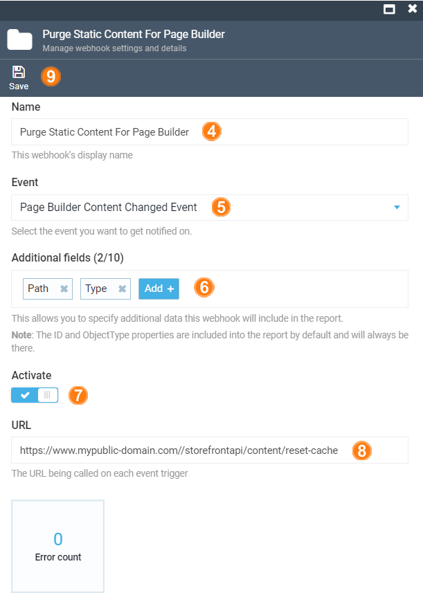
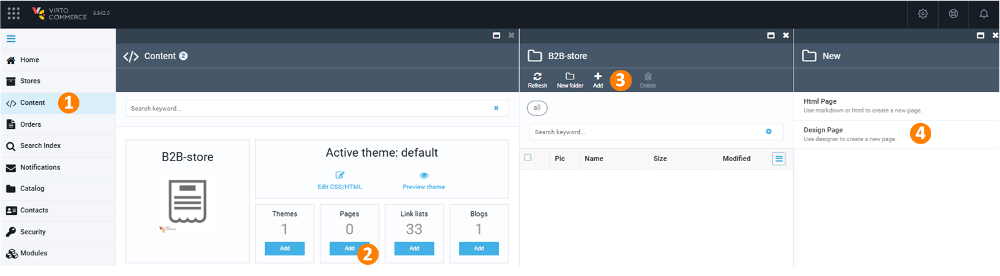
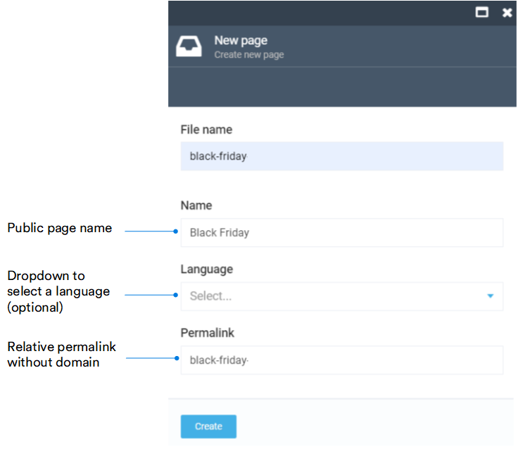
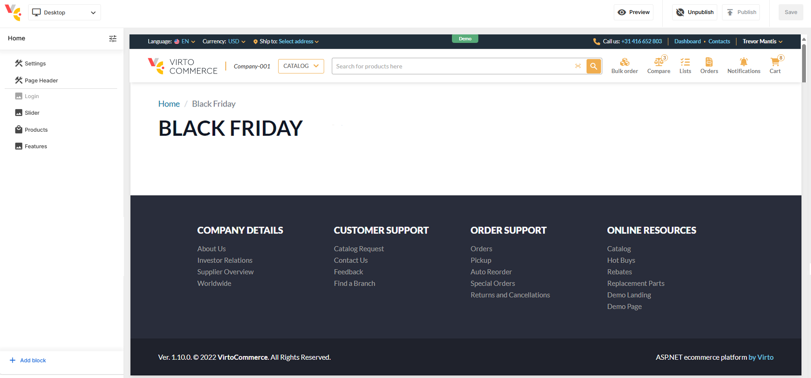
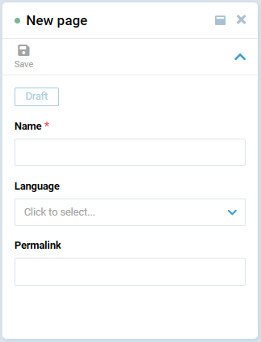

# Page Builder Setup

This guide helps you set up the Page Builder for Virto Commerce Platform and Frontend, ensuring content creation works smoothly.

## Prerequisites

Before you begin, ensure that the following components are installed:

* [Virto Commerce 3.253.0+](https://github.com/VirtoCommerce/vc-platform/releases/)  
    {: width="25"} [Platform deployment guide](/platform/developer-guide/latest/Getting-Started/Installation-Guide/windows)

* [Virto Frontend 2.2.0+](https://github.com/VirtoCommerce/vc-frontend/releases/)  
    {: width="25"} [Frontend deployment guide](/storefront/developer-guide/latest/deployment)

* [Page Builder module 3.201+](https://github.com/VirtoCommerce/vc-module-pagebuilder/releases)


## Set up shared content folder

The Virto Commerce Platform and Virto Commerce Frontend must use the same shared content folder. Verify that both applications point to the same folder before proceeding.

## Set up Content module

Extend the `Content` section in **appsettings.json** with the `PathMappings` configuration:

=== "appsettings.json"

    ```json title="appsettings.json"
    "Content": {
        "PathMappings": {
            "pages": [
                "Themes",
                "_storeId",
                "_theme",
                "content/pages"
            ],
            "themes": [
                "Themes",
                "_storeId"
            ]
        }
    }
    ```

=== "Environment variables"

    ```yaml title="env.yml"
    Content__PathMappings__pages__0: "Themes"
    Content__PathMappings__pages__1: "_storeId"
    Content__PathMappings__pages__2: "_theme"
    Content__PathMappings__pages__3: "content/pages"
    Content__PathMappings__themes__0: "Themes"
    Content__PathMappings__themes__1: "_storeId"
    ```


## Set up store

Configure the public store URL to ensure pages are accessible correctly.

1. Open Platform.
1. In the main menu, select **Stores**.
1. In the next blade, select your store.
1. In the next blade, set up the public store URL, if it is empty.
1. Click **Save** in the toolbar to save the changes.

You store URL has been set.


## Set up cache invalidation

When a page is updated in Page Builder, the storefront cache must be invalidated for changes to appear immediately. Otherwise, the storefront will serve stale content until the cache expires naturally.

Virto Commerce Frontend exposes the `/storefrontapi/content/reset-cache` endpoint for this purpose. The recommended approach is to trigger it automatically using the Webhooks module:

1. Install the [Webhooks module](https://github.com/VirtoCommerce/vc-module-webhooks).
1. Open Virto Commerce Platform and go to **Webhooks**.
1. Click **Add** in the toolbar.
1. Enter a name for the webhook subscription.
1. Select **Page Builder Content Changed Event** in the **Events** dropdown.
1. Select **Path** and **Type** in the additional fields.
1. Turn the **Activate** option to on.
1. Enter the storefront endpoint URL, for example: `https://www.your-domain.com/storefrontapi/content/reset-cache`.
1. Click **Save**.

{: style="display: block; margin: 0 auto;" width="550"}

## Enable iFrame preview

To allow the Page Builder to display a live preview of your site inside its editor, your storefront must permit itself to be embedded in an iframe. Add the following headers to your server configuration:

```http
Content-Security-Policy: frame-ancestors 'self' https://localhost:5001;
Cross-Origin-Resource-Policy: cross-origin
Cross-Origin-Embedder-Policy: credentialless
```

## Run

Now you are ready to create and manage content pages:

=== "via the Content module"

    1. Click **Content** in the main menu.
    1. In the next blade, find the required store and click on the **Pages** widget.
    1. In the next blade, click **Add** in the toolbar. 
    1. In the next blade, select **Design page**.

        {: style="display: block; margin: 0 auto;" }

    1. In the next blade, fill in the following fields:

        {: style="display: block; margin: 0 auto;" width="600"}

    1. Click **Create**. The Page Builder opens the newly created page in a new window. It contains uneditable header and footer by default.  

        {: style="display: block; margin: 0 auto;" }

    1. Click **Save** in the top right corner. 

    You can open it in the browser using the specified permalink.


=== "via the Page Builder Office"

    1. Click **Stores** in the main menu.
    1. In the next blade, select the required store.
    1. In the next blade, click on the **Page Builder** widget to open the Page Builder Office:

        {: style="display: block; margin: 0 auto;" }

    1. Click **Add** in the toolbar.
    1. In the next blade, fill in the following fields:

        {: style="display: block; margin: 0 auto;" }

    1. Click **Save** in the toolbar. 

    Your new page appears in the list of pages.

{: width="25"} [Adding content to page](/platform/user-guide/latest/page-builder/manage-pages#add-content-to-page)

{: width="25"} [Publishing and unpublishing pages](/platform/user-guide/latest/page-builder/manage-pages#publish-or-unpublish-pages)


<br>
<br>
********

<div style="display: flex; justify-content: space-between;">
    <a href="../overview">← Page Builder overview </a>
    <a href="../create-new-block">Creating new block →</a>
</div>