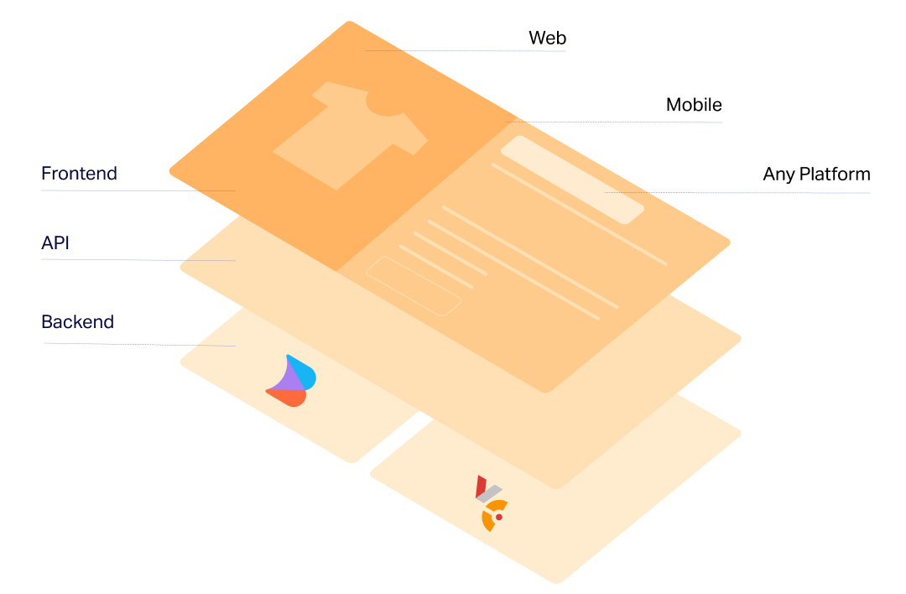
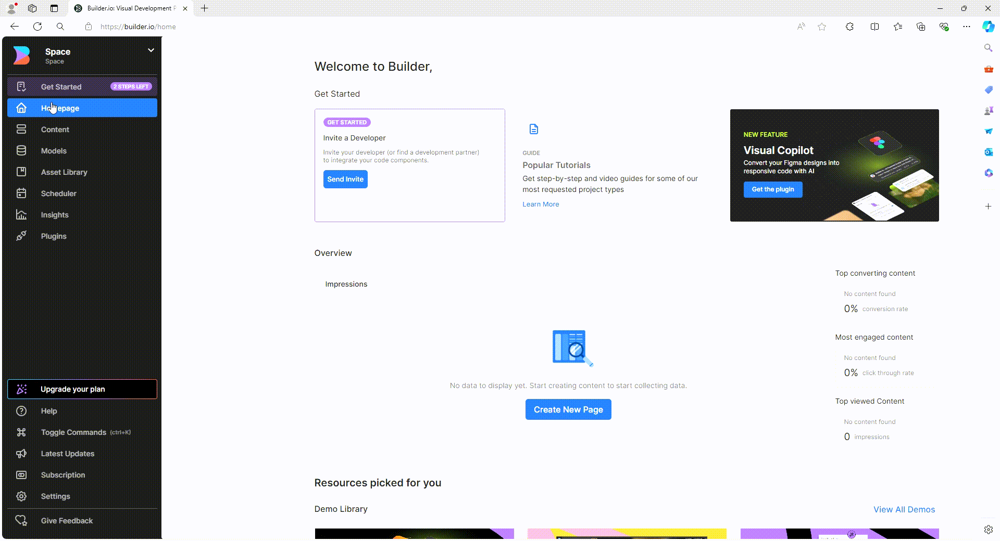
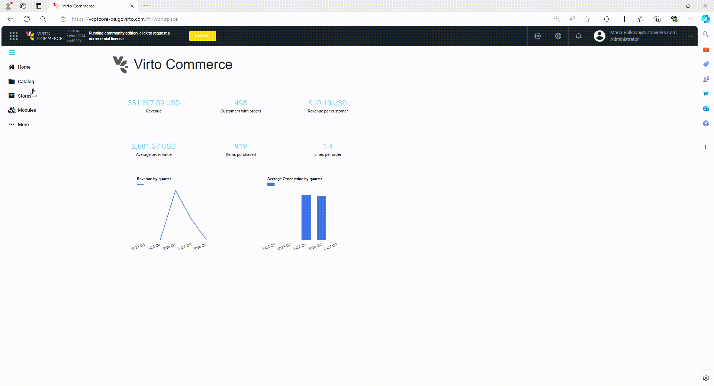
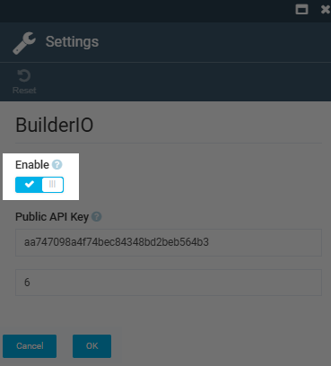
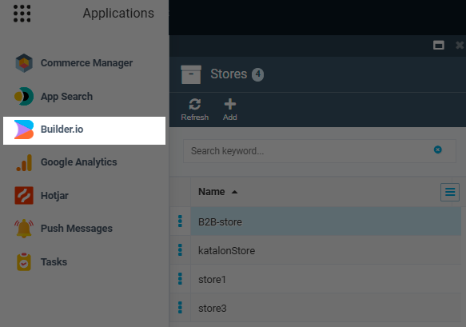

# Builder.io Setup

The **Builder.io** module adds link to Builder.io to the application menu. By clicking on it, users immediately access the toolkit for transforming Frontend Application page designs into optimized web and mobile experiences.

{: width="25"} [How builder.io works](https://www.builder.io/c/docs/how-builder-works)

{: width="25"} [Integrating custom components with Builder.io](https://www.builder.io/c/docs/custom-components-intro)

Virto Commerce and Builder.io integrate seamlessly via API. Once connected, Builder.io pulls in content components like text, images, videos, and carousels, which are then displayed in your online storefront alongside commerce modules from Virto Commerce such as stock availability, pricing, customer reviews, and shipping information.

Your ecommerce team can efficiently use existing code components and the design system from the Virto Commerce frontend as building blocks, enabling faster development while maintaining brand consistency. In addition, they can utilize Builder’s pre-built blocks to create customized experiences 

{: style="display: block; margin: 0 auto;" width="650"}

Developers can easily register new Virto frontend components in code, allowing business team members to use the Builder’s visual editor to drag and drop these components to create content-rich experiences with no dev support. These components can be reused and built into templates, speeding the launch of new pages.

Once the content is complete in the Builder's visual editor, Virto's pre-rendering functionality allows your online storefront to generate static versions of pages in advance, smoothing the development process, speeding load times, reducing server load, and simplifying SSR.

## Prerequisites

* [Builder.io module](https://github.com/VirtoCommerce/vc-module-builder-io/releases/latest).
* [Builder.io account](https://www.builder.io/).
* [Space in Builder.io](https://www.builder.io/c/docs/ui-tour#selecting-and-creating-organizations-and-spaces). For demonstration purposes, we will choose **Publish** space type.

## Enable Builder.io and assign API key to store

To start using the Builder.io solution for a specific store:

1. Copy the public API key in the Builder.io settings:

    {: style="display: block; margin: 0 auto;" }

1. Paste the copied API key into the Platform: 

    1. Go to **Platform --> Stores -->** Your store **--> Settings** widget **--> BuilderIO settings**.
    1. Paste the copied API key into the appropriate field.

    {: style="display: block; margin: 0 auto;" }

1. Turn the Builder.io option to on:

    {: style="display: block; margin: 0 auto;" }

1. Click **OK**.

Click on the link to start using Builder.io:

{: style="display: block; margin: 0 auto;" }

## Integration with Virto Frontend

Virto Commerce Frontend and the Vue B2B Theme have native integration with the Builder.io module. No additional frontend configuration is required beyond saving the store settings as described above.

{: width="25"} [Using Builder.io](/platform/user-guide/latest/integrations/builder-io/overview) 

 
 
********

    <a href="../cms-overview">← CMS integrations </a>
    <a href="../PageBuilder/overview">Page Builder →</a>

