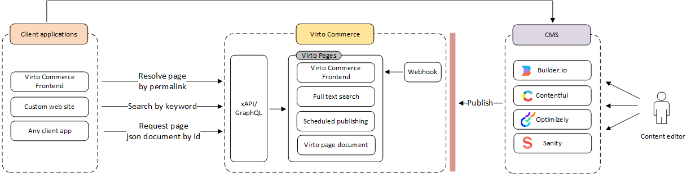

# CMSs

Virto Commerce Platform content management capabilities can be extended with external and native CMS platforms. This allows development and marketing teams to design, author, and publish pages using their preferred tools, while the Platform handles content storage, indexing, and delivery independently of any specific CMS.

The following CMS integrations are currently available:

* [Sanity](sanity-setup.md): Webhook-based integration that syncs page create, update, and delete events from Sanity Studio into Virto Commerce Pages.
* [Builder.io](builder-io-setup.md): Store-level integration that activates Builder.io tracking and connects the Builder.io visual editor with Virto Commerce Frontend.
* [Page Builder](../cms-integrations/PageBuilder/overview.md): Native Virto Commerce visual editor for creating ecommerce pages from configurable blocks, integrated directly into the Content module.

## Pages module as unification layer

All CMS integrations converge on the [Pages module](../../../../user-guide/pages/overview), which acts as a CMS-agnostic content layer. Regardless of which CMS is used to design and author content, the Pages module provides a unified storage, search, and delivery API for all published pages.

This means:

* The CMS is only required during the design and publishing phase. Once a page is published, it is stored in Virto Pages and served independently: the CMS does not need to be available at runtime.
* Multiple CMS platforms can be used simultaneously.
* All pages, regardless of their source, are accessible through the same **REST and GraphQL APIs**.

The architecture follows an event-driven pattern:

1. A CMS integration module receives a page event (create, update, or delete) from the external CMS via a webhook.
1. The integration module converts the page into a `PageDocument` and triggers a `PagesDomainEvent`.
1. The Pages module processes the event and either indexes the page for search and retrieval or removes it from the index.

{: style="display: block; margin: 0 auto;" }

### Scenarios

The Virto Pages module supports end-to-end content workflows:

* **Design time**: Integrate with a CMS to create and design pages, preparing them for publishing.
* **Publishing**: Publish pages to Virto Pages, removing dependency on the CMS afterward.
* **Rendering**: Render pages via permalink or unique ID, ensuring fast, reliable performance. Pages can also be searched by keywords for easy retrieval.

## Supported CMS platforms

| CMS                                                         | Integration type          |
|-------------------------------------------------------------|---------------------------|
| [Sanity](sanity-setup.md)                                   | Webhook                   |
| [Builder.io](builder-io-setup.md)                           | Store settings + Frontend |
| [Page Builder](../cms-integrations/PageBuilder/overview.md) | Native module             |

 
 
********

    <a href="../../opentelemetry">← Open Telemetry</a>
    <a href="../builder-io-setup">Builder.io setup →</a>

