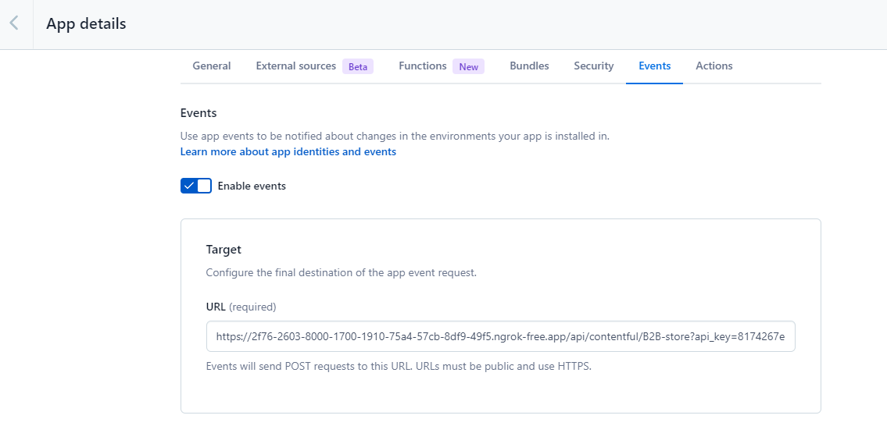
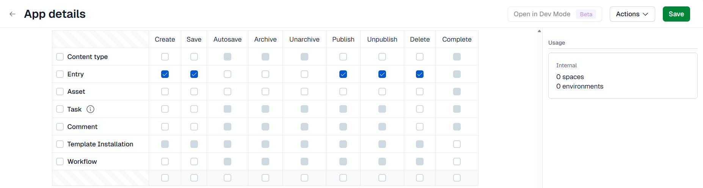

# Contentful Setup

The Contentful module integrates [Contentful](https://www.contentful.com/) CMS with Virto Commerce. It registers as a content provider for the [Pages module](cms-overview.md#pages-module-as-unification-layer) and supports three synchronization modes:

* Real-time webhook push.
* Scheduled sync.
* Full index rebuild.

[](https://github.com/VirtoCommerce/vc-module-contentful/releases)

[](https://github.com/VirtoCommerce/vc-module-contentful/releases/latest)


## Prerequisites

Before you begin, make sure the following modules are installed:

* [Pages.](https://github.com/VirtoCommerce/vc-module-pages)
* [Contentful.](https://github.com/VirtoCommerce/vc-module-contentful)

## Synchronization mechanisms

The Contentful module offers two independent synchronization mechanisms. You can enable them separately or combine them, depending on how content needs to flow between Contentful and Virto Commerce.

| Mechanism | Direction | What it enables | Required configuration |
|---|---|---|---|
| **Webhook push** | Contentful to Virto Commerce. | Real-time page updates triggered when entries are created, updated, or deleted in Contentful. | A webhook in Contentful. An API key in Virto Commerce. |
| **Content Delivery API pulling** | Virto Commerce to Contentful. | Scheduled synchronization and full index rebuild from the admin UI. | Store-level settings with the Contentful space ID and Delivery API token. |

Common setup combinations:

* **Webhook push only**: Real-time updates without scheduled sync or full-rebuild support.
* **Content Delivery API only**: Scheduled or on-demand sync without real-time events.
* **Both**: Real-time updates combined with scheduled sync and full reindex. Recommended for most production setups.

Each section below is tagged with the mechanism it applies to. Complete only the sections relevant to the modes you want to enable.

## Configure Contentful events for Virto Commerce

!!! note
    This configuration applies to **webhook push**.

To synchronize content changes from Contentful with the Virto Commerce Platform, configure event delivery in the Contentful application settings:

1. Sign in to Contentful.
1. Open the required Space.
1. In the top navigation menu, select **Apps**.
1. Open the custom application used for the Virto Commerce integration.
1. Go to the Events tab.
1. Enable event delivery.
1. In the endpoint URL field, enter the following URL:

    ```
    http://{URL}/admin/api/contentful/{STOREID}?api_key={VIRTO_API_KEY}
    ```

    where:
    
    * {URL} is the URL of your Virto Commerce Platform instance.
    * {STOREID} is the ID of the Virto Commerce store.
    * {VIRTO_API_KEY} is the [Virto Commerce API key](/platform/user-guide/latest/security/api-key/).

    

1. In the event selection section, enable only the following entry events:

    * Create (optionally).
    * Save (optionally).
    * Publish.
    * Unpublish.
    * Delete (optionally).

    

1. Save the configuration.


## Configure store settings

!!! note
    This configuration applies to **Content Delivery API pulling**.

To configure store settings:

1. Click **Stores** in the main menu.
1. In the next blade, select your store.
1. In the next blade, click on the **Settings** widget.
1. In the search field of the next blade, type **Contentful** to find the settings related to the module.
1. Configure the following fields:


    | Setting | Description | Default |
    |---|---|---|
    | **Contentful.SpaceId** | Contentful space ID. | None |
    | **Contentful.DeliveryApiKey** | Content Delivery API access token. | None |
    | **Contentful.ContentTypeId** | Content type ID to index as pages. | `page` |
    | **Contentful.PreviewApiKey** | Content Preview API token. Optional. When set, the provider returns both published and draft entries. | None |

    When **Contentful.PreviewApiKey** is configured, the provider switches to the [Content Preview API](https://www.contentful.com/developers/docs/references/content-preview-api/) endpoint (`preview.contentful.com`). Draft entries are indexed with `Status = Draft`, published entries with `Status = Published`.

1. Click **OK** to save the changes.

Your modifications have been applied.

## Set up Contentful content model

!!! note
    This configuration applies to **webhook push** and **Content Delivery API pulling**.

In your Contentful space, create a content type that represents a Virto Commerce page. The default content type ID is `page`, but you can override it via the **Contentful.ContentTypeId** store setting.

Add the following fields to the content type:

| Field name | Type | Required | Notes |
|---|---|---|---|
| `title` | Short text | Yes | Page title. |
| `permalink` | Short text | Yes | URL slug. |
| `description` | Short text | No | Meta description. |
| `content` | Rich text | No | Page body, rendered to HTML via `IContentfulRenderer`. |
| `storeId` | Short text | Recommended | Required for index rebuild. Falls back to the webhook query parameter. |
| `cultureName` | Short text | Recommended | Required for index rebuild. Falls back to auto-detection from the first available field locale. |
| `isAuthenticated` | Boolean | No | When `true` or absent, the page is Private. When `false`, the page is Public. |
| `userGroups` | List, Short text | No | Restricts access to the listed user groups. |
| `startDate` | Date and time | No | Scheduled publishing start. |
| `endDate` | Date and time | No | Scheduled publishing end. |

System fields (`sys.id`, `sys.createdAt`, `sys.updatedAt`, `sys.publishedVersion`) are read automatically by Contentful and mapped to the corresponding Virto Commerce page properties.


## Configure permissions

!!! note
    This configuration applies to **webhook push**.

The webhook endpoint requires an API key for a Virto Commerce user with the following permissions:

| Permission | Used for |
|---|---|
| `contentful:update` | Create and update operations. |
| `contentful:delete` | Delete operations. |

To create an API key with these permissions, follow the [API key guide](/platform/developer-guide/latest/Fundamentals/Security/authorization/overview).

## Configure webhook

Applies to **webhook push**.

The module exposes a single endpoint:

```
POST /api/pages/contentful?storeId={storeId}&cultureName={cultureName}
```

To connect Contentful to this endpoint:

1. Open [Contentful web app](https://app.contentful.com/) and open your space.
1. Open **Settings** > **Webhooks** and create a new webhook with the following settings:

    | Setting | Value |
    |---|---|
    | **URL** | `https://<your-domain>/api/pages/contentful?storeId=<StoreId>&cultureName=<cultureName>&api_key=<your-api-key>` |
    | **Trigger on** | `Entry: Create, Save, Auto save, Archive, Unarchive, Publish, Unpublish, Delete` |
    | **HTTP method** | `POST` |
    | **Content type filter** | `sys.contentType.sys.id` equals the content type ID configured in **Contentful.ContentTypeId**. |

## Verify webhook delivery

!!! note
    This configuration applies to **webhook push**.

To check whether webhooks are being delivered correctly, open **Contentful web app** > **Settings** > **Webhooks**, select your webhook, and open the **Activity log** tab. Each entry shows the request payload, response status, and timestamp.

<br>
<br>

{: width="20"} [Contentful Content Delivery API](https://www.contentful.com/developers/docs/references/content-delivery-api/)

{: width="20"} [Contentful Content Preview API](https://www.contentful.com/developers/docs/references/content-preview-api/)

{: width="20"} [Contentful .NET SDK](https://github.com/contentful/contentful.net)


<br>
<br>
********

<div style="display: flex; justify-content: space-between;">
    <a href="../sanity-setup">← Sanity setup</a>
    <a href="../../../Operations/maintenance-tasks-for-sql">Operations. Maintenance tasks for SQL →</a>
</div>