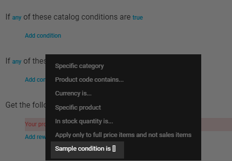

# Extend Dynamic Expression Tree

This article will show you how to extend the existing promotion expression tree of the Marketing module with these new elements:

* New expression block:

  {: style="display: block; margin: 0 auto;" }

* New block element:

  {: style="display: block; margin: 0 auto;" }

[](https://github.com/VirtoCommerce/vc-module-marketing/tree/dev/samples/VirtoCommerce.MarketingSampleModule.Web)

## Prerequisites

Prior to extending your dynamic expression tree, you need to:

* [Create an empty custom module](../Tutorials-and-How-tos/Tutorials/creating-custom-module.md).
    
* Add the [VirtoCommerce.MarketingModule.Core](https://www.nuget.org/packages/VirtoCommerce.MarketingModule.Core) NuGet dependency to your project.

## Define new class for expression tree prototype

The following example creates a new derived prototype from [PromotionConditionAndRewardTreePrototype](https://github.com/VirtoCommerce/vc-module-marketing/blob/dev/src/VirtoCommerce.MarketingModule.Core/Model/Promotions/PromotionConditionAndRewardTreePrototype.cs) that represents the original expression tree used for marketing promotion. Here, we register a new `BlockSampleConditionroot` block and extend the existing `BlockCatalogCondition` with a new element, `SampleCondition`:

``` csharp title="SamplePromotionConditionAndRewardTreePrototype.cs"
public sealed class SamplePromotionConditionAndRewardTreePrototype : PromotionConditionAndRewardTreePrototype
    {
        public SamplePromotionConditionAndRewardTreePrototype()
        {
            //Extend existing 'If any of these catalog condition' block with a new condition element
            var blockCatalogCondition = AvailableChildren.OfType<BlockCatalogCondition>().FirstOrDefault();
            blockCatalogCondition.AvailableChildren.Add(new SampleCondition());

            // Add a new block with sample condition to the beginning of the tree
            var blockSampleConditions = new BlockSampleCondition().WithAvailConditions(new SampleCondition());
            AvailableChildren.Insert(0, blockSampleConditions);
            Children.Insert(0, blockSampleConditions);
        }
    }
```

## Register your extension in module.cs

To register your extension in the **module.cs** file: 

1. Override the original `PromotionConditionAndRewardTreePrototype` type with the newly created one in the `module.cs` file:

    ``` csharp title="module.cs"
    public void Initialize(IServiceCollection serviceCollection)
            {
                // Override the original expression prototype tree with new type
                AbstractTypeFactory<PromotionConditionAndRewardTreePrototype>.OverrideType<PromotionConditionAndRewardTreePrototype, SamplePromotionConditionAndRewardTreePrototype>();
            }
    ```

1. Add a dependency to the Marketing module into the **module.manifest** file:

    ``` html title="module.manifest"
    ...
    <dependencies>
            <dependency id="VirtoCommerce.Marketing" version="3.0.0" />
        </dependencies>
    ...
    ```

!!! note
	This line is important for correct module initialization order. 
    
    {: width="25"} [Module Initialization](../Fundamentals/Modularity/04-loading-modules-into-app-process.md)

## Define HTML templates for new elements

It is a best practice to define all HTML templates for new elements within a single file, where the templates are dynamically loaded as resources.

!!! tip
	Use the following schema as a template ID: `expression-{C# element class name}.html`.

``` html title="Scripts/all-templates.js"
<script type="text/ng-template" id="expression-BlockSampleCondition.html">
    For condition evaluator with
    <a class="__link" left-click-menu data-target="allAny_menu{{element.id}}">{{element.all | boolToValue:'all':'any'}}</a> of these sample values
    <ul class="menu __context" role="menu" id="allAny_menu{{element.id}}">
        <li class="menu-item" ng-click='element.all=true;'>all</li>
        <li class="menu-item" ng-click='element.all=false;'>any</li>
    </ul>
</script>
<script type="text/ng-template" id="expression-SampleCondition.html">
    Sample condition is met: 
    <a class="__link" left-click-menu data-target="yesNo_menu{{element1.id}}">{{element1.isSatisfied | boolToValue:'yes':'no'}}</a>
    <ul class="menu __context" role="menu" id="yesNo_menu{{element1.id}}">
        <li class="menu-item" ng-click='element1.isSatisfied=true;'>yes</li>
        <li class="menu-item" ng-click='element1.isSatisfied=false;'>no</li>
    </ul>
</script>
```

## Register new elements in main module.js file

Register your newly created expression elements in `dynamicExpressionService` that is used as a registry for all known tree elements:

``` js title="Script/module.js"
angular.module(moduleName, [])
    .run(['virtoCommerce.coreModule.common.dynamicExpressionService', '$http', '$compile',
        function (dynamicExpressionService, $http, $compile) {
            //Register Sample expressions
            dynamicExpressionService.registerExpression({
                id: 'BlockSampleCondition',
                newChildLabel: '+ add sample condition',
                getValidationError: function () {
                    return (this.children && this.children.length) ? undefined : 'Promotion requires at least one eligibility';
                }
            });
            dynamicExpressionService.registerExpression({
                id: 'SampleCondition',
                displayName: 'Sample condition is []'
            });

            $http.get('Modules/$(VirtoCommerce.MarketingSample)/Scripts/all-templates.html').then(function (response) {
                // compile the response, which will put stuff into the cache
                $compile(response.data);
            });
        }
    ]);
```

## Build own module and restart Platform

1. Build your solution and pack the module scripts with the following command:

    ``` console
    npm run webpack:build
    ```

1. Restart the Platform instance to apply your changes.

1. Open Platform Manager, go to **Marketing --> Promotions --> New promotion**. The new `For condition evaluator with any of these sample values` block with its single `Sample condition is met: no/yes` line appears.


<br>
<br>
********

<div style="display: flex; justify-content: space-between;">
    <a href="../key-extensibility-points">← Key extensibility points </a>
    <a href="../product-completeness-evaluator">Extending product completeness evaluator  →</a>
</div>