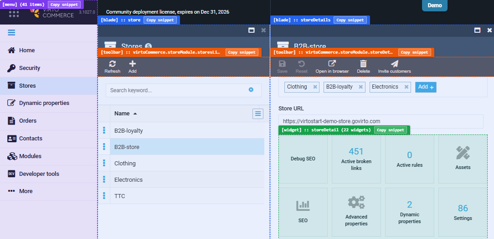

# Key Extensibility Points

Our Platform is based on a collection of various modules and components that form the backbone of the Virto value proposition, which is to make each part of our system extensible and reusable.

In order to provide solutions for many different use cases, we decided it was important to ensure that these core concepts were as flexible and extensible as possible.

The Virto Commerce Platform encompasses the **extension concept** based on various techniques and practices. It can significantly reduce the implementation and upgrade effort for your custom solution.

!!! info
	The extension concept is the backbone of the Virto Platform value proposition and has several main extensibility point types.

To address crucial extension requirements, the Platform contains various **extensions points** for all three main parts: Platform, modules, and Frontend. Such extension points enable performing multiple customizations without direct code modification. The list below mentions the important ones:

* Domain and business logic extension:
    * [Extending domain models.](../Tutorials-and-How-tos/Tutorials/extending-domain-models.md)
    * [Extending through domain events.](../Fundamentals/Event-Driven-Development/using-domain-events.md)
    * [Using dynamic properties.](../Fundamentals/Dynamic-Properties/using-DynamicPropertyAccessor.md)
* Platform manager UI extension:
    * [Extending main menu.](../Platform-Manager/Extensibility-Points/extending-main-menu.md)
    * [Working with widgets.](../Platform-Manager/Extensibility-Points/widgets.md)
    * [Using metaforms.](../Platform-Manager/Extensibility-Points/metaform.md)
    * [Extending blade toolbar.](../Platform-Manager/Extensibility-Points/blade-toolbar.md)
    * [Extending grid columns.](../Platform-Manager/Extensibility-Points/extending-grid-columns.md)
* Extending commerce logic:
    * [Registering a new payment method.](../Fundamentals/Payments/new-payment-method-registration.md)
    * [Registering a new shipping method.](../Fundamentals/Shipments/new-shipping-method-registration.md)
    * [Registering a new tax provider.](../Fundamentals/Taxes/new-tax-provider-registration.md)
* Security extensions:
    * [Extending authorization policies.](../Fundamentals/Security/extensions/extending-authorization-policies.md)
    * [Extending ASP.NET Identity UserManager and RoleManager.](../Fundamentals/Security/extensions/extending-usermanager-and-rolemanager.md)
    * [Adding new SSO Provider.](../Fundamentals/Security/extensions/adding-google-as-sso-provider.md)
* Notification extensions:
    * [Extending notification types.](../Fundamentals/Notifications/extending-notification-types.md)
* Backup and restore extensions:
    * [Including module data in backups.](including-module-data-in-backups.md)
* Logging extension:
    * [Using MS Azure Application Insights.](../Fundamentals/Logging/application-insights.md)
    * [Using Seq log module.](../Fundamentals/Logging/seq-module.md)
* Page Builder extension:
    * [Adding and editing blocks.](cms-integrations/PageBuilder/create-new-block.md)
* Product Snapshot extension:
    * [Adding custom properties via metaform.](../Tutorials-and-How-tos/How-tos/product-snapshot.md#adding-custom-properties-via-metaform)
    * [Adding widgets.](../Tutorials-and-How-tos/How-tos/product-snapshot.md#adding-widgets)

## Extension Points Inspector

The list above is the complete reference. To find the right point for a specific page the quickest possible, use the **Extension Points Inspector** in the Platform Manager admin UI. It highlights every extension point on the page and copies a ready-to-paste snippet for each.

## Usage

To inspect the extension points on a page:

1. Run the Virto Commerce Platform.
1. Open the browser developer console.
1. Run `vcExt.show()` to display the overlay. Each highlighted region shows the name or ID of the extension point and a **Copy snippet** button. For example, the illustration below shows that menu , blades, toolbars, and widgets can be extended:

    

1. Click **Copy snippet** on the point you want to extend. A ready-to-paste registration call is copied to the clipboard. For example, a widget extension snippet looks like this:

    ```js
    widgetService.registerWidget({
        controller: '<yourModule>.<yourWidgetController>',
        template: '$(YourModule)/Scripts/widgets/<widget>.tpl.html'
    }, 'storeDetail');
    ```

1. Paste the snippet into your module and adjust the parameters as needed.
1. Run `vcExt.hide()` to remove the overlay.

The available commands are:

| Command        | Purpose                                                  |
|----------------|----------------------------------------------------------|
| `vcExt.help()` | Show the list of available commands.                     |
| `vcExt.show()` | Overlay every extension point on the current page with its name and Id.    |
| `vcExt.hide()` | Remove the overlay.                                      |
| `vcExt.list()` | Print a `console.table` of every registered item across all five services. |


<br>
<br>
********

<div style="display: flex; justify-content: space-between;">
    <a href="../overview">← Extensibility overview </a>
    <a href="../extending-dynamic-expression-tree">Extending dynamic expression tree  →</a>
</div>
