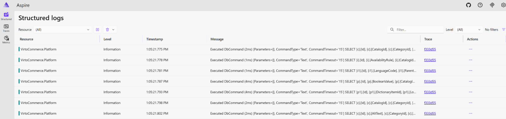

# Overview

The **Open Telemetry** module provides OpenTelemetry observability for Virto Commerce Platform (metrics, distributed tracing, and structured logging via OTLP exporter).

{: style="display: block; margin: 0 auto;" }

## Key features

- **Observability instrumentation**:

    <table border="1">
        <tr>
            <th>What is collected</th>
            <th>Source</th>
            <th>Description</th>
        </tr>
        <tr>
            <td rowspan="7">Metrics</td>
            <td>ASP.NET Core</td>
            <td>Request rate, duration, active connections.</td>
        </tr>
        <tr>
            <td>HTTP Client</td>
            <td>Outbound request duration and status.</td>
        </tr>
        <tr>
            <td>.NET Runtime</td>
            <td>GC, thread pool, memory.</td>
        </tr>
        <tr>
            <td>Process</td>
            <td>CPU, memory.</td>
        </tr>
        <tr>
            <td>EF Core</td>
            <td>Query counts and duration.</td>
        </tr>
        <tr>
            <td>Elasticsearch</td>
            <td>Transport-level metrics.</td>
        </tr>
        <tr>
            <td>Kestrel</td>
            <td>Connection and request metrics.</td>
        </tr>
        <tr>
            <td rowspan="6">Traces</td>
            <td>ASP.NET Core</td>
            <td>Incoming HTTP requests.</td>
        </tr>
        <tr>
            <td>HTTP Client</td>
            <td>Outbound HTTP calls.</td>
        </tr>
        <tr>
            <td>EF Core</td>
            <td>Database queries.</td>
        </tr>
        <tr>
            <td>Hangfire</td>
            <td>Background job execution.</td>
        </tr>
        <tr>
            <td>Elasticsearch</td>
            <td>Search and index operations.</td>
        </tr>
        <tr>
            <td>Redis</td>
            <td>Cache operations.</td>
        </tr>
    </table>

- **Logging**: Structured logs are forwarded to the OTLP endpoint via Serilog with trace/span ID fields for correlation with distributed traces.
- **Conditional activation**: Only enabled when explicitly configured.

## Module structure

```
src/
└── VirtoCommerce.OpenTelemetry.Web/
    ├── Module.cs                                   # Module entry point
    ├── ServiceCollectionExtensions.cs              # OTel metrics and tracing registration
    ├── OpenTelemetryLoggerConfigurationService.cs  # Serilog → OTLP logging
    └── VirtoCommerce.OpenTelemetry.Web.csproj
```


## Prerequisites

* Virto Commerce Platform 3.1002.0 or higher.
* OTLP-compatible collector, for example:
    * [Grafana Alloy](https://grafana.com/docs/alloy/).
    * [OpenTelemetry Collector](https://opentelemetry.io/docs/collector/).
    * [Aspire Dashboard](https://learn.microsoft.com/en-us/dotnet/aspire/fundamentals/dashboard/overview).

## Installation

Copy the module to your platform **modules** directory. It will be automatically discovered and loaded by the Virto Commerce Platform.

## Configuration

Configure the **appsettings.json** file as follows:



## Troubleshooting

| Problem | Solution |
|---------|----------|
| Module not activating | Verify `OpenTelemetry:Enabled` is `true` in configuration. |
| No data exported | Verify `OpenTelemetry:Endpoint` is set and the collector is reachable. |
| Traces missing correlations | Ensure the collector supports OTLP gRPC on the configured endpoint. |


<br>
<br>
********

<div style="display: flex; justify-content: space-between;">
    <a href="../extending-application-user">← Extending application user </a>
    <a href="../cms-integrations/cms-overview">CMS integrations  →</a>
</div>